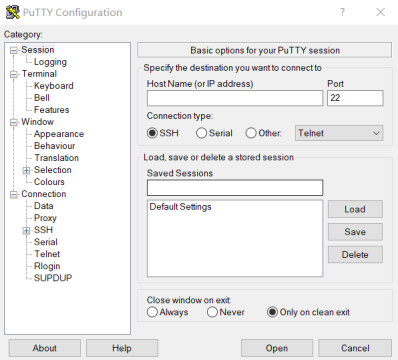
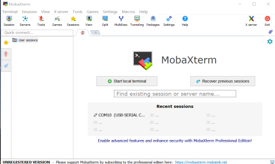
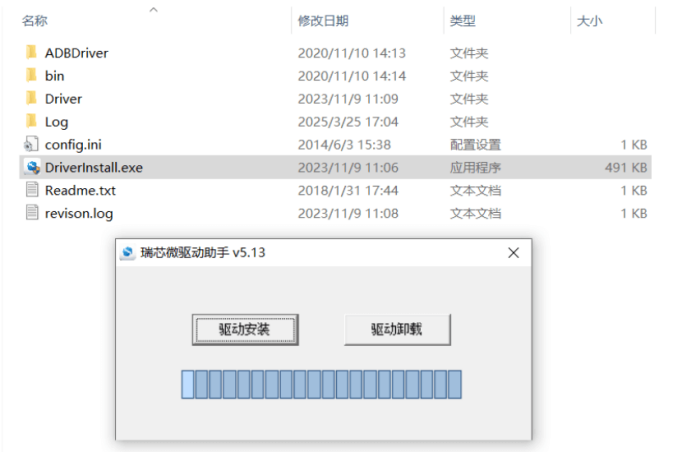
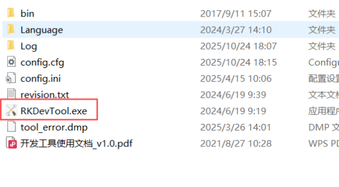
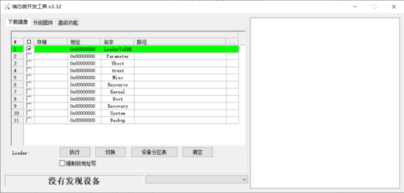
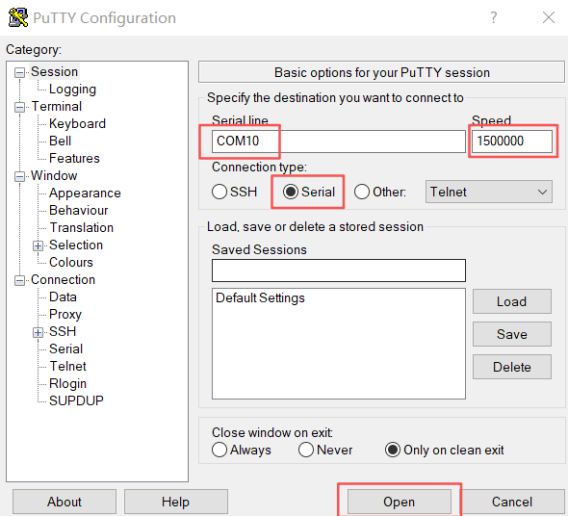

# 烧录指南

1、准备好`putty`工具或者`Mobaxterm`可以主动输入命令的串口工具；

Putty

Mobaxterm

2、下载RK烧录工具烧录工具RKDevTool（V3.30及以上版本）和驱动程序DriverAssitant；
烧录工具下载链接：
https://pan.baidu.com/s/1rsxSt4PT4A2Xqy7Y-3IAPg?pwd=1xtb#list/path=%2F

3、解压压缩包后启动`DriverAssitant`安装驱动（如有安装过需先卸载旧驱动再安装）；

下载烧录工具后直接双击 `RKDevTool.exe`进入软件界面

4、用`A to C`线连接电脑和`Debug`口，用`A to A`线连接电脑和下载口；

5、打开putty工具或者其他串口工具，设置参数使其连接上边缘计算盒，波特率为`1500000`；

6、连接上后，给边缘盒子重新上电，并立即在putty工具或串口工具里输入`ctrl+c`中止`autoboot`，随后输入`rockusb 0 mmc 0`，此时设备已进入`loader`模式；

7、回到烧录工具RKDevTool界面，此时下方已显示`发现loader设备`，点击进入`升级固件`界面，点击`固件`导入固件，点击`升级`开始进行烧录

8、烧录完成后，给设备重新上电启动系统