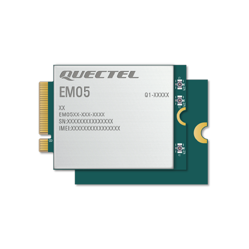
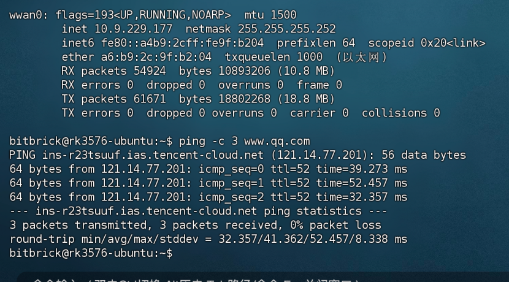
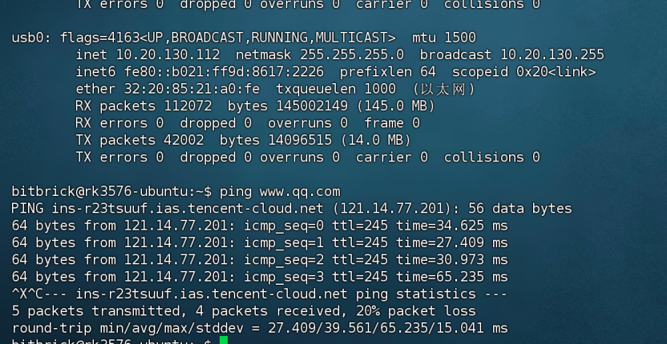

# 4G、5G模块的使用
ECP1001支持移远的4G模组EM05和5G模组RM500U。

## 1. 设备连接
把模块插入到 `pcie` 插槽中，接入 `SIM` 卡和天线，天线是使用的 `IPEX` 4代的天线。
在控制台输入 `lsusb`，显示有`Quectel`字样的设备就代表连接成功了。
~~~
 lsusb
Bus 002 Device 001: ID 1d6b:0003 Linux Foundation 3.0 root hub
Bus 001 Device 003: ID 2c7c:0125 Quectel Wireless Solutions Co., Ltd. EC25 LTE modem
Bus 001 Device 002: ID 1a86:80a0 QinHeng Electronics USB2.0 HUB
Bus 001 Device 001: ID 1d6b:0002 Linux Foundation 2.0 root hub
Bus 004 Device 001: ID 1d6b:0003 Linux Foundation 3.0 root hub
Bus 003 Device 001: ID 1d6b:0002 Linux Foundation 2.0 root hub
~~~
## 2. 拨号上网
在Debian和Ubuntu中都可以使用移远提供的拨号软件去拨号。
你可以自行编译源码或者直接下载我们已经编译好的软件来使用

地址如下：[Quectel-CM](https://pan.baidu.com/s/1aiiHBW1s6PH6sxBM33PEJg?pwd=dgrd)

### 2.1 编译quectel-CM源码
~~~
#更新软件
sudo apt update

#获取依赖软件
sudo apt install make gcc git busybox udhcpc

#解压源码包
unzip Quectel_QConnectManager_Linux_V1.6.8.zip

cd Quectel_QConnectManager_Linux_V1.6.8

#编译
make
~~~

之后就会得到可执行的quectel-CM程序。

### 2.2 拨号

在ubuntu系统中需要关闭默认的ModemManager服务，要不拨号系统会有冲突，debian则不用
~~~
sudo systemctl stop ModemManager
sudo systemctl disable ModemManager
~~~
拨号命令如下，其中APN根据手机卡运营商而定
~~~
#-s参数指定数据连接的APN
sudo ./quectel-CM -s APN &
~~~

~~~
#APN:
移动："cmnet"
联通："3gnet"
电信："ctnet"
测试用的是移动卡所以使用的命令如下
~~~

例如指定移动的APN
~~~
sudo ./quectel-CM -s cmnet &
[05-29_17:04:52:385] QConnectManager_Linux_V1.6.8
[05-29_17:04:52:386] Find /sys/bus/usb/devices/6-1 idVendor=0x2c7c idProduct=0x900, bus=0x006, dev=0x002
[05-29_17:04:52:386] Auto find qmichannel = /dev/ttyUSB2
[05-29_17:04:52:386] Auto find usbnet_adapter = enx62d3d1e2dc2d
[05-29_17:04:52:386] netcard driver = cdc_ether, driver version = 6.1.99
[05-29_17:04:52:386] Modem works in ECM_RNDIS_NCM mode
[05-29_17:04:52:389] /proc/1522/fd/9 -> /dev/ttyUSB2
[05-29_17:04:52:389] /proc/1522/exe -> /usr/sbin/ModemManager
[05-29_17:04:54:405] atc_fd = 7
[05-29_17:04:54:406] AT> ATE0Q0V1
[05-29_17:04:54:409] AT< OK
[05-29_17:04:55:410] AT> AT+QCFG="usbnet"
[05-29_17:04:55:415] AT< +QCFG: "usbnet",1
[05-29_17:04:55:415] AT< OK
[05-29_17:04:55:415] AT> AT+QNETDEVCTL=?
[05-29_17:04:55:416] AT< +QNETDEVCTL: (1-8),(0-3),(0,1)
[05-29_17:04:55:416] AT< OK
[05-29_17:04:55:416] AT> AT+CGREG=2
[05-29_17:04:55:419] AT< OK
[05-29_17:04:55:419] AT> AT+CEREG=2
[05-29_17:04:55:422] AT< OK
[05-29_17:04:55:422] AT> AT+C5GREG=2
[05-29_17:04:55:424] AT< OK
[05-29_17:04:55:424] AT> AT+QNETDEVSTATUS=?
[05-29_17:04:55:427] AT< +QNETDEVSTATUS: (1-8)
[05-29_17:04:55:427] AT< OK
[05-29_17:04:55:428] AT> AT+QCFG="NAT"
[05-29_17:04:55:431] AT< +QCFG: "nat",0
[05-29_17:04:55:431] AT< OK
[05-29_17:04:55:432] AT> AT+CGMR
[05-29_17:04:55:433] AT< RM500UCNAAR03A05M2G_01.001.01.001
[05-29_17:04:55:433] AT< OK
[05-29_17:04:55:433] AT> AT+CPIN?
[05-29_17:04:55:435] AT< +CPIN: READY
[05-29_17:04:55:435] AT< OK
[05-29_17:04:55:435] AT> AT+QCCID
[05-29_17:04:55:439] AT< +QCCID: 89860040191702516660
[05-29_17:04:55:439] AT< OK
[05-29_17:04:55:439] requestGetICCID 89860040191702516660
[05-29_17:04:55:439] AT> AT+CIMI
[05-29_17:04:55:441] AT< 460028194360396
[05-29_17:04:55:441] AT< OK
[05-29_17:04:55:441] requestGetIMSI 460028194360396
[05-29_17:04:55:442] AT> AT+QICSGP=1
[05-29_17:04:55:449] AT< +QICSGP: 3,"cmnet","","",0
[05-29_17:04:55:449] AT< OK
[05-29_17:04:55:449] requestGetProfile[1] cmnet///0/IPV4V6
[05-29_17:04:55:449] requestSetProfile[1] cmnet///0/IPV4
[05-29_17:04:55:449] AT> AT+QICSGP=1,1,"cmnet","","",0
[05-29_17:04:56:281] AT< OK
[05-29_17:04:56:282] AT> AT+COPS=3,0;+COPS?;+COPS=3,1;+COPS?;+COPS=3,2;+COPS?
[05-29_17:04:56:299] AT< +COPS: 0,0,"",11
[05-29_17:04:56:304] AT< +COPS: 0,1,"N-V�y�R�",11
[05-29_17:04:56:310] AT< +COPS: 0,2,"46000",11
[05-29_17:04:56:310] AT< OK
[05-29_17:04:56:310] AT> AT+C5GREG?
[05-29_17:04:56:313] AT< +C5GREG: 2,1,"14259F","C0FC72003",11,2,01
[05-29_17:04:56:313] AT< OK
[05-29_17:04:56:313] AT> AT+QNETDEVSTATUS=1
[05-29_17:04:56:388] AT< +CME ERROR: 3
[05-29_17:04:56:388] AT> at+cops?
[05-29_17:04:56:392] AT< +COPS: 0,2,"46000",11
[05-29_17:04:56:393] AT< OK
[05-29_17:04:56:393] AT> at+qeng="servingcell"
[05-29_17:04:56:404] AT< +QENG: "servingcell","NOCONN","NR5G-SA","TDD",460,00,C0FC72003,565,14259F,504990,41,100,-87,-8,13,20,32,1
[05-29_17:04:56:404] AT< OK
[05-29_17:04:56:404] ip addr flush dev enx62d3d1e2dc2d
[05-29_17:04:56:420] ip link set dev enx62d3d1e2dc2d down
[05-29_17:04:56:426] AT> AT+QNETDEVCTL=1,1,1
[05-29_17:04:56:655] AT< OK
[05-29_17:04:56:656] AT> AT+QNETDEVSTATUS=1
[05-29_17:04:56:715] AT< +CME ERROR: 3
[05-29_17:04:57:028] AT< +QNETDEVSTATUS: 1,1,"IPV4",0
[05-29_17:04:57:715] AT> AT+QNETDEVSTATUS=1
[05-29_17:04:57:776] AT< +QNETDEVSTATUS: 10.82.96.30,255.255.255.0,10.82.96.1,,120.196.165.7,221.179.38.7,,,,,,
[05-29_17:04:57:776] AT< OK
[05-29_17:04:57:776] AT> AT+QNETDEVSTATUS=1
[05-29_17:04:57:834] AT< +QNETDEVSTATUS: 10.82.96.30,255.255.255.0,10.82.96.1,,120.196.165.7,221.179.38.7,,,,,,
[05-29_17:04:57:834] AT< OK
[05-29_17:04:57:834] requestGetIPAddress 10.82.96.30
[05-29_17:04:57:834] AT> at+cops?
[05-29_17:04:57:836] AT< +COPS: 0,2,"46000",11
[05-29_17:04:57:836] AT< OK
[05-29_17:04:57:836] AT> at+qeng="servingcell"
[05-29_17:04:57:840] AT< +QENG: "servingcell","CONNECT","NR5G-SA","TDD",460,00,C0FC72003,565,14259F,504990,41,30,-89,-6,16,20,32,1
[05-29_17:04:57:841] AT< OK
[05-29_17:04:57:841] AT> AT+QNETDEVSTATUS=1
[05-29_17:04:57:900] AT< +QNETDEVSTATUS: 10.82.96.30,255.255.255.0,10.82.96.1,,120.196.165.7,221.179.38.7,,,,,,
[05-29_17:04:57:901] AT< OK
[05-29_17:04:57:901] ip link set dev enx62d3d1e2dc2d up
[05-29_17:04:57:909] No default.script found, it should be in '/usr/share/udhcpc/' or '/etc//udhcpc' depend on your udhcpc version!
[05-29_17:04:57:909] busybox udhcpc -f -n -q -t 5 -i enx62d3d1e2dc2d
udhcpc: started, v1.35.0
udhcpc: broadcasting discover
udhcpc: broadcasting select for 10.82.96.30, server 10.82.96.1
udhcpc: lease of 10.82.96.30 obtained from 10.82.96.1, lease time 86400
[05-29_17:04:57:974] ERROR: IP from udhcpc (0.0.0.0) is different to IP from ATC (10.82.96.30)!
[05-29_17:04:57:974] AT> at+cops?
[05-29_17:04:57:977] AT< +COPS: 0,2,"46000",11
[05-29_17:04:57:977] AT< OK
[05-29_17:04:57:977] AT> at+qeng="servingcell"
[05-29_17:04:57:982] AT< +QENG: "servingcell","CONNECT","NR5G-SA","TDD",460,00,C0FC72003,565,14259F,504990,41,30,-89,-6,16,20,32,1
[05-29_17:04:57:982] AT< OK
[05-29_17:04:57:983] AT> AT+QNETDEVSTATUS=1
[05-29_17:04:58:042] AT< +QNETDEVSTATUS: 10.82.96.30,255.255.255.0,10.82.96.1,,120.196.165.7,221.179.38.7,,,,,,
[05-29_17:04:58:042] AT< OK
[05-29_17:05:13:057] AT> at+cops?
[05-29_17:05:13:062] AT< +COPS: 0,2,"46000",11
[05-29_17:05:13:062] AT< OK
[05-29_17:05:13:062] AT> at+qeng="servingcell"
[05-29_17:05:13:068] AT< +QENG: "servingcell","NOCONN","NR5G-SA","TDD",460,00,C0FC72003,565,14259F,504990,41,100,-90,-8,11,0,29,1
[05-29_17:05:13:068] AT< OK

~~~

拨号成功后即可用ifconfig来看到它分配的ip地址

4G是`wwan0`

5G是`usb0`

如果遇到DNS的问题，则可以通过如下命令导入`aliyun`的`DNS`
~~~
echo "nameserver 223.5.5.5" | sudo tee /etc/resolv.conf
~~~

## 3.开启自动启拨号

为了方便我们可以把quectel-CM复制到系统的可执行目录去
~~~
sudo cp quectel-CM /usr/bin/ -f
~~~

### 3.1 创建脚本并加入执行权限
~~~
sudo vim /opt/auto_quectel.sh
sudo chmod +x /opt/auto_quectel.sh
~~~
脚本内容如下
`/opt/auto_quectel.sh`
~~~
#!/bin/bash

# 等待 /dev/ttyUSB  出现
while [ ! -e /dev/ttyUSB* ]; do
            sleep 1
    done

    quectel-CM

~~~
### 3.2 添加自启动配置
创建配置文件，在/etc/systemd/system/目录下创建一个quectel-dial.service配置文件，内容如下

~~~
[Unit]
Description=auto_quectel daemon
After=network.target systemd-udev-settle.service
Wants=systemd-udev-settle.service

[Service]
ExecStart=/opt/auto_quectel.sh
Restart=always
Type=simple
User=root

[Install]
WantedBy=multi-user.target
~~~

启用和开启自启动服务
~~~
sudo systemctl daemon-reload
sudo systemctl enable quectel-dial
sudo systemctl start quectel-dial
~~~

