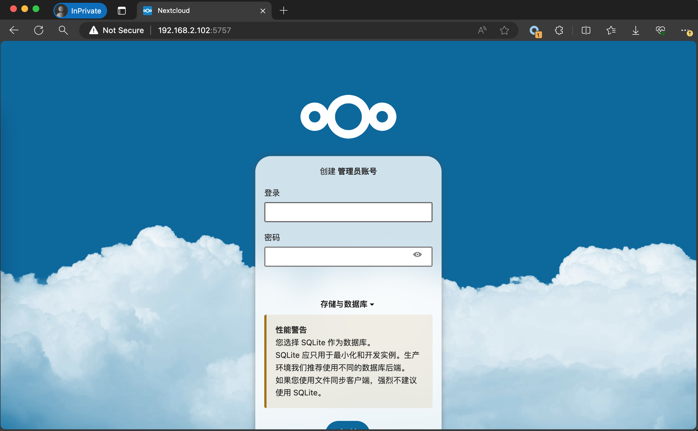
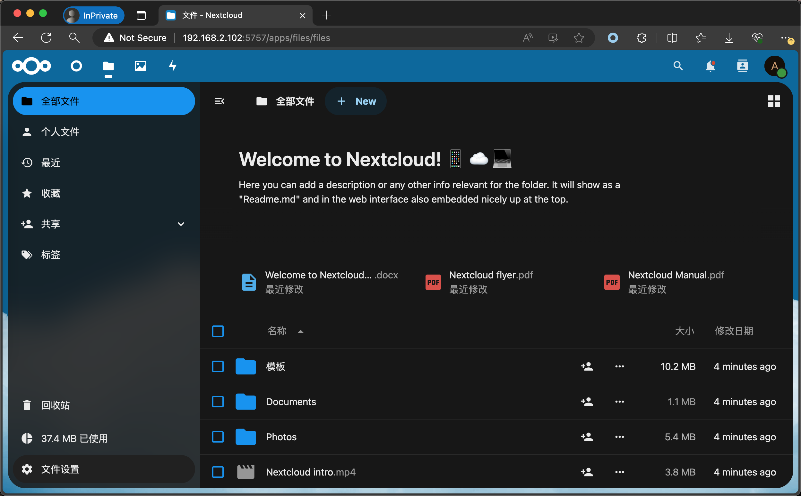

# 在PI One 中部署NextCloud私人网盘

## Nextcloud 介绍
Nextcloud是一款开源免费的私有云存储网盘项目，可以让你快速便捷地搭建一套属于自己或团队的云同步网盘，从而实现跨平台跨设备文件同步、共享、版本控制、团队协作等功能。它的客户端覆盖了Windows、Mac、Android、iOS、Linux 等各种平台，也提供了网页端以及 WebDAV接口，所以你几乎可以在各种设备上方便地访问你的云盘。

## 1、在PI One上安装docker
我们使用docker来部署NextCloud，所以我们要在PI One 上安装docker环境，安装教程见如下链接：

[在PI One中安装docker](https://docs.bit-brick.com/docs/pi-one/pi-one-software/docker)

## 2、查询并下载NextCloud镜像
执行命令
~~~
docker search nextcloud
docker pull nextcloud
~~~
演示操作
~~~
# 查询nextcloud镜像[root@docker ~]# docker search nextcloud     
NAME                             DESCRIPTION                                     STARS     OFFICIAL   AUTOMATED
nextcloud                        A safe home for all your data                   3113      [OK]
linuxserver/nextcloud            A Nextcloud container, brought to you by Lin…   480
nextcloud/all-in-one                                                             25
crazymax/nextcloud               Nextcloud image based on Alpine Linux           9
nextcloudci/server               Nextcloud server straight from GitHub master    2                    [OK]
nextcloudci/php7.2               Docker container to execute PHP 7.2 unit tes…   1                    [OK]
nextcloud/univention-app-image                                                   1
nextcloudci/php7.3               Docker container to execute PHP 7.3 unit tes…   1                    [OK]
nextcloudci/translations-app     The docker image to run our translation sync…   0                    [OK]
nextcloud/aio-talk                                                               0
nextcloud/aio-nextcloud                                                          0
nextcloud/aio-postgresql                                                         0
nextcloud/aio-apache                                                             0
nextcloud/aio-collabora                                                          0
nextcloudcookbook/testci         A repository to contain the test routines fo…   0
nextcloud/aio-redis                                                              0
nextcloudci/php7.4               Docker container for php7.4 unit tests          0
nextcloud/aio-clamav                                                             0
treehouses/nextcloud-tags                                                        0
treehouses/nextcloud                                                             0
nextcloudci/php7.1               Docker container to execute PHP 7.1 unit tes…   0                    [OK]
nextcloudci/android              Android test container                          0                    [OK]
nextcloudci/php7.0               Docker container to execute PHP 7.0 unit tes…   0                    [OK]
nextcloud/aio-onlyoffice                                                         0
nextcloudci/php8.0                                                               0

# 拉取nextcloud镜像[root@docker ~]# docker pull nextcloud
Using default tag: latestlatest: Pulling from library/nextclouda2abf6c4d29d: Pull completec5608244554d: Pull complete
2d07066487a0: Pull complete
1b6dfaf1958c: Pull complete
32c5e6a60073: Pull complete
90cf855b27cc: Pull complete
8b0f1068c586: Pull complete
53530861540e: Pull completeb088256e8218: Pull complete
29c48e642f3d: Pull completebebfd59a832e: Pull complete
3c07d6be5322: Pull complete
52a174ca2213: Pull complete
2db451f4f766: Pull complete
462c9168620c: Pull complete
5f6a7ae88b1d: Pull complete
8507904d39d6: Pull completef6dc5bb9d193: Pull completed57202c49578: Pull complete
57f778f1c66e: Pull completeDigest: sha256:bd3406506335b6621b1eb7a3d897654ac7963e3db4b91cbea3436f159655d0baStatus: Downloaded newer image for nextcloud:latest
docker.io/library/nextcloud:latest

# 查询nextcloud镜像是否下载完成[root@docker ~]# docker images | grep nextcloud
nextcloud       latest         e03d9136125c   4 months ago   969MB

~~~
    
## 3、创建并启动NextCloud容器
~~~
docker run -d --restart=always --name nextcloud -p 5757:80 nextcloud:latest

# 参数解释：
# docker run：启动容器
# -d：后台启动
# --restart=always：docker重启该容器跟着重启
# --nmae nextcloud：自定义容器名称
# -p 5757:80：将服务器的5757端口映射到容器的80端口
# nextcloud:latest：选择启动的镜像和版本
~~~

访问http://IP:5757  
本例访问http://192.168.0.1:5757 

## 4、访问NextCloudWEB界面
### 设置管理员用户名与密码

### 主界面

