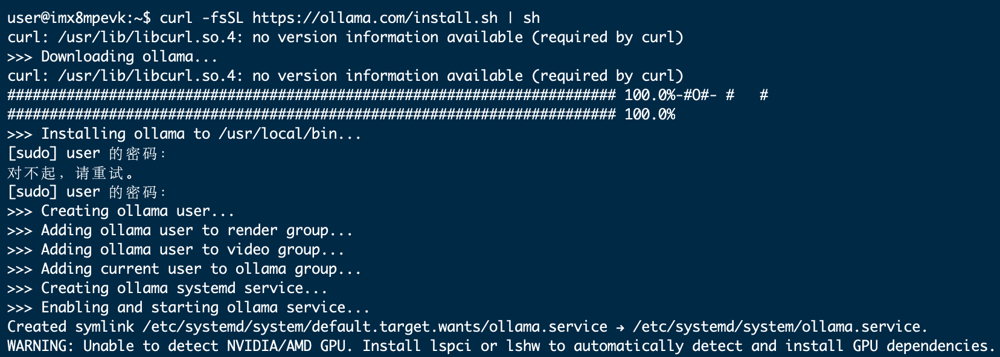
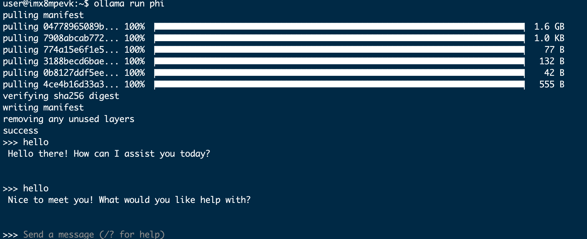

# 在PI One 上安装Ollama
## 什么是 Ollama？

Ollama 是在个人计算机上运行本地 LLM 的最佳解决方案之一，无需从头开始进行设置。只需几个命令，一切都可以顺利完成，并且在多种设备和型号上都能很好地运行。它甚至公开了一个用于模型推理的 REST API，因此您可以让它在 Raspberry Pi 上运行，并在需要时从其他应用程序和设备调用它。

## 1.安装Ollama
要在  PI One 上安装 Ollama，我们将避免使用 Docker 以节省资源。

在终端中运行：
~~~
curl https://ollama.ai/install.sh | sh
~~~
运行上述命令后，您应该会看到类似下图的内容。

由于我们使用的是 PI One，因此看到“警告：未检测到 NVIDIA GPU。Ollama 将以仅 CPU 模式运行。”

## 2. 通过命令行运行 LLM
查看官方 [Ollama 模型库](https://ollama.ai/library)，了解可使用 Ollama 运行的模型列表。在 4GB PI One 上，大于 7B 的模型无法容纳。我们使用 Phi-2，这是微软的 2.7B LLM，现在已获得 MIT 许可。

我们将使用默认的 Phi-2 模型，但您也可以随意使用此处的任何其他标签。查看Phi-2 模型页面，了解如何与其交互。

在终端中运行如下命令：
~~~
ollama run phi
~~~
一旦您看到类似于以下输出的内容，您就已经在 PI One 上运行了 LLM！就这么简单。

您可以尝试其他模型，如 Mistral、Llama-2 等，只需确保 SD 卡上有足够的空间容纳模型重量。