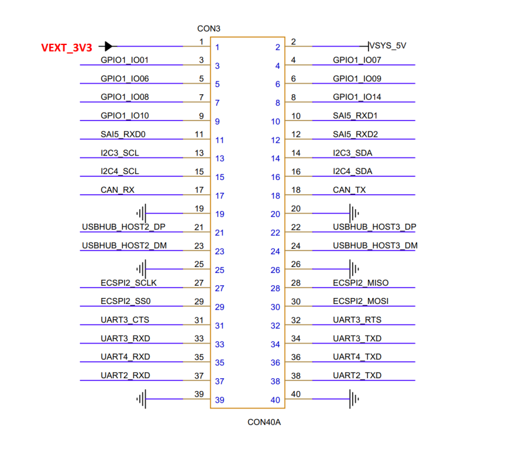

# 产品介绍

 

IMX8MP-HMI是一款基于NXP i.MX 8M Plus处理器开发设计的高性能开发板。集成四核ARM Cortex-A53和单核ARM Cortex-M7 CPU，主频最高可达1.8 GHz。集成2.3 TOPS NPU、双图像信号处理器和双核GPU引擎，支持HDMI、MIPI-DSI和LVDS显示输出，支持1080p@60fps视频编解码，适合工业自动化、智能设备、多媒体处理和边缘计算等广泛应用场景。

IMX8MP-HMI提供了丰富的接口，如USB3.0、PCIe、HDMI 2.0a、MIPI-CSI、MIPI-DSI、LVDS、5G、RTC和双千兆以太网等，满足多样化的功能扩展需求，为开发人员提供了一个灵活高效的平台，可用于快速原型设计、系统评估和早期技术验证。

## 功能框图

## 规格参数
| 参数          | 描述                                                         |
| ------------- | ------------------------------------------------------------ |
| CPU           | NXP i.MX 8M Plus, 四核ARM Cortex-A53@1.8GHz + Cortex-M7@800MHz |
| GPU           | GC520L 2D and GC7000UL 3D GPU, 支持OpenGL ES 1.1, 2.0, 3.0, OpenCL 1.2, Vulkan |
| NPU           | 2.3 TOPS                                                     |
| VPU           | 解码: 1080p@60fps(H.265/H.264/VP9/VP8)编码: 1080p@60fps(H.265/H.264) |
| RAM           | 2GB/4GB LPDDR4 SDRAM                                         |
| Flash         | 16GB/32GB eMMC                                               |
| PCIe          | 1x PCIe                                                      |
| 以太网        | 2x Gigabit Ethernet                                          |
| USB           | 2x USB3.0, 2xUSB2.0                                          |
| UART          | 3x                                                           |
| I2C           | 2x                                                           |
| SPI           | 2x                                                           |
| CAN FD        | 2x                                                           |
| PWM           | 4x                                                           |
| MIPI DSI      | 1x                                                           |
| MIPI CSI      | 1x                                                           |
| HDMI          | 1x HDMI2.0a                                                  |
| LVDS          | 1x                                                           |
| RTC           | 1x                                                           |
| 5G            | 1x                                                           |
| GPIO          | 10x                                                          |
| Audio         | 1x 3.5mm Earphone interface; 1x Speaker header               |
| 电源          | DC 12V                                                       |
| 工作温度      | -20 ~ 75 °C                                                  |
| 尺寸（长X宽） | 120 x 90mm                                                   |
| 操作系统      | Linux                                                        |

## 引脚定义

## 机械尺寸

