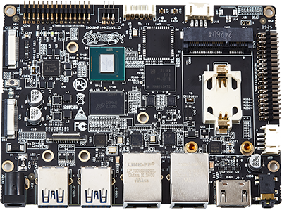
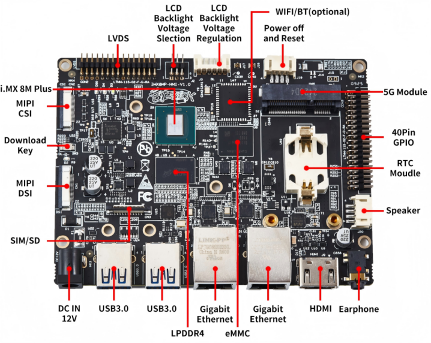
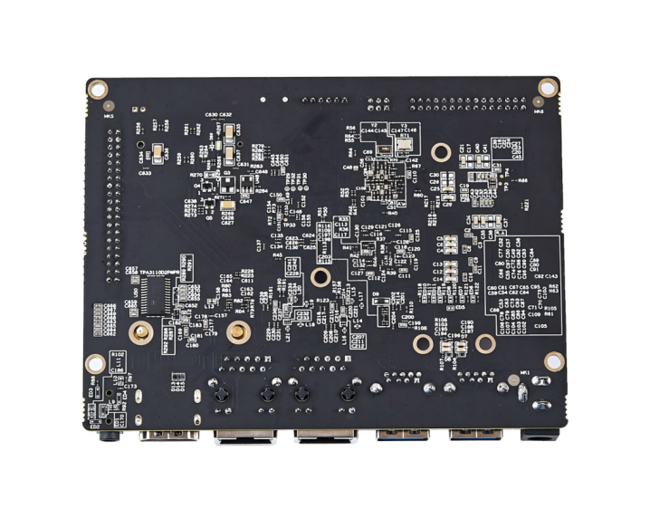
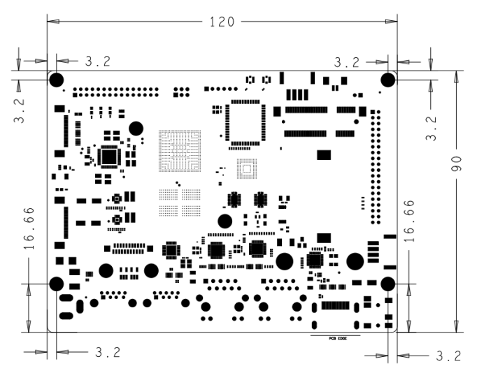

# 产品介绍

IMX8MP-HMI是一款基于NXP i.MX 8M Plus处理器开发设计的高性能开发板。集成四核ARM Cortex-A53和单核ARM Cortex-M7 CPU，主频最高可达1.8 GHz。集成2.3 TOPS NPU、双图像信号处理器和双核GPU引擎，支持HDMI、MIPI-DSI和LVDS显示输出，支持1080p@60fps视频编解码，适合工业自动化、智能设备、多媒体处理和边缘计算等广泛应用场景。

IMX8MP-HMI提供了丰富的接口，如USB3.0、PCIe、HDMI 2.0a、MIPI-CSI、MIPI-DSI、LVDS、5G、RTC和双千兆以太网等，满足多样化的功能扩展需求，为开发人员提供了一个灵活高效的平台，可用于快速原型设计、系统评估和早期技术验证。

## 功能框图

## 机械尺寸

