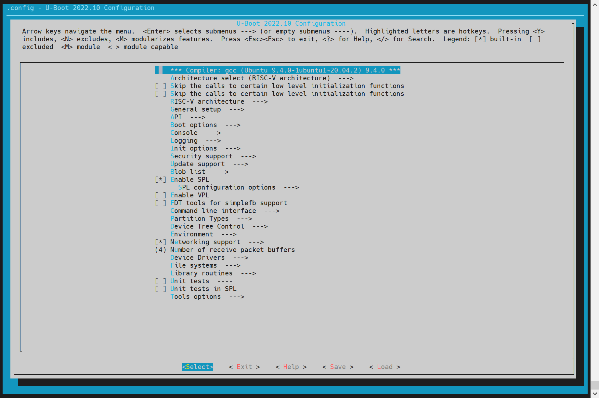
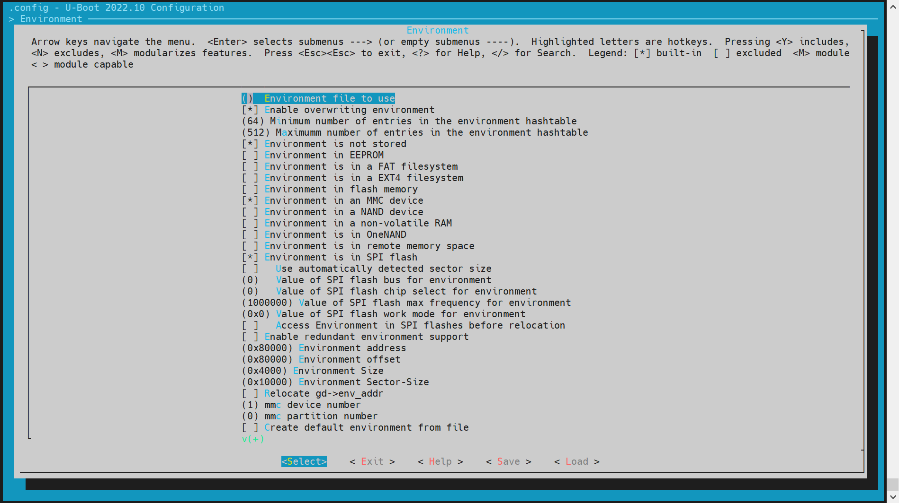
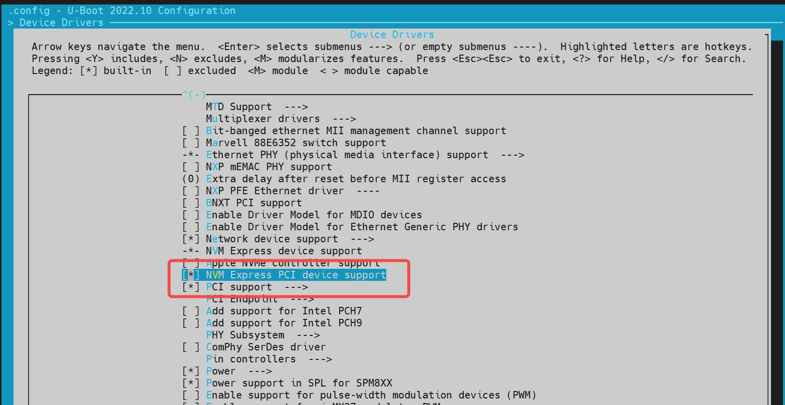
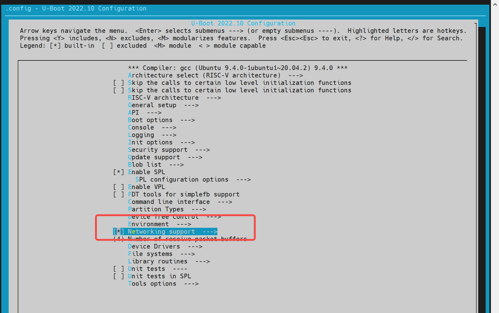
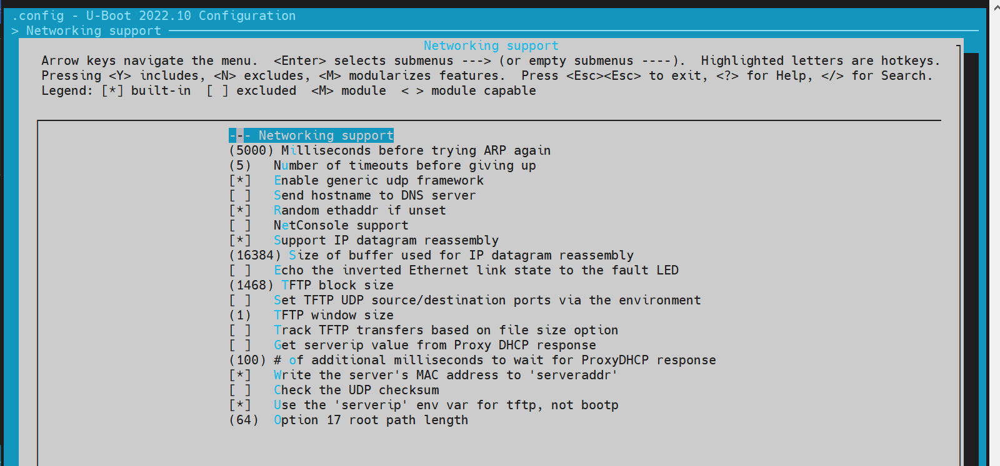
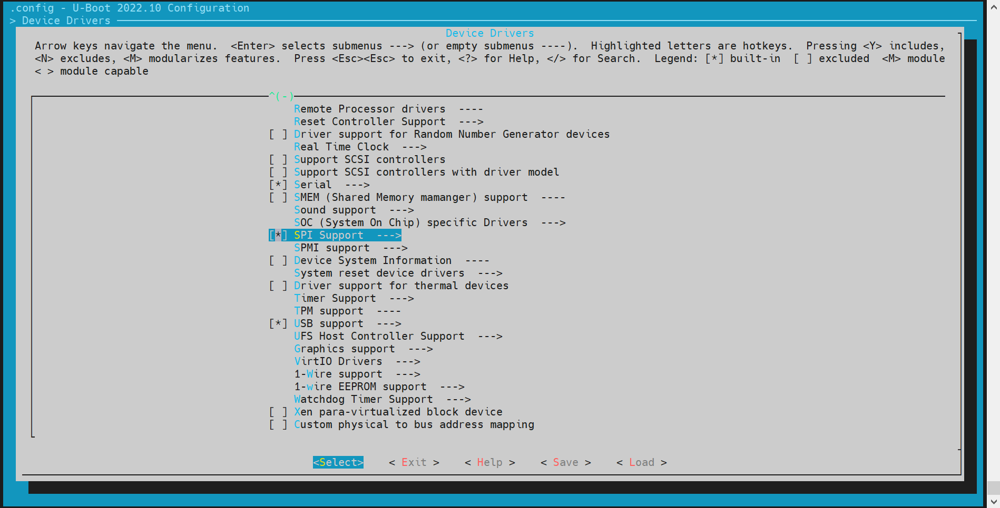
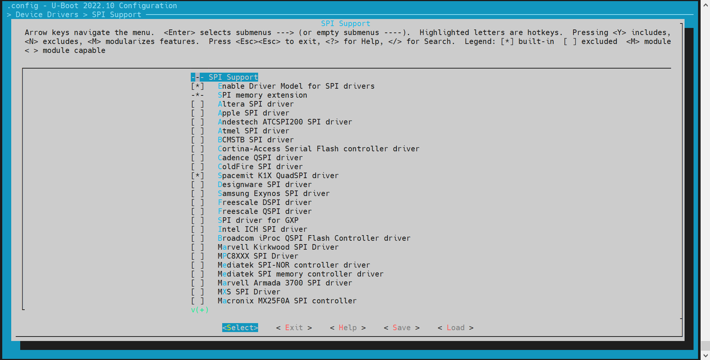

# 启动

U-Boot和OpenSBI开发调试指南。

## uboot 功能与配置

### 功能介绍

uboot 的主要功能有以下几点：

- 加载启动内核

uboot 从存储介质(emmc/sd/nand/nor/ssd 等)，加载内核镜像到内存指定位置，并启动内核。

- fastboot 刷机功能

通过 fastboot 工具，烧写镜像到指定的分区位置。

- 开机 logo

uboot 启动阶段显示启动 logo 以及 boot menu。

- 驱动调试

基于 uboot 调试设备驱动，如 mmc/spi/nand/nor/nvme 等驱动。uboot 提供 shell 命令行对各个驱动进行功能调试。

uboot 驱动在 drivers/目录下。

### 编译

本章节介绍基于 uboot 代码环境，编译生成 uboot 的镜像文件。

- 编译配置

首次编译，或者需要重新选择其他方案，则需要先选择编译配置，这里以 k1 为例：

```shell
cd ~/uboot-2022.10
make ARCH=riscv k1_defconfig -C ~/uboot-2022.10/
```

可视化更改编译配置：

```shell
make ARCH=riscv menuconfig
```



通过键盘"Y"/"N"以开启/关闭相关的功能配置。保存后会更新到 uboot 根目录的.config 文件。

- 编译 uboot

```shell
cd ~/uboot-2022.10
GCC_PREFIX=riscv64-unknown-linux-gnu-
make ARCH=riscv CROSS_COMPILE=${GCC_PREFIX} -C ~/uboot-2022.10 -j4
```

- 编译产物


```shell
~/uboot-2022.10$ ls u-boot* -l
u-boot
u-boot.bin           # uboot镜像
u-boot.dtb           # dtb文件
u-boot-dtb.bin       # 带dtb的uboot镜像
u-boot.itb           # 将u-boot-nodtb.bin和dtb打包成fit格式
u-boot-nodtb.bin
bootinfo_emmc.bin    # 用于emmc启动时记录spl位置的信息
bootinfo_sd.bin
bootinfo_spinand.bin
bootinfo_spinor.bin
FSBL.bin             # u-boot-spl.bin加上头信息。由brom加载启动
k1-x_deb1.dtb        # 方案deb1的dtb文件
k1-x_spl.dtb         # spl的dtb文件
```

### dts 配置

uboot dts 配置在目录 uboot-2022.10/arch/riscv/dts/，根据不同的方案修改该方案的 dts，如 deb1 方案。

```shell
~/uboot-2022.10$ ls arch/riscv/dts/k1*.dts -l
arch/riscv/dts/k1-x_deb1.dts
arch/riscv/dts/k1-x_deb2.dts
arch/riscv/dts/k1-x_evb.dts
arch/riscv/dts/k1-x_fpga_1x4.dts
arch/riscv/dts/k1-x_fpga_2x2.dts
arch/riscv/dts/k1-x_fpga.dts
arch/riscv/dts/k1-x_spl.dts
```

## uboot 驱动开发调试

本章节主要介绍 uboot 的驱动使用和调试方法，默认情况下所有的驱动都已经做好配置。

### boot kernel

本小节介绍 uboot 启动 kernel，以及分区的自定义配置和启动。

- 开发板上电启动后，立即按下键盘上的"s"键，进入 uboot shell
- 可通过执行 fastboot 0 进入 fastboot mode，通过电脑端的 fastboot stage Image 发送镜像到开发板。(或者其他下载镜像的方式，如 fatload 等命令)
- 执行 booti 启动 kernel(或者 bootm 启动 fit 格式镜像)

```shell
#下载kernel镜像
=> fastboot -l 0x40000000 0
Starting download of 50687488 bytes
...
downloading/uploading of 50687488 bytes finished

#电脑端执行命令
C:\Users>fastboot stage Z:\k1\output\Image
Sending 'Z:\k1\output\Image' (49499 KB)           OKAY [  1.934s]
Finished. Total time: 3.358s

#下载完成后，在uboot shell中，通过键盘输入CTRL+C退出fastboot mode。


#下载dtb
=> fastboot -l 0x50000000 0
Starting download of 33261 bytes

downloading/uploading of 33261 bytes finished

#电脑端执行命令
C:\Users>fastboot stage Z:\k1\output\k1-x_deb1.dtb
Sending 'Z:\k1\output\k1-x_deb1.dtb' (32 KB)      OKAY [  0.004s]
Finished. Total time: 0.054s
```

执行启动命令

```shell
=> booti 0x40000000 - 0x50000000
Moving Image from 0x40000000 to 0x200000, end=3d4f000
## Flattened Device Tree blob at 50000000
   Booting using the fdt blob at 0x50000000
   Using Device Tree in place at 0000000050000000, end 0000000050014896

Starting kernel ...

[    0.000000] Linux version 6.1.15+ ... ...
[    0.000000] OF: fdt: Ignoring memory range 0x0 - 0x200000
[    0.000000] Machine model: spacemit k1-x deb1 board
[    0.000000] earlycon: sbi0 at I/O port 0x0 (options '')
[    0.000000] printk: bootconsole [sbi0] enabled
```

- 通过 bootm 命令启动 fit 格式镜像

假设 emmc 中分区 5 为 fat32 文件系统。且里面保存 uImage.itb 文件，通过以下命令加载启动 kernel。

```shell
=> fatls mmc 2:5
sdh@d4281000: 74 clk wait timeout(100)
 50896911   uImage.itb
     4671   env_k1-x.txt

2 file(s), 0 dir(s)

=> fatload mmc 2:5 0x40000000 uImage.itb
50896911 bytes read in 339 ms (143.2 MiB/s)
=> bootm 0x40000000
## Loading kernel from FIT Image at 40000000 ...
Boot from fit configuration k1_deb1
   Using 'conf_2' configuration
   Trying 'kernel' kernel subimage
     Description:  Vanilla Linux kernel
     Type:         Kernel Image
     Compression:  uncompressed
     Data Start:   0x400000e8
     Data Size:    50687488 Bytes = 48.3 MiB
     Architecture: RISC-V
     OS:           Linux
     Load Address: 0x01400000
     Entry Point:  0x01400000
   Verifying Hash Integrity ... OK
## Loading fdt from FIT Image at 40000000 ...
   Using 'conf_2' configuration
   Trying 'fdt_2' fdt subimage
     Description:  Flattened Device Tree blob for k1_deb1
     Type:         Flat Device Tree
     Compression:  uncompressed
     Data Start:   0x43067c90
     Data Size:    68940 Bytes = 67.3 KiB
     Architecture: RISC-V
     Load Address: 0x28000000
   Verifying Hash Integrity ... OK
   Loading fdt from 0x43067c90 to 0x28000000
   Booting using the fdt blob at 0x28000000
   Loading Kernel Image
   Using Device Tree in place at 0000000028000000, end 0000000028013d4b

Starting kernel ...

[    0.000000] Linux version 6.1.15+ ... ...
[    0.000000] OF: fdt: Ignoring memory range 0x0 - 0x1400000
[    0.000000] Machine model: spacemit k1-x deb1 board
[    0.000000] earlycon: sbi0 at I/O port 0x0 (options '')
[    0.000000] printk: bootconsole [sbi0] enabled
```

### env

本章节介绍如何配置在 uboot 启动阶段，从指定存储介质加载 env。

- 执行 make menuconfig，进入 Environment，




目前支持可选的介质为 mmc，mtd 设备(其中 mtd 设备包括 spinor，spinand)。

env 的偏移地址需要根据分区表的配置来确定，具体可以参考刷机启动设置章节的分区表配置，默认是 0x80000。

```shell
(0x80000) Environment address       #spinor的env偏移地址
(0x80000) Environment offset        #mmc设备的env偏移地址
```

### mmc

emmc 和 sd 卡都是使用到 mmc 驱动，dev number 分别为 2、0。

- config 配置

执行 make menuconfig，进入 Device Drivers--->MMC Host controller Support，开启以下配置


- dts 配置

```c
//uboot-2022.10/arch/riscv/dts/k1-x.dtsi
         sdhci0: sdh@d4280000 {
             compatible = "spacemit,k1-x-sdhci";
             reg = <0x0 0xd4280000 0x0 0x200>;
             interrupt-parent = <&intc>;
             interrupts = <99>;
             resets = <&reset RESET_SDH_AXI>,
                      <&reset RESET_SDH0>;
             reset-names = "sdh_axi", "sdh0";
             clocks = <&ccu CLK_SDH0>,
                      <&ccu CLK_SDH_AXI>;
             clock-names = "sdh-io", "sdh-core";
             status = "disabled";
         };

         sdhci2: sdh@d4281000 {
             compatible = "spacemit,k1-x-sdhci";
             reg = <0x0 0xd4281000 0x0 0x200>;
             interrupt-parent = <&intc>;
             interrupts = <101>;
             resets = <&reset RESET_SDH_AXI>,
                      <&reset RESET_SDH2>;
             reset-names = "sdh_axi", "sdh2";
             clocks = <&ccu CLK_SDH2>,
                      <&ccu CLK_SDH_AXI>;
             clock-names = "sdh-io", "sdh-core";
             status = "disabled";
         };

//uboot-2022.10/arch/riscv/dts/k1-x_deb1.dts
&sdhci0 {
        pinctrl-names = "default";
        pinctrl-0 = <&pinctrl_mmc1 &gpio80_pmx_func0>;
        bus-width = <4>;
        cd-gpios = <&gpio 80 0>;
        cd-inverted;
        cap-sd-highspeed;
        sdh-phy-module = <0>;
        status = "okay";
};

/* eMMC */
&sdhci2 {
        bus-width = <8>;
        non-removable;
        mmc-hs400-1_8v;
        mmc-hs400-enhanced-strobe;
        sdh-phy-module = <1>;
        status = "okay";
};
```

- 调试验证

uboot shell 提供命令行调试 mmc 驱动，需要开启编译配置项 CONFIG_CMD_MMC

```shell
=> mmc list
sdh@d4280000: 0 (SD)
sdh@d4281000: 2 (eMMC)
=> mmc dev 2 #切换到emmc
switch to partitions #0, OK
mmc2(part 0) is current device

#read 0偏移的0x1000个blk_cnt到内存0x40000000
=> mmc read 0x40000000 0 0x1000

MMC read: dev # 2, block # 0, count 4096 ... 4096 blocks read: OK

#从内存地址0x40000000 写到0x1000个blk_cnt到0偏移
=> mmc write 0x40000000 0 0x1000

MMC write: dev # 2, block # 0, count 4096 ... 4096 blocks written: OK

#其他用法可参考mmc -h
```

- 常用接口

参考 cmd/mmc.c 中的接口

### nvme

nvme 驱动主要用于调试 ssd 硬盘。

- config 配置

执行 make menuconfig，进入 Device Driver，开启以下配置，




- dts 配置

```c
//uboot-2022.10/arch/riscv/dts/k1-x.dtsi
         pcie1_rc: pcie@ca400000 {
             compatible = "k1x,dwc-pcie";
             reg = <0x0 0xca400000 0x0 0x00001000>, /* dbi */
                   <0x0 0xca700000 0x0 0x0001ff24>, /* atu registers */
                   <0x0 0x90000000 0x0 0x00100000>, /* config space */
                   <0x0 0xd4282bd4 0x0 0x00000008>, /*k1x soc config addr*/
                   <0x0 0xc0c20000 0x0 0x00001000>, /* phy ahb */
                   <0x0 0xc0c10000 0x0 0x00001000>, /* phy addr */
                   <0x0 0xd4282bcc 0x0 0x00000008>, /* conf0 addr */
                   <0x0 0xc0b10000 0x0 0x00001000>; /* phy0 addr */
             reg-names = "dbi", "atu", "config", 
                            "k1x_conf", "phy_ahb", 
                            "phy_addr", "conf0_addr", 
                            "phy0_addr";

             k1x,pcie-port = <1>;
             clocks = <&ccu CLK_PCIE1>;
             clock-names = "pcie-clk";
             resets = <&reset RESET_PCIE1>;
             reset-names = "pcie-reset";

             bus-range = <0x00 0xff>;
             max-link-speed = <2>;
             num-lanes = <2>;
             num-viewport = <8>;
             device_type = "pci";
             #address-cells = <3>;
             #size-cells = <2>;
             ranges = <0x01000000 0x0 0x90100000 
                          0 0x90100000 0x0 0x100000>,
                  <0x02000000 0x0 0x90200000 
                      0 0x90200000 0x0 0x0fe00000>;

             interrupts = <142>, <146>;
             interrupt-parent = <&intc>;
             #interrupt-cells = <1>;
             interrupt-map-mask = <0 0 0 0x7>;
             interrupt-map = <0000 0 0 1 &pcie1_intc 1>, /* int_a */
                     <0000 0 0 2 &pcie1_intc 2>, /* int_b */
                     <0000 0 0 3 &pcie1_intc 3>, /* int_c */
                     <0000 0 0 4 &pcie1_intc 4>; /* int_d */
             linux,pci-domain = <1>;
             status = "disabled";
             pcie1_intc: interrupt-controller@0 {
                 interrupt-controller;
                 reg = <0 0 0 0 0>;
                 #address-cells = <0>;
                 #interrupt-cells = <1>;
             };
         };


//uboot-2022.10/arch/riscv/dts/k1-x_deb1.dts
 &pcie1_rc {
     pinctrl-names = "default";
     pinctrl-0 = <&pinctrl_pcie1_3>;
     status = "okay";
 };
```

- 调试验证

需要开启编译配置 CONFIG_CMD_NVME，调试方法如下：

```shell
=> nvme scan
=> nvme detail
Blk device 0: Optional Admin Command Support:
        Namespace Management/Attachment: no
        Firmware Commit/Image download: yes
        Format NVM: yes
        Security Send/Receive: yes
Blk device 0: Optional NVM Command Support:
        Reservation: yes
        Save/Select field in the Set/Get features: yes
        Write Zeroes: yes
        Dataset Management: yes
        Write Uncorrectable: yes
Blk device 0: Format NVM Attributes:
        Support Cryptographic Erase: No
        Support erase a particular namespace: Yes
        Support format a particular namespace: Yes
Blk device 0: LBA Format Support:
        LBA Foramt 0 Support: (current)
                Metadata Size: 0
                LBA Data Size: 512
                Relative Performance: Good
Blk device 0: End-to-End DataProtect Capabilities:
        As last eight bytes: No
        As first eight bytes: No
        Support Type3: No
        Support Type2: No
        Support Type1: No
Blk device 0: Metadata capabilities:
        As part of a separate buffer: No
        As part of an extended data LBA: No
=> nvme read/write addr blk_off blk_cnt
```

- 常用接口

参考 cmd/nvme.c 中的代码接口

### net

- config 配置

执行 make menuconfig，开启以下配置，





- dts 配置

```c
//uboot-2022.10/arch/riscv/dts/k1-x.dtsi
         eth0: ethernet@cac80000 {
             compatible = "spacemit,k1x-emac";
             reg = <0x00000000 0xCAC80000 0x00000000 0x00000420>;
             ctrl-reg = <0x3e4>;
             dline-reg = <0x3e8>;
             clocks = <&ccu CLK_EMAC0_BUS>;
             clock-names = "emac-clk";
             resets = <&reset RESET_EMAC0>;
             reset-names = "emac-reset";
             status = "disabled";
         };

//uboot-2022.10/arch/riscv/dts/k1-x_deb1.dts
 &eth0 {
     status = "okay";
     pinctrl-names = "default";
     pinctrl-0 = <&pinctrl_gmac0>;

     phy-reset-pin = <110>;

     clk_tuning_enable;
     clk-tuning-by-delayline;
     tx-phase = <90>;
     rx-phase = <73>;

     phy-mode = "rgmii";
     phy-addr = <1>;
     phy-handle = <&rgmii>;

     ref-clock-from-phy;

     mdio {
         #address-cells = <0x1>;
         #size-cells = <0x0>;
         rgmii: phy@0 {
             compatible = "ethernet-phy-id001c.c916";
             device_type = "ethernet-phy";
             reg = <0x1>;
         };
     };
 };
```

- 调试验证

需要先开启编译配置 CONFIG_CMD_NET，网线接上开发板的网口，且已经准备好 tftp 服务器(tftp 服务器的搭建方法可搜索网上资料，这里不做介绍)

```shell
=> dhcp #执行dhcp后，如果返回地址，表示与网络服务器联通。其他情况为连接失败
ethernet@cac80000 Waiting for PHY auto negotiation to complete...... done
emac_adjust_link link:1 speed:1000 duplex:full
BOOTP broadcast 1
BOOTP broadcast 2
BOOTP broadcast 3
BOOTP broadcast 4
BOOTP broadcast 5
BOOTP broadcast 6
BOOTP broadcast 7
DHCP client bound to address 10.0.92.130 (7982 ms)

=> tftpboot 0x40000000 site11/uImage.itb
ethernet@cac80000 Waiting for PHY auto negotiation to complete...... done
emac_adjust_link link:1 speed:1000 duplex:full
Using ethernet@cac80000 device
TFTP from server 10.0.92.134; our IP address is 10.0.92.130
Filename 'site11/uImage.itb'.
Load address: 0x40000000
Loading: ##############################################################
         ########
         1.1 MiB/s
done
Bytes transferred = 66900963 (3fcd3e3 hex)
=>

#启动kernel
=>bootm 0x40000000 
```

- 常用接口

参考 cmd/net.c 中的代码接口

### spi

spi 只引出一个硬件接口，所以只支持 nand 或者 nor flash。

- config 配置

执行 make menuconfig，进入 Device Drivers，开启以下配置





- dts 配置

```c
//k1-x.dtsi
/dts-v1/;

/ {
        compatible = "spacemit,k1x", "riscv";
        #address-cells = <2>;
        #size-cells = <2>;

        soc:soc {
                compatible = "simple-bus";
                #address-cells = <2>;
                #size-cells = <2>;
                ranges;

                qspi: spi@d420c000 {
                        compatible = "spacemit,k1x-qspi";
                        #address-cells = <1>;
                        #size-cells = <0>;
                        reg = <0x0 0xd420c000 0x0 0x1000>,
                              <0x0 0xb8000000 0x0 0xd00000>;
                        reg-names = "qspi-base", "qspi-mmap";
                        qspi-sfa1ad = <0xa00000>;
                        qspi-sfa2ad = <0xb00000>;
                        qspi-sfb1ad = <0xc00000>;
                        qspi-sfb2ad = <0xd00000>;
                        clocks = <&ccu CLK_QSPI>,
                                <&ccu CLK_QSPI_BUS>;
                        clock-names = "qspi_clk", "qspi_bus_clk";
                        resets = <&reset RESET_QSPI>,
                                <&reset RESET_QSPI_BUS>;
                        reset-names = "qspi_reset", "qspi_bus_reset";
                        qspi-pmuap-reg = <0xd4282860>;
                        spi-max-frequency = <26500000>;
                        qspi-id = <4>;
                        status = "disabled";
                };
        };
};

//k1-x_deb1.dts
&qspi {
        status = "okay";
        pinctrl-names = "default";
        pinctrl-0 = <&pinctrl_qspi>;
};
```

- 调试验证

开启 uboot shell 命令 sspi 的配置，CONFIG_CMD_SPI，

调试命令：

```c
sspi -h

    "SPI utility command",
    "[<bus>:]<cs>[.<mode>][@<freq>] <bit_len> <dout> - Send and receive bits\n"
    "<bus>     - Identifies the SPI bus\n"
    "<cs>      - Identifies the chip select\n"
    "<mode>    - Identifies the SPI mode to use\n"
    "<freq>    - Identifies the SPI bus frequency in Hz\n"
    "<bit_len> - Number of bits to send (base 10)\n"
    "<dout>    - Hexadecimal string that gets sent"

```

- 常用接口

参考 cmd/spi.c 里面的接口

### nand

nand 驱动是基于 spi，所以需要先开启 spi 驱动功能。

- config 配置

执行 make menuconfig，进入 Device Drivers --->MTD Support


若需要新增一个 nand flash，可以根据已支持的厂商驱动，添加该 nand flash 的 jedec id。

```shell
~/uboot-2022.10$ ls drivers/mtd/nand/spi/*.c -l
drivers/mtd/nand/spi/core.c
drivers/mtd/nand/spi/gigadevice.c
drivers/mtd/nand/spi/macronix.c
drivers/mtd/nand/spi/micron.c
drivers/mtd/nand/spi/other.c
drivers/mtd/nand/spi/toshiba.c
drivers/mtd/nand/spi/winbond.c
```

如在 gigadevice 添加新的 flash

```c
//uboot-2022.10/drivers/mtd/nand/spi/gigadevice.c
 static const struct spinand_info gigadevice_spinand_table[] = {
     SPINAND_INFO("GD5F1GQ4UExxG", 0xd1,
              NAND_MEMORG(1, 2048, 128, 64, 1024, 1, 1, 1),
              NAND_ECCREQ(8, 512),
              SPINAND_INFO_OP_VARIANTS(&gd5fxgq4_read_cache_variants,
                           &write_cache_variants,
                           &update_cache_variants),
              0,
              SPINAND_ECCINFO(&gd5fxgqxxexxg_ooblayout,
                      gd5fxgq4xexxg_ecc_get_status)),
     SPINAND_INFO("GD5F1GQ5UExxG", 0x51,
              NAND_MEMORG(1, 2048, 128, 64, 1024, 1, 1, 1),
              NAND_ECCREQ(4, 512),
              SPINAND_INFO_OP_VARIANTS(&gd5f1gq5_read_cache_variants,
                           &write_cache_variants,
                           &update_cache_variants),
              0,
              SPINAND_ECCINFO(&gd5fxgqxxexxg_ooblayout,
                      gd5fxgq5xexxg_ecc_get_status)),
 };
```

如果为其他品牌的 nand flash，可参考 gigadevice 的驱动重新实现。

- dts 配置

nand 驱动是挂在 spi 驱动下，所以 dts 需要配置在 spi 节点下面。

```c
 &qspi {
     status = "okay";
     pinctrl-names = "default";
     pinctrl-0 = <&pinctrl_qspi>;

     spi-nand@0 {
         compatible = "spi-nand";
         reg = <0>;
         spi-tx-bus-width = <1>;
         spi-rx-bus-width = <1>;
         spi-max-frequency = <6250000>;
         u-boot,dm-spl;
         status = "okay";
     };
 };
```

- 调试验证

nand 驱动可以基于 mtd 命令调试

```shell
=> mtd
mtd - MTD utils

Usage:
mtd - generic operations on memory technology devices

mtd list
mtd read[.raw][.oob]                  <name> <addr> [<off> [<size>]]
mtd dump[.raw][.oob]                  <name>        [<off> [<size>]]
mtd write[.raw][.oob][.dontskipff]    <name> <addr> [<off> [<size>]]
mtd erase[.dontskipbad]               <name>        [<off> [<size>]]

Specific functions:
mtd bad                               <name>

With:
        <name>: NAND partition/chip name (or corresponding DM device name or OF path)
        <addr>: user address from/to which data will be retrieved/stored
        <off>: offset in <name> in bytes (default: start of the part)
                * must be block-aligned for erase
                * must be page-aligned otherwise
        <size>: length of the operation in bytes (default: the entire device)
                * must be a multiple of a block for erase
                * must be a multiple of a page otherwise (special case: default is a page with dump)

The .dontskipff option forces writing empty pages, don't use it if unsure.

=> mtd list
[RESET]spacemit_reset_set assert=1, id=77
[RESET]spacemit_reset_set assert=1, id=78
clk qspi_bus_clk already disabled
clk qspi_clk already disabled
ccu_mix_set_rate of qspi_clk timeout
[RESET]spacemit_reset_set assert=0, id=77
[RESET]spacemit_reset_set assert=0, id=78
SF: Detected w25q32 with page size 256 Bytes, erase size 64 KiB, total 4 MiB
Could not find a valid device for spi-nand
List of MTD devices:
* nor0
  - device: flash@0
  - parent: spi@d420c000
  - driver: jedec_spi_nor
  - path: /soc/spi@d420c000/flash@0
  - type: NOR flash
  - block size: 0x10000 bytes
  - min I/O: 0x1 bytes
  - 0x000000000000-0x000000400000 : "nor0"
          - 0x0000000a0000-0x000000100000 : "opensbi"
          - 0x000000100000-0x000000300000 : "uboot"
=> mtd read/write partname addr off size
```

- 常用接口

参考 cmd/mtd.c 的代码接口

### nor

nor 驱动是基于 spi 驱动下，所以需要先开启 spi 驱动功能。

- config 配置

执行 make menuconfig，进入 Device Drivers --->MTD Support --->SPI Flash Support，将以下配置打开(默认情况下已开启)。示例以开启 winbond 的 nor flash 为例。


添加一个新的 spi nor flash:

- 对于上图已支持的厂商 nor flash，可以直接开启对应的编译配置，如 gigadevice 厂商的 flash。
- spi flash 的 jedec id 列表在 uboot-2022.10/drivers/mtd/spi/spi-nor-ids.c 里面维护。如果列表里面没有特定的 nor flash jedec id，则可以自行添加 jedec id 到列表中（jedec id 为 spi flash 对应的厂商代号，可根据 nor flash 的 datasheet 查找 manufac 关键字，如 winbond 为 0xfe）
- dts 配置

nor 驱动依赖 spi 驱动接口，spi 驱动请参考 spi 子章节。需要添加 dts 节点，如下：

```c
//k1/uboot-2022.10/arch/riscv/dts/k1-x_deb1.dts
 &qspi {
     status = "okay";
     pinctrl-names = "default";
     pinctrl-0 = <&pinctrl_qspi>;

     flash@0 {
         compatible = "jedec,spi-nor";
         reg = <0>;
         spi-max-frequency = <26500000>;
         m25p,fast-read;
         broken-flash-reset;
         status = "okay";
     };
 };
```

- 调试验证

可基于 uboot 命令行的 mtd/sf 命令调试。编译配置需要开启 CONFIG_CMD_MTD=y，CONFIG_CMD_SF

基于 mtd 命令读写 nor flash：

```shell
=> mtd list
List of MTD devices:
* nor0
  - device: flash@0
  - parent: spi@d420c000
  - driver: jedec_spi_nor
  - path: /soc/spi@d420c000/flash@0
  - type: NOR flash
  - block size: 0x1000 bytes
  - min I/O: 0x1 bytes
  - 0x000000000000-0x000000400000 : "nor0"
          - 0x0000000a0000-0x0000000e0000 : "opensbi"
          - 0x000000100000-0x000000200000 : "uboot"
=>

=> mtd
mtd - MTD utils

Usage:
mtd - generic operations on memory technology devices

mtd list
mtd read[.raw][.oob]                  <name> <addr> [<off> [<size>]]
mtd dump[.raw][.oob]                  <name>        [<off> [<size>]]
mtd write[.raw][.oob][.dontskipff]    <name> <addr> [<off> [<size>]]
mtd erase[.dontskipbad]               <name>        [<off> [<size>]]

Specific functions:
mtd bad                               <name>

With:
        <name>: NAND partition/chip name (or corresponding DM device name or OF path)
        <addr>: user address from/to which data will be retrieved/stored
        <off>: offset in <name> in bytes (default: start of the part)
                * must be block-aligned for erase
                * must be page-aligned otherwise
        <size>: length of the operation in bytes (default: the entire device)
                * must be a multiple of a block for erase
                * must be a multiple of a page otherwise (special case: default is a page with dump)

The .dontskipff option forces writing empty pages, don't use it if unsure.

=>
=> mtd read uboot 0x40000000
Reading 1048576 byte(s) at offset 0x00000000
=> mtd dump uboot 0 0x10
Reading 16 byte(s) at offset 0x00000000

Dump 16 data bytes from 0x0:
0x00000000:     d0 0d fe ed 00 0d e8 95  00 00 00 38 00 0d e4 44
=>
```

基于 sf 命令读写 nor flash

```shell
=> sf
sf - SPI flash sub-system

Usage:
sf probe [[bus:]cs] [hz] [mode] - init flash device on given SPI bus
                                  and chip select
sf read addr offset|partition len       - read `len' bytes starting at
                                          `offset' or from start of mtd
                                          `partition'to memory at `addr'
sf write addr offset|partition len      - write `len' bytes from memory
                                          at `addr' to flash at `offset'
                                          or to start of mtd `partition'
sf erase offset|partition [+]len        - erase `len' bytes from `offset'
                                          or from start of mtd `partition'
                                         `+len' round up `len' to block size
sf update addr offset|partition len     - erase and write `len' bytes from memory
                                          at `addr' to flash at `offset'
                                          or to start of mtd `partition'
sf protect lock/unlock sector len       - protect/unprotect 'len' bytes starting
                                          at address 'sector'
=> sf probe
SF: Detected w25q32 with page size 256 Bytes, erase size 4 KiB, total 4 MiB
=> sf read 0x40000000 0 0x10
device 0 offset 0x0, size 0x10
SF: 16 bytes @ 0x0 Read: OK
=>
```

- 常用接口

```c
include <spi.h>
#include <spi_flash.h>

struct udevice *new, *bus_dev;
int ret;
static struct spi_flash *flash;

//bus,cs对应spi的bus和cs编号，如0，0
ret = spi_find_bus_and_cs(bus, cs, &bus_dev, &new);
flash = spi_flash_probe(bus, cs, speed, mode);

ret = spi_flash_read(flash, offset, len, buf);
```

### hdmi

本小节主要介绍如何开启 hdmi 驱动。

- config 配置

执行 make uboot_menuconfig，即进入 Device Drivers -> Graphics support，将以下配置打开(默认情况下已开启)。


- dts 配置

```c
&dpu {
        status = "okay";
};

&hdmi {
        pinctrl-names = "default";
        pinctrl-0 = <&pinctrl_hdmi_0>;
        status = "okay";
};
```

### boot logo

本小节主要介绍如何在 uboot 启动阶段显示 bootlogo。

- config 配置

执行 make menuconfig，将以下配置打开。

1. 首先打开 uboot 下 hdmi 支持，参考 5.12 小结。
2. 再打开 uboot 下 bootlogo 支持，进入 Device Drivers -> Graphics support，开启以下选项。


- env 配置

在 uboot-2022.10\include\configs 目录下的 k1-x.h 增加 bootlogo 所需的 3 个 env 变量：splashimage、splashpos、splashfile。

```c
//uboot-2022.10/include/configs/k1-x.h
    ... ...
    ... ...
 #define CONFIG_EXTRA_ENV_SETTINGS \
     "fdt_high=0xffffffffffffffff\0" \
     "initrd_high=0xffffffffffffffff\0" \
        ... ...
        ... ...
     "splashimage=" __stringify(CONFIG_FASTBOOT_BUF_ADDR) "\0" \
     "splashpos=m,m\0" \
     "splashfile=k1-x.bmp\0" \

        ... ...
        ... ...
     BOOTENV_DEVICE_CONFIG \
     BOOTENV

 #endif /* __CONFIG_H */
```

其中 splashimage 代表 bootlogo 图片加载到内存的地址;

splashpos 代表图片显示的位置，“m,m”代表图片显示在屏幕正中间;

splashfile 指将要显示的 bmp 文件名，这个图片需要放在在 bootfs 所在的分区。

- 打包.bmp 图片进 bootfs

将要显示的 bmp 图片打包进 bootfs：

将 k1-x.bmp 文件放在./buildroot-ext/board/spacemit/k1 目录下，文件名要和 buildroot-ext/board/spacemit/k1/prepare_img.sh 中的 UBOOT_LOGO_FILE 和以及环境变量 splashfile 保持一致，如 k1-x.bmp。

在编译打包后，bmp 图片将被打包进 bootfs。

```shell
//buildroot-ext/board/spacemit/k1/prepare_img.sh
#!/bin/bash

######################## Prepare sub-iamges and pack ####################
#$0 is this file path
#$1 is buildroot output images dir

IMGS_DIR=$1
DEVICE_DIR=$(dirname $0)

... ...

UBOOT_LOGO_FILE="$DEVICE_DIR/k1-x.bmp"

```

- 如何修改 bootlogo

1. 直接替换 buildroot-ext/board/spacemit/k1/目录中的 k1-x.bmp，或根据上述描述新增图片

### boot menu

本小节主要介绍开启 uboot 的 bootmenu 功能。

- config 配置

执行 make menuconfig，进入 Command line interface > Boot commands，将以下配置打开


再进入 Boot options > Autoboot options 开启以下选项


- env 配置

buildroot-ext/board/spacemit/k1/env_k1-x.txt 中需要添加 bootdelay 和 bootmenu_delay，例如 bootdelay=5，bootmenu_delay=5,其中 5 代表 bootmenu 的等待时间，单位为秒。

```c
//buildroot-ext/board/spacemit/k1/env_k1-x.txt
bootdelay=5

# Boot menu definitions
boot_default=echo "Current Boot Device: ${boot_device}"
flash_default=echo "Returning to Boot Menu..."
spacemit_flashing_usb=echo "recovery from usb...... "; \
                      spacemit_flashing usb;
spacemit_flashing_mmc=echo "recovery from mmc...... " \
                      spacemit_flashing mmc;
spacemit_flashing_net=echo "recovery from net...... " \
                      spacemit_flashing net;
bootmenu_delay=5
bootmenu_0="-------- Boot Options --------"=run boot_default
bootmenu_1="Boot from Nor"=run nor_boot
bootmenu_2="Boot from Nand"=run nand_boot
bootmenu_3="Boot from MMC"=run try_mmc
bootmenu_4="Autoboot"=run autoboot
bootmenu_5="Show current Boot Device"=run boot_default
bootmenu_6="-------- Flash Options --------"=run flash_default
bootmenu_7="recovery from usb"=run spacemit_flashing_usb
bootmenu_8="recovery from mmc"=run spacemit_flashing_mmc
bootmenu_9="recovery from net"=run spacemit_flashing_net
```

- 进入 bootmenu

上电后按住键盘 Esc 键进入 bootmenu

### fastboot command

本小节主要介绍 k1-deb1 方案支持的 fastboot command。

- 编译配置

执行 make menuconfig，进入 Device Drivers --->Fastboot support，开启以下编译配置


fastboot 依赖 usb 驱动，需要开启 usb 的配置的 USB support。


- 进入 fastboot mode

1. 可以通过系统启动后按"s"键进入 uboot shell，执行 fastboot 0 进入 fastboot 模式。

系统默认的 fastboot buffer addr/size 为宏定义 CONFIG_FASTBOOT_BUF_ADDR/CONFIG_FASTBOOT_BUF_SIZE

```shell
#或者fastboot -l 0x30000000 -s 0x10000000 0，指定buff addr/size
=> fastboot 0
k1xci_udc: phy_init
k1xci_udc probe
k1xci_udc: pullup 1
-- suspend --
handle setup GET_DESCRIPTOR, 0x80, 0x6 index 0x0 value 0x100 length 0x40
handle setup SET_ADDRESS, 0x0, 0x5 index 0x0 value 0x22 length 0x0
handle setup GET_DESCRIPTOR, 0x80, 0x6 index 0x0 value 0x100 length 0x12
..
```

1. 设备启动到 bianbu os 后，发送 adb reboot bootloader 命令，系统将重启进入 fastboot 模式

- 支持的 fastboot command

电脑端的 fastboot 环境配置，请参考电脑环境安装章节。

```shell
#fastboot原生协议命令
fastboot devices              #显示可用的设备
fastboot reboot               #重启设备
fastboot getvar [version/product/serialno/max-download-size]
fastboot flash partname image #烧写image镜像到partname分区
fastboot erase partname       #擦除partname分区
fastboot stage file           #下载文件file到内存的buff addr

#oem厂商自定义的命令和功能
fastboot getvar [mtd-size/blk-size] #获取mtd/blk设备size，没有则返回NULL
fastboot oem read part              #读取part中的数据到buff addr
fastboot get_staged file       #上传数据并命名为file。依赖oem read part命令
```

### 文件系统

- fat

```shell
=> fat
  fatinfo fatload fatls fatmkdir fatrm fatsize fatwrite
=> fatls mmc 2:5
 50896911   uImage.itb
     4671   env_k1-x.txt

2 file(s), 0 dir(s)

=> fatload mmc 2:5 0x40000000 uImage.itb #load uImage.itb到0x40000000
50896911 bytes read in 339 ms (143.2 MiB/s)
=>
```

- ext4

类似 fat 指令

```shell
=> ext4
  ext4load ext4ls ext4size
=> ext4load
ext4load - load binary file from a Ext4 filesystem

Usage:
ext4load <interface> [<dev[:part]> [addr [filename [bytes [pos]]]]]
    - load binary file 'filename' from 'dev' on 'interface'
      to address 'addr' from ext4 filesystem
=>
```

### 其他 shell 命令

常用命令，常用工具

```shell
printenv  - print environment variables
md        - memory display
mw        - memory write (fill)
fdt       - flattened device tree utility commands


help      - print command description/usage
```

- fdt

fdt 命令主要用于打印 dts 内容，如 uboot 启动后当前加载的 dtb 文件

```shell
=> fdt
fdt - flattened device tree utility commands

Usage:
fdt addr [-c] [-q] <addr> [<size>]  - Set the [control] fdt location to <addr>
fdt move   <fdt> <newaddr> <length> - Copy the fdt to <addr> and make it active
fdt resize [<extrasize>]            - Resize fdt to size + padding to 4k addr + some optional <extrasize> if needed
fdt print  <path> [<prop>]          - Recursive print starting at <path>
fdt list   <path> [<prop>]          - Print one level starting at <path>
fdt get value <var> <path> <prop> [<index>] - Get <property> and store in <var>
                                      In case of stringlist property, use optional <index>
                                      to select string within the stringlist. Default is 0.
fdt get name <var> <path> <index>   - Get name of node <index> and store in <var>
fdt get addr <var> <path> <prop>    - Get start address of <property> and store in <var>
fdt get size <var> <path> [<prop>]  - Get size of [<property>] or num nodes and store in <var>
fdt set    <path> <prop> [<val>]    - Set <property> [to <val>]
fdt mknode <path> <node>            - Create a new node after <path>
fdt rm     <path> [<prop>]          - Delete the node or <property>
fdt header [get <var> <member>]     - Display header info
                                      get - get header member <member> and store it in <var>
fdt bootcpu <id>                    - Set boot cpuid
fdt memory <addr> <size>            - Add/Update memory node
fdt rsvmem print                    - Show current mem reserves
fdt rsvmem add <addr> <size>        - Add a mem reserve
fdt rsvmem delete <index>           - Delete a mem reserves
fdt chosen [<start> <size>]         - Add/update the /chosen branch in the tree
                                        <start>/<size> - initrd start addr/size
NOTE: Dereference aliases by omitting the leading '/', e.g. fdt print ethernet0.
=>

=> fdt addr $fdtcontroladdr
=> fdt print
/ {
        compatible = "spacemit,k1x", "riscv";
        #address-cells = <0x00000002>;
        #size-cells = <0x00000002>;
        model = "spacemit k1-x deb1 board";
... ...
        memory@0 {
                device_type = "memory";
                reg = <0x00000000 0x00000000 0x00000000 0x80000000>;
        };
        chosen {
                bootargs = "earlycon=sbi console=ttyS0,115200 debug loglevel=8,initcall_debug=1 rdinit=/init.tmp";
                stdout-path = "serial0:115200n8";
        };
};

=> fdt print /chosen
chosen {
        bootargs = "earlycon=sbi console=ttyS0,115200 debug loglevel=8,initcall_debug=1 rdinit=/init.tmp";
        stdout-path = "serial0:115200n8";
};
=>
```

- shell 命令

uboot 支持 shell 风格的命令，如 if/fi，echo 等。

```shell
=> if test ${boot_device} = nand; then echo "nand boot"; else echo "not nand boot";fi
not nand boot
=> printenv boot_device
boot_device=nor
=> if test ${boot_device} = nor; then echo "nor boot"; else echo "not nor boot";fi
nor boot
=>
```

## opensbi 功能与配置

### opensbi 编译

```shell
cd ~/opensbi/

#注意，这里的编译工具链需要为spacemit提供，非spacemit提供的可能会引起编译异常
GCC_PREFIX=riscv64-unknown-linux-gnu-

CROSS_COMPILE=${GCC_PREFIX} PLATFORM=generic \
PLATFORM_DEFCONFIG=k1-x_deb1_defconfig \
PLATFORM_RISCV_ISA=rv64gc \
FW_TEXT_START=0x0  \
make
```

### 生成的编译文件如下所示

```shell
~/opensbi$ ls build/platform/generic/firmware/ -l
fw_dynamic.bin     #dynamic镜像跳转会传递配置参数
fw_dynamic.elf
fw_dynamic.elf.dep
fw_dynamic.itb     #将fw_dynamic.bin打包成fit格式
fw_dynamic.its
fw_dynamic.o
fw_jump.bin       #jump镜像仅做跳转
fw_payload.bin    #payload镜像会包含uboot镜像
```

### opensbi 功能配置

可以通过执行 menuconfig，开启或关闭某些功能

```shell
make PLATFORM=generic PLATFORM_DEFCONFIG=k1-x_deb1_defconfig menuconfig
```


### 烧写 opensbi 镜像

对于已正常启动的设备，可以基于 fastboot 单独烧写 opensbi 镜像

```shell
#设备通过adb reboot bootloader或者上电后长按键盘"s"进入uboot，
#在uboot shell输入fastboot 0
#进入fastboot mode后，可以通过fastboot工具烧写镜像

#工具端命令

#烧写opensbi镜像
fastboot flash opensbi ~/opensbi/fw_dynamic.itb
```

## 启动设置

本小节介绍不同的存储介质的配置方式。对于所有的存储介质启动，从板子上电后的启动流程都如下图所示：


根据硬件的 boot pin select，软件上会选择对应存储介质的驱动介质启动下一级镜像。具体的 boot pin select 在刷机章节做介绍。

K1 上电启动后，会先 try boot from sd，然后根据 boot pin select，从 emmc 或者 nand 或者 nor 等存储介质加载 uboot 和 opensbi 的镜像。

以下小节将介绍 spl 和 uboot 两个阶段的配置，包括分区表配置，menuconfig 配置，dts 等

对于分区表配置，mtd 存储介质(nand/nor flash)会以 partition_2M.json 等容量的形式表示，blk 设备以 partition_universal.json 命名。分区表存放在 buildroot-ext/board/spacemit/k1/flash_config/partition_xxx.json，

注意：

1. 分区表以 json 格式编写，所有分区的定义都在 partitions 列表中。
2. 每个分区的 name/size 为必选项。offset/image 为可选。如果没有 offset，则以前面的所有分区的 size 之和为 offset。如果没有 image，则不会烧写但会保留该分区。
3. bootinfo 分区为必选项，不能更改。主要作用是引导 brom 加载 FSBL.bin 镜像。
4. fsbl 为必选项，由 bootinfo 指定偏移地址，且可以添加 fsbl_1 备份分区。FSBL.bin 由 u-boot-spl.bin 加上地址信息等头信息组成。
5. env 分区会跟 uboot 的 env 加载相关。

### sd 启动配置

默认都会 try boot from sd，失败后再 try 其他介质。需要确保 uboot 已开启 mmc 驱动配置，具体的 mmc 驱动配置可参考 uboot 驱动开发调试的 mmc 章节。

- 分区表配置

分区表保存在 buildroot-ext/board/spacemit/k1/partition_universal.json。其中 bootinfo 不作为一个显式的分区，用于保存启动介质相关的信息。

```json
{
  "version": "1.0",
  "format": "gpt",
  "partitions": [
    {
      "name": "bootinfo",
      "offset": "0",
      "size": "80B",
      "image": "factory/bootinfo_sd.bin"
    },
    {
      "name": "fsbl",
      "offset": "256K",
      "size": "256K",
      "image": "factory/FSBL.bin"
    },
    {
      "name": "env",
      "offset": "512K",
      "size": "128K"
    },
    {
      "name": "opensbi",
      "offset": "1M",
      "size": "1M",
      "image": "opensbi.itb"
    },
    {
      "name": "uboot",
      "offset": "2M",
      "size": "2M",
      "image": "u-boot.itb"
    },
    {
      "name": "bootfs",
      "offset": "4M",
      "size": "128M",
      "image": "bootfs.img"
    },
    {
      "name": "rootfs",
      "size": "-"
    }
  ]
}
```

- spl 配置

执行 make uboot_menuconfig，选择 SPL configuration options


开启 MMC Raw mode: by partition，Support MMC（键盘输入 Y 表示是选中，N 表示取消）

Partition to use to load U-Boot from 表示从哪一个分区加载下一级启动镜像，具体要根据分区表来判定。

K1 方案默认独立加载 opensbi 和 uboot，且从 mmc 的 opensbi，uboot 分区分别加载镜像文件。


注意：

若支持 opensbi/uboot 单独加载启动的，需要开启 Support loading from mtd device。第一个 partition 必须是 opensbi，其次是 uboot。spl 会先根据分区表加载镜像，如果加载失败会根据分区号加载镜像。

分区名和分区编号位置要与分区表一致。

- spl-dts 配置

spl 的 dts 需要使能 mmc 驱动，如下 dts 配置所示

```c
//uboot-2022.10/arch/riscv/dts/k1-x_spl.dts
        /* eMMC */
        sdh@d4281000 {
                bus-width = <8>;
                non-removable;
                mmc-hs400-1_8v;
                mmc-hs400-enhanced-strobe;
                sdh-phy-module = <1>;
                status = "okay";
                u-boot,dm-spl;
        };
```

### emmc 启动配置

emmc 与 sd 都是用到 mmc 驱动，uboot 的代码流程上会根据启动的 boot pin select 选择 emmc 或 sd。

启动配置同 sd 的启动配置。

### nor+ssd 启动配置

对于 nor 介质启动，k1 会提供 nor(u-boot-spl/uboot/opensbi)+ssd(bootfs/rootfs)或者纯 nor(u-boot-spl/uboot/opensbi/kernel)启动。下面将介绍 nor+ssd 启动方案配置。

请确保 nor，spi，nvme 等驱动配置均正常开启。

- 分区表配置

nor 分区表，如 buildroot-ext/board/spacemit/k1/partition_4M.json。对于 nand/nor 设备，分区表都是以 partiton_xM.json 命名，且需要根据实际的 flash 容量重命名，否则会导致刷机时找不到对应的分区表。

Nor flash 分区表修改：

1.分区起始地址和 size 默认以 64KB 对齐（对应 erasesize 为 64KB）。

2.如果起始地址和 size 需要更改成 4KB 对齐，则要开启 uboot 的编译配置"CONFIG_SPI_FLASH_USE_4K_SECTORS "

```json
//buildroot-ext/board/spacemit/k1/partition_4M.json
{
  "version": "1.0",
  "format": "mtd",
  "partitions": [
    {
      "name": "bootinfo",
      "offset": "0",
      "size": "64K",
      "image": "factory/bootinfo_spinor.bin"
    },
    {
      "name": "fsbl",
      "offset": "64K",
      "size": "256K",
      "image": "factory/FSBL.bin"
    },
    {
      "name": "env",
      "offset": "512K",
      "size": "128K",
      "image": "env.bin"
    },
    {
      "name": "opensbi",
      "offset": "640K",
      "size": "384K",
      "image": "opensbi.itb"
    },
    {
      "name": "uboot",
      "offset": "1M",
      "size": "1M",
      "image": "u-boot.itb"
    }
  ]
}
```

ssd 分区表。对于 blk 设备的分区表，都是 partition_universal.json。此时 bootinfo、fsbl、env、opensbi、uboot 等分区以及里面的数据不会影响到正常的启动。

```json
//buildroot-ext/board/spacemit/k1/partition_universal.json
{
  "version": "1.0",
  "format": "gpt",
  "partitions": [
    {
      "name": "bootinfo",
      "offset": "0",
      "size": "80B",
      "image": "factory/bootinfo_sd.bin"
    },
    {
      "name": "fsbl",
      "offset": "256K",
      "size": "256K",
      "image": "factory/FSBL.bin"
    },
    {
      "name": "env",
      "offset": "512K",
      "size": "128K"
    },
    {
      "name": "opensbi",
      "offset": "1M",
      "size": "1M",
      "image": "opensbi.itb"
    },
    {
      "name": "uboot",
      "offset": "2M",
      "size": "2M",
      "image": "u-boot.itb"
    },
    {
      "name": "bootfs",
      "offset": "4M",
      "size": "128M",
      "image": "bootfs.img"
    },
    {
      "name": "rootfs",
      "size": "-"
    }
  ]
}
```

- spl 配置

执行 make uboot_menuconfig，选择 SPL configuration options


开启“Support MTD drivers”、“Support SPI DM drivers in SPL”、“Support SPI drivers”、“Support SPI flash drivers”、“Support for SPI flash MTD drivers in SPL”、“Support loading from mtd device”，

“Partition name to use to load U-Boot from”与分区表中的分区名保持一致。

如果开启 opensbi/uboot 独立镜像。则需要开启“Second partition to use to load U-Boot from”，且必须要保持 opensbi/uboot 分区为 first/second 的顺序。


对于 mtd 设备，需要开启 env，以确保 spl 启动后能从 env 获取 mtd 分区信息

执行 make uboot_menuconfig，选择 Environment，选择开启 spi 的 env 加载。这里的 env 偏移地址需要与分区表的 env 分区保持一致，如 0x80000。


spi flash 驱动需要适配硬件上的 spi flash 对应厂商的型号。在 menuconfig 上选择对应的厂商 manufactureID

执行 make uboot_menuconfig，选择 Device Drivers--->MTD Support--->SPI Flash Support

根据硬件的 spi flash 厂商，选择对应的驱动程序。


如果驱动里面都没有，可以在代码上直接添加。flash_name 可以自定义，一般为硬件 flash 名称，0x1f4501 为该 flash 的 jedecid，其他参数可以根据该硬件的 flash 添加。

```c
//uboot-2022.10/drivers/mtd/spi/spi-nor-ids.c
const struct flash_info spi_nor_ids[] = {
     { INFO("flash_name",    0x1f4501, 0, 64 * 1024,  16, SECT_4K) },

```

- blk 设备配置

执行 make uboot_menuconfig，选择 Device Drivers --->Fastboot support

选择 Support blk device，这里支持是 ssd/emmc 等 blk 设备，如 ssd 对应的是 nvme，emmc 对应是 mmc。


- spl-dts 配置

```c
//uboot-2022.10/arch/riscv/dts/k1-x_spl.dts
        spi@d420c000 {
                status = "okay";
                pinctrl-names = "default";
                pinctrl-0 = <&pinctrl_qspi>;
                u-boot,dm-spl;

                spi-max-frequency = <15140000>;
                flash@0 {
                        compatible = "jedec,spi-nor";
                        reg = <0>;
                        spi-max-frequency = <26500000>;

                        m25p,fast-read;
                        broken-flash-reset;
                        u-boot,dm-spl;
                        status = "okay";
                };
        };

```

### nand 启动配置

对于 nand 介质启动，K1 会提供 nand(u-boot-spl/uboot/opensbi)+ssd(bootfs/rootfs)或者纯 nand(u-boot-spl/uboot/opensbi/kernel)启动。下面将介绍纯 nand 启动方案配置。

请确保 nand，spi 驱动已正常配置。

- 分区表配置

如 256MB 容量的 nand，分区表为 partition_256M.json

```json
//buildroot-ext/board/spacemit/k1/partition_256M.json
{
  "version": "1.0",
  "format": "mtd",
  "partitions": [
    {
      "name": "bootinfo",
      "offset": "0",
      "size": "128K",
      "image": "factory/bootinfo_spinand.bin"
    },
    {
      "name": "fsbl",
      "offset": "256K",
      "size": "256K",
      "image": "factory/FSBL.bin"
    },
    {
      "name": "env",
      "offset": "512K",
      "size": "128K"
    },
    {
      "name": "opensbi",
      "offset": "640K",
      "size": "384K",
      "image": "opensbi.itb"
    },
    {
      "name": "uboot",
      "offset": "1M",
      "size": "1M",
      "image": "u-boot.itb"
    },
    {
      "name": "user",
      "offset": "2M",
      "size": "-",
      "volume_images": {"bootfs": "bootfs.img", "rootfs": "rootfs.img"}
    }
  ]
}
```

- spl 配置

执行 make uboot_menuconfig，选择 SPL configuration options


开启

Support MTD drivers

Support SPI DM drivers in SPL

Support SPI drivers

Use standard NAND driver

Support simple NAND drivers in SPL

Support loading from mtd device，

Partition name to use to load U-Boot from 与分区表中的分区名保持一致。

如果开启 opensbi/uboot 独立镜像。则需要开启 Second partition to use to load U-Boot from，且必须要保持 opensbi/uboot 的先后顺序。


对于 mtd 设备，需要开启 env，以确保 spl 启动后能从 env 获取 mtd 分区信息

执行 make uboot_menuconfig，选择 Environment，选择开启 spi 的 env 加载。这里的 env 偏移地址需要与分区表的 env 分区保持一致，如 0x80000。

nand flash 驱动需要适配硬件上的 spi flash 对应厂商的型号。目前已支持的 nand flash 如下驱动所示。如果没有对应的驱动，可以在 other.c 驱动中添加厂商的 jedecid

```c
~/uboot-2022.10$ ls drivers/mtd/nand/spi/*.c
uboot-2022.10/drivers/mtd/nand/spi/core.c
uboot-2022.10/drivers/mtd/nand/spi/micron.c
uboot-2022.10/drivers/mtd/nand/spi/winbond.c
uboot-2022.10/drivers/mtd/nand/spi/gigadevice.c
uboot-2022.10/drivers/mtd/nand/spi/other.c
uboot-2022.10/drivers/mtd/nand/spi/macronix.c
uboot-2022.10/drivers/mtd/nand/spi/toshiba.c


//uboot-2022.10/drivers/mtd/nand/spi/other.c
 static int other_spinand_detect(struct spinand_device *spinand)
 {
     u8 *id = spinand->id.data;
     int ret = 0;

     /*
      * dosilicon nand flash
      */
     if (id[1] == 0xe5)
        ret = spinand_match_and_init(spinand, dosilicon_spinand_table,
                     ARRAY_SIZE(dosilicon_spinand_table),
                     id[2]);

     /*FORESEE nand flash*/
     if (id[1] == 0xcd)
        ret = spinand_match_and_init(spinand, foresee_spinand_table,
                     ARRAY_SIZE(foresee_spinand_table),
                     id[2]);
     if (ret)
         return ret;

     return 1;
 }
```

- spl-dts 配置

```c
//uboot-2022.10/arch/riscv/dts/k1-x_spl.dts
        spi@d420c000 {
                status = "okay";
                pinctrl-names = "default";
                pinctrl-0 = <&pinctrl_qspi>;
                u-boot,dm-spl;

                spi-max-frequency = <15140000>;
                spi-nand@0 {
                       compatible = "spi-nand";
                       reg = <0>;
                       spi-tx-bus-width = <1>;
                       spi-rx-bus-width = <1>;
                       spi-max-frequency = <6250000>;
                       u-boot,dm-spl;
                       status = "okay";
               };
        };
```
