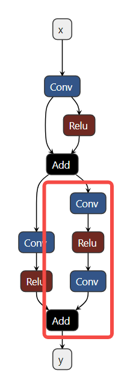
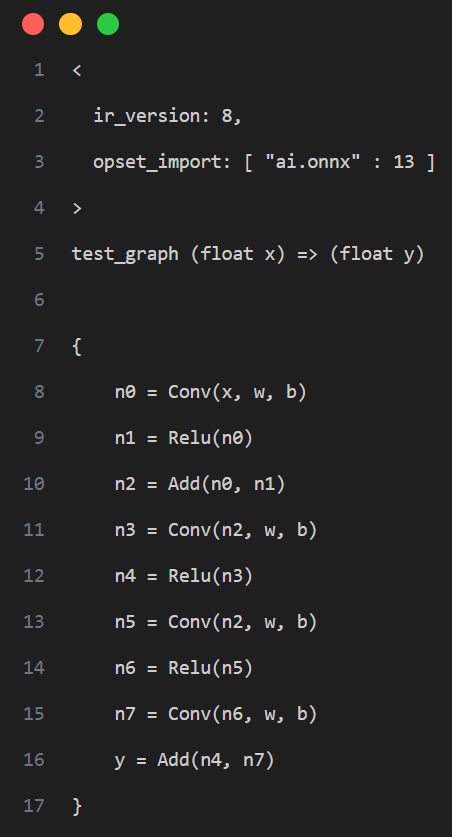
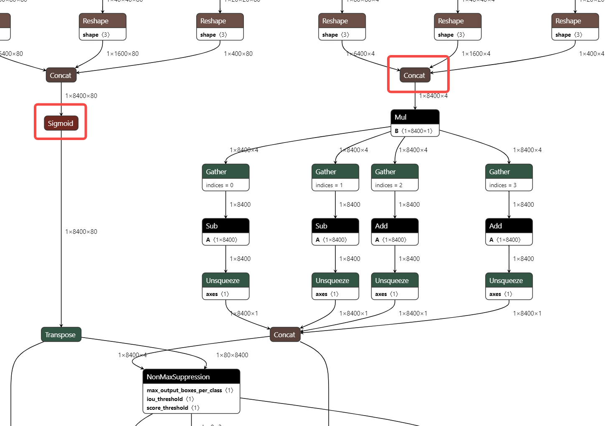

# 模型量化

本章节主要介绍模型量化工具的使用细节。进迭时空 RISC - V 系列芯片支持直接部署浮点（FP32）模型，但我们强烈建议您将浮点模型进一步量化为定点（INT8）模型。量化后模型的精度损失一般可以控制在 1%以内，但推理性能却可以提升数十倍！

## 1 模型量化简介
XQuant 是基于 PPQ（0.6.6 +）开发的量化工具，集成了已经调整好的适配芯片的量化策略，使用 Json 配置文件调用统一接口实现模型量化。


## 2 量化工具说明
当前，模型量化功能已经被集成进 `spine convert`命令中，您可以通过 `-c`或 `--config`选项指定相关量化配置文件路径。

【提示】量化工具安装包位于 SDK 中 `spacengine - wheel/xquant`目录下，您也可以将其安装到指定的 Python 虚拟环境中。安装示例：
```
$ python3 -m pip install spacengine - wheel/xquant/xquant - 1.1.0 - py3 - none - any.whl --extra - index - url https://pypi.ngc.nvidia.com
```

### 2.1 QuickStart
Python Code 以及 Shell 示例在 `xquant_samples`中有源码，以便于快速开始模型量化

#### Python Code 使用
```python
import xquant

demo_json = dict()
# 以下缺省对demo_json内容的填入
demo_json_path = "./demo_json.json"
# 使用字典的方式
xquant.quantize_onnx_model(demo_json)
# 使用json文件的方式
xquant.quantize_onnx_model(demo_json_path)
# 支持API调用时传入模型路径或模型Proto
# xquant.quantize_onnx_model("resnet18.json", "/home/share/modelzoo/classification/resnet18/resnet18.onnx")
# xquant.quantize_onnx_model(
#    "resnet18.json", "/home/share/modelzoo/classification/resnet18/resnet18.onnx", "resnet18_output.onnx"
# )
# import onnx
# onnx_model = onnx.load("/home/share/modelzoo/classification/resnet18/resnet18.onnx")
# quantized_onnx_model = xquant.quantize_onnx_model("resnet18.json", onnx_model)
```

#### Shell 使用
```
python -m xquant --config./demo_json.json
# 指定输入以及输出模型路径
# python -m xquant -c./demo_json.json -i demo.onnx -o demo.q.onnx
```

### 2.2 配置文件说明
Json 配置示例：
```json
{
    "model_parameters": {
        "onnx_model": "",
        "output_prefix": "",
        "working_dir": "",
        "skip_onnxsim": false
    },
    "calibration_parameters": {
        "calibration_step": 100,
        "calibration_device": "cpu",
        "calibration_type": "default",
        "input_parametres": [
            {
                "input_name": "data",
                "input_shape": [1, 3, 224, 224],
                "dtype": "float32",
                "file_type": "img",
                "color_format": "bgr",
                "mean_value": [103.94, 116.78, 123.68],
                "std_value": [57, 57, 57],
                "preprocess_file": "",
                "data_list_path": ""
            },
            {
                "input_name": "data1",
                "input_shape": [1, 3, 224, 224],
                "dtype": "float32",
                "file_type": "img",
                "mean_value": [103.94, 116.78, 123.68],
                "std_value": [57, 57, 57],
                "preprocess_file": "",
                "data_list_path": ""
            }
        ]
    },
    "quantization_parameters": {
        "analysis_enable": true,
        "precision_level": 0,
        "finetune_level": 1,
        "max_percentile": 0.9999,
        "custom_setting": [
            {
                "input_names": ["aaa", "bbb"],
                "output_names": ["ccc"],
                "max_percentile": 0.999,
                "precision_level": 2,
                "calibration_type": "default"
            }
        ],
        "truncate_var_names": ["/Concat_5_output_0", "/Transpose_6_output_0"] "截断模型"
    }
}
```
支持省略的字段：
|字段名|默认值|可选值|备注|
|---|---|---|---|
|output_prefix|onnx_model 的去后缀文件名，输出以.q.onnx 结尾|/|/|
|working_dir|onnx_model 所在的目录|/|/|
|calibration_step|100|一般建议设置为 100 - 1000 范围|/|
|calibration_device|cuda|cuda、cpu|系统自动检测|
|calibration_type|default|default、kl、minmax、percentile、mse|推荐先使用 default，而后是 percentile 或 minmax，如果觉得 default 校准耗时过长，则可以转用 percentile|
|input_name|从 onnx 模型中读取|/|/|
|input_shape|从 onnx 模型中读取|需要 shape 为全 int，支持 batch 为符号，并默认填为 1|/|
|dtype|从 onnx 模型中读取|float32、int8、uint8、int16|当前仅支持 float32|
|file_type|img|img、npy、raw|只支持读取与 dtype 一致的 raw 数据，即默认为 float32|
|preprocess_file|None|PT_IMAGENET、IMAGENET|系统预设了两种 IMAGENET 标准预处理，或自定义 py 预处理，"py 文件路径:py 方法名"，sample 中的 resnet18_custom_preprocess.json 有相关示例|

校准数据列表文件的规则：
`img_list.txt`每行表示一个校准数据文件路径，可以写相对于 `img_list.txt`所在目录的相对路径，也可以写绝对路径，如果模型是多输入的，请确保每个文件列表的顺序是对应的。
```
QuantZoo/Data/Imagenet/Calib/n01440764/ILSVRC2012_val_00002138.JPEG
QuantZoo/Data/Imagenet/Calib/n01443537/ILSVRC2012_val_00000994.JPEG
QuantZoo/Data/Imagenet/Calib/n01484850/ILSVRC2012_val_00014467.JPEG
QuantZoo/Data/Imagenet/Calib/n01491361/ILSVRC2012_val_00003204.JPEG
QuantZoo/Data/Imagenet/Calib/n01494475/ILSVRC2012_val_00015545.JPEG
QuantZoo/Data/Imagenet/Calib/n01496331/ILSVRC2012_val_00008640.JPEG
```

preprocess_file 的规则：
例如这是一个 `custom_preprocess.py`脚本文件，则在配置文件中将 preprocess_file 设为 `custom_preprocess.py:preprocess_impl`指向具体 py 文件的具体方法，如果是多输入的情况，code 差距不大的情况下，可以直接复用自己的预处理方法。
如下采用的预处理方式，即为 preprocess_file = None 时的预处理，
```python
from typing import Sequence
import torch
import cv2
import numpy as np

def preprocess_impl(path_list: Sequence[str], input_parametr: dict ) -> torch.Tensor:
    """
    读取path_list, 并依据input_parametr中的参数预处理, 返回一个torch.Tensor

    Args:
        path_list (Sequence[str]): 一个校准batch的文件列表
        input_parametr (dict): 等同于配置中的calibration_parameters.input_parametres[idx]

    Returns:
        torch.Tensor: 一个batch的校准数据
    """
    batch_list = []
    mean_value = input_parametr["mean_value"]
    std_value = input_parametr["std_value"]
    input_shape = input_parametr["input_shape"]
    for file_path in path_list:
        img = cv2.imread(file_path)
        img = cv2.resize(img, (input_shape[-1], input_shape[-2]), interpolation=cv2.INTER_AREA)
        img = img.astype(np.float32)
        img = (img - mean_value) / std_value
        img = np.transpose(img, (2, 0, 1))
        img = torch.from_numpy(img)
        img = torch.unsqueeze(img, 0)
        batch_list.append(img)
    return torch.cat(batch_list, dim=0)
```

custom_setting 的规则：
可参考 samples 中的 mobilenet_v3_small
```json
"custom_setting": [
    {
        "input_names": ["input_0"],
        "output_names": ["/features/features.1/block/block.0/block.0.0/Conv_output_0"],
        "precision_level": 2
     }
  ]
```
工具采用计算图出入边包围子图的方式捕获一个子图并设置自定义量化参数，如下图示例，我们希望将计算图红框中的算子调整为 precision_level = 2 的精度模式，则需要先确定当前子图的所有非常量出入边，即入边为子图内首个 Conv 的输入 n2，Add 的旁支输入 n7，出边为 Add 的输出 y




即产生如下的配置：
```json
"custom_setting": [
     {
         "input_names": ["n2", "n7"],
         "output_names": ["y"],
         "precision_level": 2
     }
  ]
```

truncate_var_names 的规则：
truncate_var_names 支持将完整的带有后处理层的 ONNX 模型送入量化工具，量化产出模型也会保留后处理结构，但需要使用者指定模型主结构与后处理结构的分离点，即 truncate_var_names



例如 yolov6p5_n 模型，只需要指定 Sigmoid、Concat（红框）算子的输出即可将模型二分，只量化上半部分。

### 2.3 量化输出说明
量化工具执行完毕后，将输出如下两个产物。
1. ONNX 量化模型：QDQ 格式的 ONNX 量化模型，由推理库解析为相应的量化算子并执行定点推理。
2. 量化分析文件：开启 analysis_enable 后，将在输出目录下生成量化分析文件，以 markdown 文件形式呈现。
   


SNR 高于 0.1、Cosine 小于 0.99 的输出将被标记，如果某个模型标记输出过多，则可能产生量化误差，Cosine 低并不一定产生量化误差，SNR 的可信度更高，而上图所示的结果则表明该模型很可能不适合量化，或者需要特别调整量化参数。

### 2.4 量化 Sample
为了使用户更加容易上手，我们提供了相应的量化 Sample。
可见 SDK 包中，spacengine - xquant/xquant_sample.tar.gz

## 3 常见问题（FAQ）
欢迎大家踊跃提问

### 3.1 配置相关
1. 报错：Calibration input_parametres size should equal to model inputs size.
答: 当前配置 json 文件中设置的模型输入数量与模型真实的输入数量不一致。
2. 报错：calibration_type xxx not implemented yet.
答：量化校准算法不支持，当前仅 default、minmax、percentile、kl、mse。
3. 报错: file_type xxx not implemented yet.
答：量化校准数据集的文件格式不支持，当前仅支持图像、Npy、Raw 文件。
4. 报错: Calibration input xxx finds 0 items.
答: 校准数据集设置错误或找不到任何有效的校准数据，可能是数据路径错误或文件格式问题。
5. 报错: truncate graph failed.
答: 截断模型错误，可能量化配置 json 文件中，模型中 tensor 名称设置错了（不存在或拼写错误）。可以用 netron 打开模型文件，查看/确认目标输入 tensor 名称。也可能是当前设置的 tensor 名称不足以将模型一分为二。

### 3.2 精度相关
1. 示例：量化后模型 PC 端和 `芯片端`推理结果不一致
答：目前芯片端的算子实现，强调推理效率，可能与 x86 或其他平台有轻微差距，但在算子实现没有明显 bug 的情况下，其批量精度应当与其他平台一致。
2. 示例：量化后模型 PC 端精度和 `芯片端`实测不一致
答：一般认为，多平台间合理的批量精度差异在 ±0.5% 以内，如果出现芯片端精度明显降低（>2%）的情况，则大概率是芯片端推理时的计算 bug 导致，请及时向我们反馈。

### 3.3 性能相关
1. 示例
INT8 量化后的 Resnet18 单核 @1.2GHz 时的推理耗时约为 FP32 的 52 倍，38ms vs 1992ms。
INT8 量化后的 MobileNetV2 单核 @1.2GHz 时的推理耗时约为 FP32 的 9.6 倍，45ms vs 431ms。