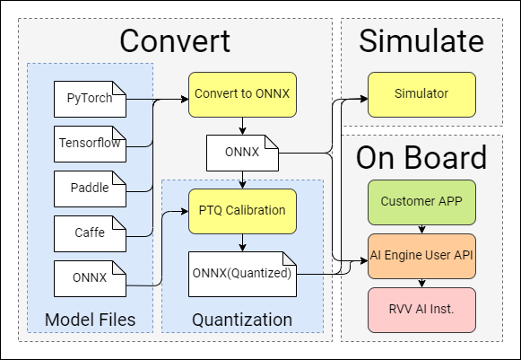

# 工具概述

## 1. 工具总览
Spacengine™ 是由进迭时空研发的一套 AI 算法模型部署工具，旨在帮助用户快速、高效地在进迭时空 RISC - V 系列芯片产品（以下简称`设备端`或`芯片端`）上部署 AI 算法模型。Spacengine™ 依托进迭时空自研 AI 指令及量化技术，针对自研 X60、X100 等 RISC - V 系列芯片进行了深度性能优化，从而显著提升了常见算法模型在`芯片端`的推理性能。

Spacengine™ 主要由工具集（Tools）、AI 引擎（Engine）以及示例包（Samples）构成：


Spacengine™ 工具集（Tools）

Spacengine™ 工具集中的功能指令均以`spine`开头。您在部署过程中，主要涉及的指令包括：`spine convert`，`spine simulate`以及`spine helper`：
```
$ spine -h
usage: spine [-h] {convert,simulate,helper}...

Spacemit AI Toolkit(Version: 2024/01/15)

positional arguments:
  {convert,simulate,helper}

optional arguments:
  -h, --help            show this help message and exit
```
其中：
- `spine convert`主要负责算法模型的一键转换和/或量化
- `spine simulate`提供 PC 端（当前仅限 x86）的模型仿真测试功能
- `spine helper`提供了一系列的辅助功能

【提示】相关`功能指令`及其子命令支持自动补全

Spacengine™ AI 引擎（AI Engine）

得益于进迭时空智算核架构，Spacengine™ AI 引擎以轻量化插件的方式接入 ONNXRuntime 等开源框架，结合深度调优的加速后端，就可以成功的将模型高效的部署到我们的芯片上。目前主要包含 Runtime Library，Profiling 工具，Custom - Ops Plugin 等组件。

Spacengine™ 示例包（Samples）

Spacengine™ 示例包为您提供了丰富的模型量化、推理运行代码示例，方便您快速、高效的对进迭时空 RISC - V 系列芯片进行评估和适配。其中，模型应用场景包括但不限于图像分类、目标检测、文字识别等，主干网络涉及但不限于 MobileNet、ResNet 等。

## 2 部署流程
配合 Spacengine™ 工具的 AI 模型部署流程，主要涉及模型转换、模型量化、仿真运行、模型部署（`芯片端`）这四个阶段：





模型转换

转换工具目前支持 3. 模型转换章节。

模型量化

为了提高模型在`芯片端`的运行性能、充分发挥芯片算力，我们强烈建议您将浮点模型量化为定点模型。量化后，大部分典型模型的精度损失都可以控制在 1% 以内。具体使用细节，您可以参阅 4. 模型量化章节。

仿真测试

对于转换或量化后的 ONNX 模型，您可以在 x86 平台上进行仿真推理测试。正常情况下，该推理结果与`芯片端`运行结果完全一致。您可以参阅 5. 仿真测试章节内容，了解更多使用细节。

模型部署

当模型性能和精度都符合预期后，即可参考 6. 模型部署章节内容，实现`芯片端`具体上层应用的开发。