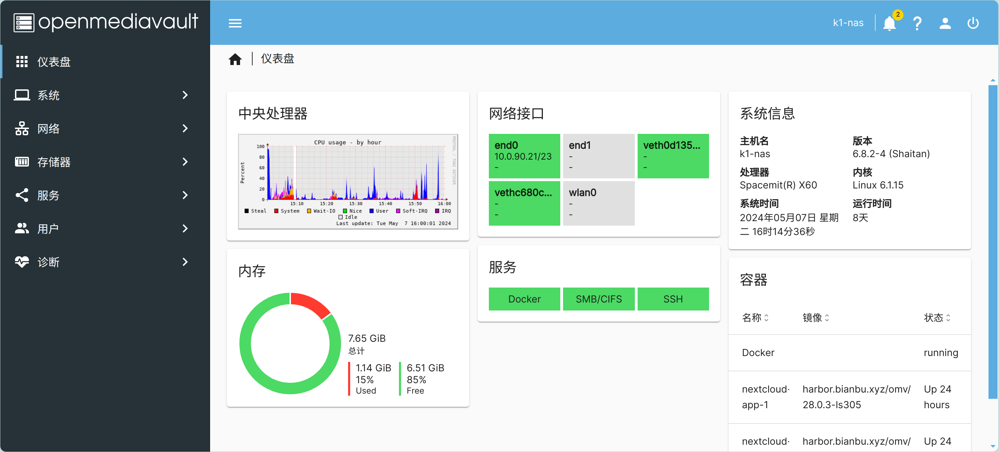

# 简介

Bianbu NAS 是在 Bianbu 操作系统基础上精简并深度优化的一款专为 NAS 产品设计的系统。它集成了应用程序（如 openmediavault、docker 和常用软件）、框架、库、运行时环境、Linux 内核、引导加载程序（U-Boot）和监管程序接口（OpenSBI）等多种组件。该系统的目标是为客户提供 NAS 软件的参考设计，并支持驱动和应用程序的开发。

## 软件组件

Bianbu NAS 的组件包括：

- 应用
- 框架
- 运行时
- 库
- Linux 内核
- U-Boot
- OpenSBI

上述组件的软件包均通过 [APT 软件源](http://archive.spacemit.com/bianbu-ports/) 进行管理，软件包是标准的 debian 软件包格式。

**应用**

- Openmediavault
- Docker
- Wi-Fi AP
- 软路由
- 快速U盘
- SMB、NFS等网络协议组件

**多媒体框架**

- FFmpeg (with Hardware Accelerated)
- GStreamer (with Hardware Accelerated)
- PipeWire

**推理框架**

- onnxruntime (with Hardware Accelerated)

**运行时**

- Python
- Java
- Node.js
- Rust
- Go

**库**

- OpenCV (with RVV Accelerated)
- OpenSSL (with Hardware Accelerated)
- MPP，进迭时空多媒体处理平台，提供 C API 和 sample
- OpenGLES/Vulkan/OpenCL

### Linux 内核

Linux 内核负责管理处理器和其他硬件资源，提供用户和应用程序与硬件之间的接口。主要功能包括中断和时钟管理、进程管理、内存管理、文件系统管理、设备驱动管理和网络协议栈等。

版本：6.1。

源码：[https://gitee.com/bianbu-linux/linux-6.1](https://gitee.com/bianbu-linux/linux-6.1)

### U-Boot

U-Boot 是一个引导加载程序，负责初始化特定硬件，从介质（如 SD 卡、eMMC、SPI Flash、SSD、网络）加载 Linux 内核镜像、设备树和初始 RAM 文件系统。

版本：u-boot-2022.10。

源码：[https://gitee.com/bianbu-linux/uboot-2022.10](https://gitee.com/bianbu-linux/uboot-2022.10)

### OpenSBI

OpenSBI 是 RISC-V 架构处理器的监管程序接口的实现，运行在 M 模式下的固件，提供引导加载程序、hypervisor、操作系统访问硬件的接口。

版本：1.3。

源码：[https://gitee.com/bianbu-linux/opensbi](https://gitee.com/bianbu-linux/opensbi)

## 支持的设备

目前，Bianbu NAS 支持以下硬件设备：

- BPI-F3
- [MUSE N1](device_list/muse_n1.md)
- [MUSE Pi](device_list/muse_pi.md)

## 固件

Bianbu NAS 固件现在有两个版本，分别基于 Bianbu OS 23.10 和 Bianbu OS 24.04，此处称 Bianbu NAS 23.10 和 Bianbu NAS 24.0。前者经过多个版本迭代，更稳定，推荐下载这个版本；如果要求更新的操作系统和SDK等，可以下载后者，该版本还在迭代中，有不稳定的风险。

Bianbu NAS 23.10 最新版本：v1.0.14。

Bianbu NAS 24.04 最新版本：v2.0beta2。

Bianbu NAS 固件地址：[https://archive.spacemit.com/image/k1/version/bianbu/](https://archive.spacemit.com/image/k1/version/bianbu/)

- `bianbu-*-nas-*.img.zip` 是 sdcard 固件，解压后可以用 `dd` 命令或者 [balenaEtcher](https://etcher.balena.io/) 写入 sdcard。

- `bianbu-*-nas-*.zip` 适用于 Titan Flasher，刷机参考 [刷机工具使用手册](https://developer.spacemit.com/#/documentation?token=O6wlwlXcoiBZUikVNh2cczhin5d)，或者解压后用 `fastboot` 命令刷机。

固件 `root` 用户密码：`bianbu`。
