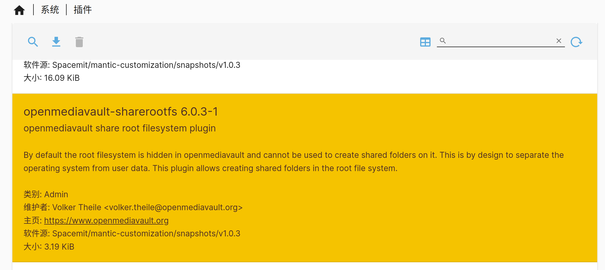

# 必要设置

## 更新软件源

第一次下载软件包之前，更新软件源（`apt update`）是必要的。之后也建议定期更新软件源，以确保系统始终下载到最新的软件。

- 点击“系统 -> 更新管理 -> 设置”， 勾选“预发布更新”，点击“保存”，等待更新。

## 挂载rootfs

Bianbu NAS 通过 `sharerootfs` 插件管理 rootfs，如果要挂载 rootfs 请先下载 `sharerootfs` 插件。

- 点击“系统 -> 插件”，选中 `sharerootfs` 插件，点击下载按钮。

- 下载 `sharerootfs` 插件之后，点击“存储器 -> 文件系统”，可以看到 rootfs 已挂载。

