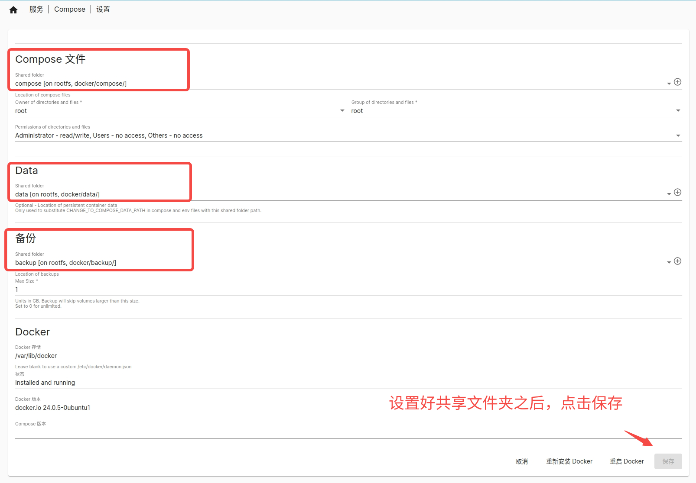
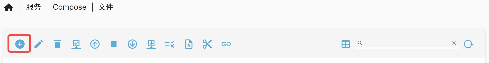
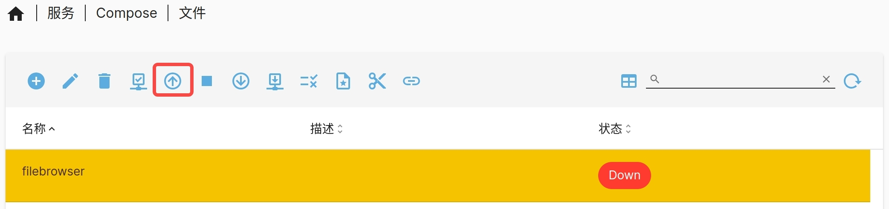

# docker-compose插件

Bianbu NAS 使用 docker-compose 工具来部署 Docker 服务。当单个容器无法满足应用的运行环境需求时，docker-compose 可以方便地定义和管理多个容器。

## 启动Docker后台服务

在创建 Docker 服务实例之前，需先确保 Docker 后台服务已启动。执行下述操作开启 Docker 后台服务：

1. 挂载磁盘和创建共享文件夹，至少创建三个共享文件夹。
2. 下载 `compose` 插件，下载后在“服务”页查看 `compose` 插件。
3. 打开“服务 -> Compose -> 设置”，选择共享文件夹，启动 Docker 服务。



## 创建Docker服务实例

以 Filebrowser 程序（一个开源的基于 Web 的文件管理工具）为例，介绍如何在 Bianbu NAS 上创建和访问 Docker 服务实例。 

- 点击“服务 -> Compose -> 文件”，点击“➕”添加 docker-compose.yml 文件：



填写内容如下：

```yaml
version: '3.8'

services:
  filebrowser:
    image: harbor.spacemit.com/application/filebrowser:2.28.0
    container_name: filebrowser
    volumes:
      - ./filebrowser_data:/srv        # 将文件挂载到宿主机目录
      - ./filebrowser_config:/config   # 配置文件目录
    ports:
      - "8080:8080"                      # 将 8080 端口映射到容器的 8080 端口
    restart: unless-stopped
```

填写之后，点击保存，等待检查 docker-compose.yml 文件格式。检查无误，点击“⬆️”按钮拉取服务。



如果本地没有下载 Docker 镜像，第一次拉取会比较耗时，因为要下载镜像。拉取完成之后，浏览器输入 `https://HOST_IP:8080` 访问 Filebrowser，初始帐号和密码均为 `admin`。

## docker-compose指令解释

- **docker-compose up**


解析 `docker-compose.yml` 文件，拉取镜像（如果本地没有镜像）、创建网络、容器和卷、启动服务。

- **docker-compose stop**


停止运行的容器，但保留容器的状态和数据，可通过 `docker-compose up` 指令恢复。

- **docker-compose down**


停止容器，并删除容器、网络、卷等相关数据和状态，不能通过 `docker-compose up` 恢复。

- **查看服务运行日志**

