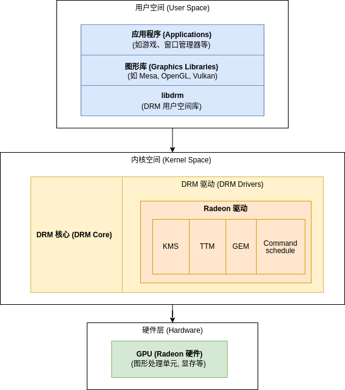

以下文档旨在为在 K1 平台上适配其他 AMD 显卡的开发者提供参考指导。本文将以我们在适配 Radeon HD7350 显卡时对内核所做的改动为例，介绍所涉及的关键点，并解释这些修改背后的原因和考量。无论您正在适配与 HD7350 同一代的 GPU，还是其他 AMD GPU，此文档都可作为参考和指导。

# 1. 简介
Linux内核中的独立显卡驱动主要依托于DRM（Direct Rendering Manager）子系统，这是一个用于管理图形处理单元（GPU）资源的内核模块，旨在提供统一的接口以支持多种硬件设备。独立显卡驱动通常包括以下几个层次：
 - **用户空间接口**：通过 ioctl 等接口与用户空间的图形库（如 Mesa、X.Org、Wayland）进行交互。
 - **DRM核心层**：提供基础的框架和通用功能，如内存管理、调度、同步等。
 - **硬件特定驱动模块**：针对不同厂商和型号的显卡（如 NVIDIA、AMD、Intel 等）实现具体的硬件控制逻辑。

  
DRM 主要组件有：
- **DRM核心（DRM Core）**：负责管理显卡设备的初始化、资源分配、内存管理及用户空间与内核空间的通信。
提供通用的 API 接口，供具体硬件驱动调用。
- **驱动模块（Driver Modules）**：针对不同品牌和型号的独立显卡，Linux 内核提供相应的驱动模块，如 nouveau（NVIDIA 开源驱动）、amdgpu（AMD 显卡驱动）等。这些模块实现硬件初始化、指令集管理、中断处理、功耗管理等具体功能。
- **GEM（Graphics Execution Manager）**：提供图形内存对象的管理，支持显存的高效分配与共享。
通过 GEM，用户空间应用可以创建和管理图形缓冲区，实现高效的图形渲染。
- **TTM（Translation Table Maps）**：TTM 可以作为 GEM 的后端，负责显存与系统内存之间的映射与管理。
主要用于处理内存压力和资源分配策略。
- **调度与同步**：显卡驱动需要有效管理多任务的调度，确保各个图形任务的高效执行。使用同步机制（如 Fence）来协调内核与用户空间之间的操作顺序，避免资源冲突。
- **内存管理**：负责显存的分配、映射与回收，确保内存资源的高效利用。支持零拷贝技术，减少数据在内核与用户空间之间的传输开销。

radeon 驱动结构框图：



# 2. 配置与修改

在将 AMD 显卡适配至 K1 平台时，往往需要对内核中显卡驱动、设备树(Device Tree)、地址映射、缓存策略、DMA 位宽以及中断管理等方面进行修改与调整。对于 RISC-V 架构平台，这些调整需要在理解 RISC-V 的内存管理和 PCIe 地址空间映射机制的前提下进行。本参考文档将从以下几个方面展开：

1. 设备树解析与地址映射；
2. 添加write-combining支持；
3. 缓存属性与访问权限的调整；
4. DMA 地址宽度适配；
5. MSI 中断支持限制；
6. linux内核显卡驱动配置。

### 2.1 设备树与地址映射

**设备树解析：**

1. 在设备树中，`ranges`属性用于定义地址映射关系，即如何将子设备的地址空间映射到父设备的地址空间。这个属性通常出现在需要进行地址转换的场景中，例如在外部总线或PCIe设备中。
2. pcie主控设备树节点的`ranges`属性的格式为一个数字矩阵，这里的 `ranges` 包含四个部分：属性、PCIe地址、CPU地址和地址长度。具体来说，其格式为 `<地址属性，PCIe地址, CPU地址, 地址长度>`。

``` c
diff --git a/arch/riscv/boot/dts/spacemit/k1-x.dtsi b/arch/riscv/boot/dts/spacemit/k1-x.dtsi
index 7ea166ca6fb0..fd978a379c37 100644
--- a/arch/riscv/boot/dts/spacemit/k1-x.dtsi
+++ b/arch/riscv/boot/dts/spacemit/k1-x.dtsi
@@ -2198,7 +2198,8 @@ pcie2_rc: pcie@ca800000 {
             #address-cells = <3>;
             #size-cells = <2>;
             ranges = <0x01000000 0x0 0xb7002000 0 0xb7002000 0x0 0x100000>,
-                 <0x02000000 0x0 0xa0000000 0 0xa0000000 0x0 0x17000000>;
+                 <0x42000000 0x0 0xa0000000 0 0xa0000000 0x0 0x10000000>,
+                 <0x02000000 0x0 0xb0000000 0 0xb0000000 0x0 0x7000000>; 
             interconnects = <&dram_range2>;
             interconnect-names = "dma-mem";
```

改动前：

1. 映射的源地址是 `0xa0000000`，目标地址也是 `0xa0000000`，大小为 `0x17000000`（即 368 MB），该段地址空间的属性是MEM属性；

改动后：

1. 第一段：源地址是 `0xa0000000`，目标地址是 `0xa0000000`，大小为 `0x10000000`（即 256 MB），该段地址空间的属性是MEM + 预取属性；
2. 第二段：源地址是 `0xb0000000`，目标地址是 `0xb0000000`，大小为 `0x7000000`（即 112 MB），该段地址空间的属性是MEM属性；

对较大的显存区间进行区分（如将其中一部分标记为预取属性），优化访问性能。通过此变更，更合理地划分地址空间，提升特定段的访问性能（如预取加速）。

**提示**：K1平台上pcie2可以使用的地址空间的大小为384MB，包含了配置空间和BAR空间各个区域。在修改设备树时，可以参考现有的 GPU 映射示例，对比不同 GPU 型号的 BAR 地址范围，并适当修改映射区域。

### 2.2 添加wc(write-combining)支持

```c 
diff --git a/arch/riscv/include/asm/pci.h b/arch/riscv/include/asm/pci.h
index cc2a184cfc2e..9f6f59aff214 100644
--- a/arch/riscv/include/asm/pci.h
+++ b/arch/riscv/include/asm/pci.h
@@ -27,6 +27,10 @@ static inline int pcibus_to_node(struct pci_bus *bus)
 #endif
 #endif /* defined(CONFIG_PCI) && defined(CONFIG_NUMA) */
 
+#if defined(CONFIG_SOC_SPACEMIT_K1X)
+#define arch_can_pci_mmap_wc() 1
+#endif
+
 /* Generic PCI */
 #include <asm-generic/pci.h>
```

K1平台 pci 地址空间映射添加wc(write-combining)支持。

write_combine 生效需要资源本身有 IORESOURCE_PREFETCH 标志，所以结合上面设备树的修改，实现了将 PCI 资源映射到用户空间时，支持 write-combining 模式，从而提高显存访问效率。

### 2.3 缓存属性与访问权限设置

```c
diff --git a/drivers/gpu/drm/radeon/radeon_ttm.c b/drivers/gpu/drm/radeon/radeon_ttm.c
index 4eb83ccc4906..4693119e2412 100644
--- a/drivers/gpu/drm/radeon/radeon_ttm.c
+++ b/drivers/gpu/drm/radeon/radeon_ttm.c
@@ -512,6 +512,8 @@ static struct ttm_tt *radeon_ttm_tt_create(struct ttm_buffer_object *bo,
     else
         caching = ttm_cached;
 
+    caching = ttm_write_combined;
     if (ttm_sg_tt_init(&gtt->ttm, bo, page_flags, caching)) {
         kfree(gtt);
         return NULL;
```

在 radeon_ttm_tt_create 接口中根据 rbo->flags 原本会选择不同的缓存模式（uncached/write-combined/cached）。默认的 caching 策略可能不适合 GPU 显存访问模式，通过强制使用write-combined，可以保证缓存的一致性。

```c
diff --git a/drivers/gpu/drm/ttm/ttm_module.c b/drivers/gpu/drm/ttm/ttm_module.c
index b3fffe7b5062..1319178edf03 100644
--- a/drivers/gpu/drm/ttm/ttm_module.c
+++ b/drivers/gpu/drm/ttm/ttm_module.c
@@ -74,7 +74,8 @@ pgprot_t ttm_prot_from_caching(enum ttm_caching caching, pgprot_t tmp)
 #endif /* CONFIG_UML */
 #endif /* __i386__ || __x86_64__ */
 #if defined(__ia64__) || defined(__arm__) || defined(__aarch64__) || \
-    defined(__powerpc__) || defined(__mips__) || defined(__loongarch__)
+    defined(__powerpc__) || defined(__mips__) || defined(__loongarch__) \
+    || defined(__riscv)
     if (caching == ttm_write_combined)
         tmp = pgprot_writecombine(tmp);
     else
```

`ttm_prot_from_caching` 函数中引入 RISC-V 架构支持。当 caching = ttm_write_combined 时，会将相应页表属性设置为写合并模式。在 RISC-V 平台下，当缓存属性为写合并时，对应 PTE 能正确设置为非缓存或写合并的属性。

### 2.4 DMA 地址宽度 (dma_bits) 调整

```c 
diff --git a/drivers/gpu/drm/radeon/radeon_device.c b/drivers/gpu/drm/radeon/radeon_device.c
index afbb3a80c0c6..42e6510eccf0 100644
--- a/drivers/gpu/drm/radeon/radeon_device.c
+++ b/drivers/gpu/drm/radeon/radeon_device.c
@@ -1361,7 +1361,7 @@ int radeon_device_init(struct radeon_device *rdev,
      * AGP - generally dma32 is safest
      * PCI - dma32 for legacy pci gart, 40 bits on newer asics
      */
-    dma_bits = 40;
+    dma_bits = 32;
     if (rdev->flags & RADEON_IS_AGP)
         dma_bits = 32;
     if ((rdev->flags & RADEON_IS_PCI) &&
```

在驱动初始化时设置 `dma_bits`，原代码中 `dma_bits = 40`，表示 GPU 可访问到 1TB 内存。根据实际情况改为 `dma_bits = 32`，限制在 4GB 内存范围内。从原先的 40 位缩小到 32 位，缩小 了DMA 位宽以提高稳定性。

对于其他 AMD 显卡，如若 GPU 本身不需要访问过大的物理内存空间，则可相应调整 `dma_bits` 来确保设备正常工作。

### 2.5 MSI 中断适配

```c 
diff --git a/drivers/gpu/drm/radeon/radeon_irq_kms.c b/drivers/gpu/drm/radeon/radeon_irq_kms.c
index c4dda908666c..f540529909d3 100644
--- a/drivers/gpu/drm/radeon/radeon_irq_kms.c
+++ b/drivers/gpu/drm/radeon/radeon_irq_kms.c
@@ -244,6 +244,10 @@ static bool radeon_msi_ok(struct radeon_device *rdev)
     /* MSIs don't work on AGP */
     if (rdev->flags & RADEON_IS_AGP)
         return false;
+#if IS_ENABLED(CONFIG_SOC_SPACEMIT_K1X)
+       /* Chips <= GCN1 cannot get MSI to work on K1 */
+       return false;
+#endif
 
     /*
      * Older chips have a HW limitation, they can only generate 40 bits
```

K1平台上某些旧架构 GPU 使用 MSI 中断可能导致中断无法正确触发。禁用 MSI 可以退回到传统中断模式，确保系统稳定运行。

**提示**：  

- 如果您的 GPU 无法触发中断或系统在插入 GPU 后中断异常，可尝试禁用 MSI。  
- 仅在必要时才禁用 MSI，如果平台支持 MSI，启用它通常能获得更好的性能和更低的延迟。

### 2.6 打开显卡驱动配置

``` c
diff --git a/arch/riscv/configs/k1_defconfig b/arch/riscv/configs/k1_defconfig
index 1e14a4a5c4f7..58dfdf05bfce 100644
--- a/arch/riscv/configs/k1_defconfig
+++ b/arch/riscv/configs/k1_defconfig
@@ -881,6 +881,8 @@ CONFIG_SPACEMIT_K1X_SENSOR_V2=y
 # CONFIG_DVB_CXD2099 is not set
 # CONFIG_DVB_SP2 is not set
 # CONFIG_DRM_DEBUG_MODESET_LOCK is not set
+CONFIG_DRM_RADEON=m
+CONFIG_DRM_RADEON_USERPTR=y
 CONFIG_DRM_SPACEMIT=y
 CONFIG_SPACEMIT_MIPI_PANEL=y
 CONFIG_SPACEMIT_HDMI=y
```

将linux内核对应显卡驱动的配置打开，在make menuconfig中配置成Y（build in）或者m（编译成模块）。

目前K1平台支持了 radeon 驱动（对应GCN 1.0 之前架构的AMD显卡）。对于较新的 AMD 显卡，包括 GCN 1.0 及之后的架构（Radeon Rx 系列及更高端的显卡），需要适配 amdgpu 驱动。在修改驱动代码之后，需要把对应的驱动配置打开。