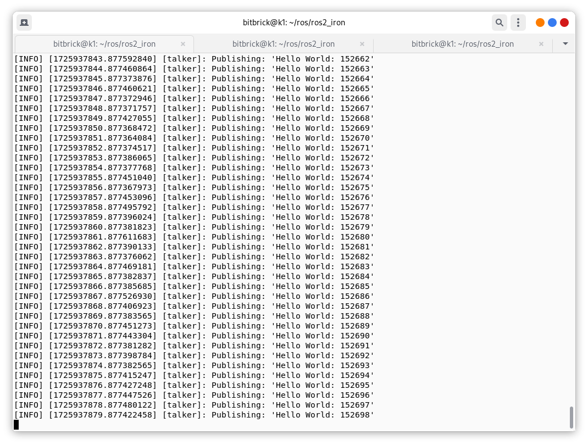
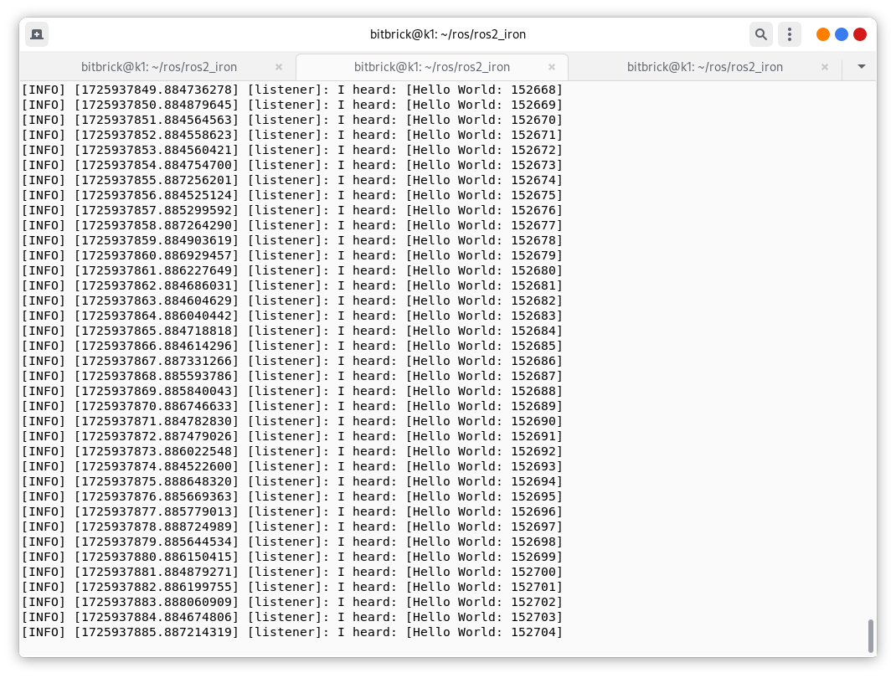
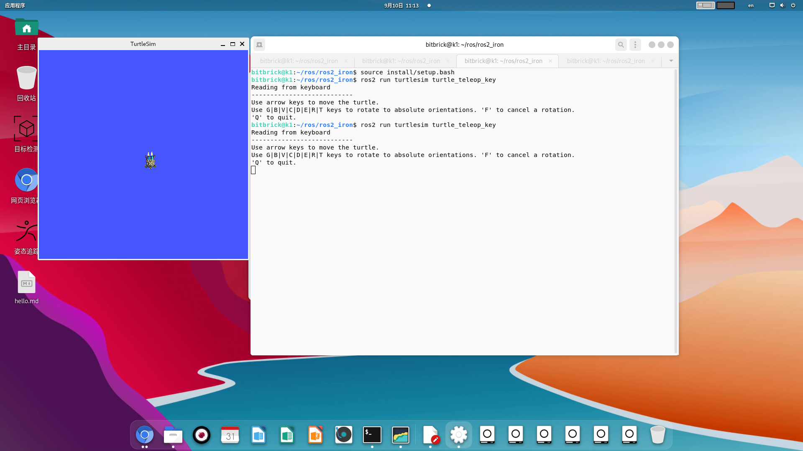

# ROS2 Installation

Since the official ROS2 does not provide an installation package for RISC-V based ROS2, it is necessary to compile and install it yourself. The following is the complete process of installing ROS2 on the K1.

 First,you need AT LEAST 25 GB of hard drive space in your VM to install ROS 2 from source. Make sure that you have the space before continuing.
## System setup
### Set locale
This is exactly the same as in the official instructions:
~~~
locale  # check for UTF-8

sudo apt update && sudo apt install locales
sudo locale-gen en_US en_US.UTF-8
sudo update-locale LC_ALL=en_US.UTF-8 LANG=en_US.UTF-8
export LANG=en_US.UTF-8

locale  # verify settings
~~~
### Enable required repositories
Here things differ a bit. I think we can only do the following:

~~~
sudo apt install software-properties-common
sudo add-apt-repository universe

~~~
Install dependencies
Okay, let’s try to install all the stuff required but without using ros-dev-tools. We will use apt and pip:
~~~
sudo apt update && sudo apt upgrade && sudo apt install -y \
    build-essential \
    cmake \
    git \
    apt-utils \
    ca-certificates \
    conntrack \
    curl \
    dh-python \
    dhcpcd5 \
    ebtables \
    ethtool \
    git-lfs \
    gnupg2 \
    ifupdown \
    iptables \
    iproute2 \
    iputils-ping \
    libasio-dev \
    libbullet-dev \
    libconsole-bridge-dev \
    libtinyxml2-dev \
    libeigen3-dev \
    lsb-release \
    net-tools \
    openssh-client \
    python3-dev \
    python3-distlib \
    python3-empy \
    python3-lark \
    python3-notify2 \
    python3-numpy \
    python3-pip \
    python3-pytest-cov \
    python3-setuptools \
    python3-yaml \
    samba \
    socat \
    systemd \
    vim \
    wget 
~~~
DISCLAIMER: Probably we don’t need ALL those dependencies. Feel free to opt out some of them (and share with us :smiley: )

There are still some dependencies missing that are not available without ROS 2 repo. Let’s use pip for them:
~~~
sudo pip install vcstool \
    rosdep \
    catkin-pkg-modules \
    rosdistro-modules \
    colcon-common-extensions
~~~
So far so good. Let’s move to building ROS 2.
Note:
If you cannot install these dependencies normally, you can use `apt` to install some of them, but you need to add an `ubuntu-ports` `source.list` first, as shown below:
/etc/apt/sources.list.d/ubuntu.list
~~~
deb http://ports.ubuntu.com/ubuntu-ports/  mantic main restricted universe multiverse
# deb-src https://mirrors.tuna.tsinghua.edu.cn/ubuntu-ports/ mantic main restricted universe multiverse
deb http://ports.ubuntu.com/ubuntu-ports/  mantic-updates main restricted universe multiverse
# deb-src https://mirrors.tuna.tsinghua.edu.cn/ubuntu-ports/ mantic-updates main restricted universe multiverse
deb http://ports.ubuntu.com/ubuntu-ports/  mantic-backports main restricted universe multiverse
# deb-src https://mirrors.tuna.tsinghua.edu.cn/ubuntu-ports/ mantic-backports main restricted universe multiverse

# 以下安全更新软件源包含了官方源与镜像站配置，如有需要可自行修改注释切换
deb http://ports.ubuntu.com/ubuntu-ports/ mantic-security main restricted universe multiverse
# deb-src http://ports.ubuntu.com/ubuntu-ports/ mantic-security main restricted universe multiverse

# 预发布软件源，不建议启用
deb http://ports.ubuntu.com/ubuntu-ports/  mantic-proposed main restricted universe multiverse
# # deb-src https://mirrors.tuna.tsinghua.edu.cn/ubuntu-ports/ mantic-proposed main restricted universe multiverse

~~~
增加之后我们就有两个源，分别是`bianbu.list`和 `ubuntu.list`

然后再使用`apt`命令安装部分pip安装不了依赖:
~~~
sudo apt-get install python3-catkin-pkg
sudo apt-get install python3-rosdistro
sudo apt install vcstool 
~~~

## Build ROS 2
### Get ROS 2 code
The same as in the official docs:

~~~
mkdir -p ~/ros2/ros2_iron/src
cd ~/ros2/ros2_iron
vcs import --input https://raw.githubusercontent.com/ros2/ros2/iron/ros2.repos src
~~~

If you encounter the error "Failed to connect to raw.githubusercontent.com port 443 after 13 ms: Connection refused",
you can refer to https://www.guyuehome.com/37844
The handling method:
~~~
sudo vi /etc/hosts
#####################
127.0.0.1	localhost
127.0.1.1	iron-virtual-machine
### Add the following resolution
185.199.108.133  raw.githubusercontent.com
~~~

### Install dependencies using rosdep
Here things start being a bit tricky:
~~~
sudo rosdep init
rosdep update
rosdep install -r --from-paths src --ignore-src -y --skip-keys "fastcdr rti-connext-dds-6.0.1 urdfdom_headers"
~~~
Take a closer look: I added the -r option to ignore failures. rosdep assumes we have access to the ROS repo and uses apt to install some dependencies. apt will fail finding some dependencies. Thankfully, we could download them using pip previously. In any case, rosdep will print which packages failed, so you can double-check that we installed them using pip previously and that we are good to go.

Note: If you’re using a distribution that is based on Ubuntu (like Linux Mint) but does not identify itself as such, you’ll get an error message like Unsupported OS `[bianbu]`. In this case append `--os=ubuntu:jammy` to the above command.

### Build the code in the workspace
As I previously mentionend, the Mimick library does not provide support for RISC-V 64. However, GitHub user @ziyao233 helped me and opened a PR to fix this 17 (thank you so much!). So, before building the code, we must tweak the mimick_vendor dependency:
~~~
vi ~/ros2_iron/src/ros2/mimick_vendor/CMakeLists.txt
   # Go to line 61 and modify the commit hash to https://github.com/ziyao233/Mimick/tree/ros2-fixed:
  set(mimick_version "90d02296025f38da2e33c67b02b7fa0c7c7d460c")
    # Go to line 63 and modify git repo to https://github.com/ziyao233/Mimick:
    GIT_REPOSITORY https://github.com/ziyao233/Mimick.git
~~~
We are now ready to go.
I’m currently stuck here. If you run the following command:
~~~
colcon build --symlink-install
~~~
It starts building some dependencies… but it will eventually fail with mimick_vendor. In essence, mimick_vendor just tries to compile the Mimick package 4 which does not support RISC-V architectures. However, the original fork of this package has an open PR 5 that DOES provide support for RISC-V. Sadly, it seems that the author is not very active. However, I already opened a few issues asking the maintainers of ROS 2 Mimick to add this functionality.

From now, I’ll tweak the ROS dependency list to point to this fork that provides support for RISC-V and see if I can advance in the installation. I’ll keep you updated.
### Setup environment
~~~

source ~/ros2/ros2_iron/install/local_setup.bash
~~~

## Try some examples
If you installed ros-foxy-desktop above you can try some examples.

In one terminal, source the setup file and then run a C++ talker:
~~~
ros2 run demo_nodes_cpp talker
~~~
In another terminal source the setup file and then run a Python listener:

~~~
ros2 run demo_nodes_py listener
~~~
You should see the talker saying that it’s Publishing messages and the listener saying I heard those messages. This verifies both the C++ and Python APIs are working properly. Hooray!

Example 2:

Little Turtle Simulation Example
Let's try again the classic example in ROS - the little turtle simulator.

Start two terminals and run the following instructions respectively:
~~~
ros2 run turtlesim turtlesim_node
ros2 run turtlesim turtle_teleop_key
~~~

