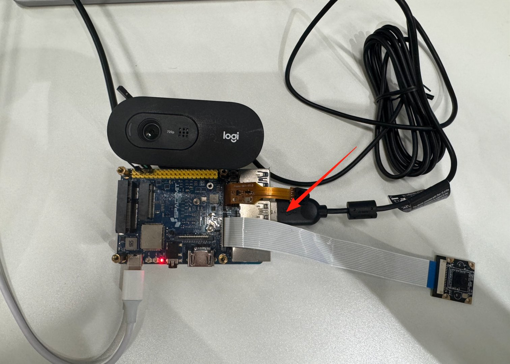
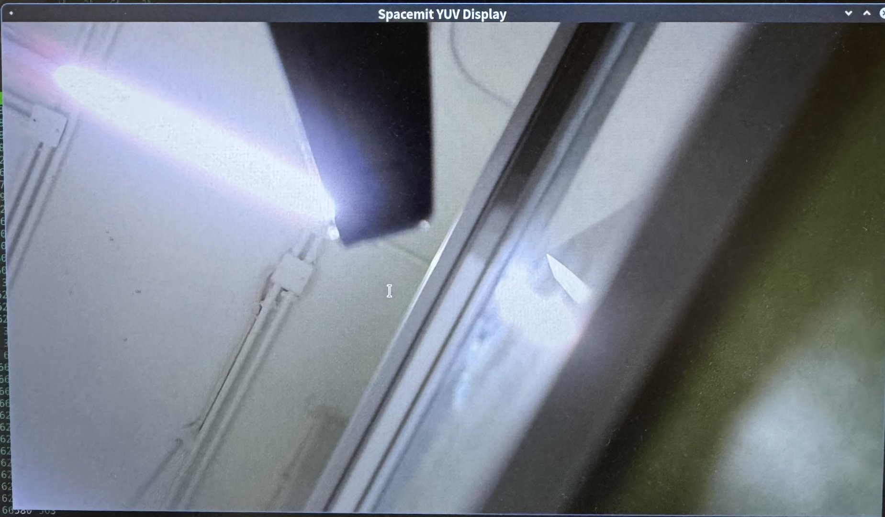

# 3.1.2 USB 相机使用说明

## 1.环境准备

### 1.1硬件连接

请将 USB 摄像头模组连接至开发板的 USB 接口，如下图所示：



同时，开发板与显示器之间请使用 HDMI 线缆进行连接，以便输出图像画面。

## 2.C++接口调用示例

以下示例展示了如何通过 JDK 提供的 C++ 接口实现 USB 摄像头图像的采集、解码和显示：

```c++
// 打开摄像头节点
auto camera = JdkUsbCam::create(device, width, height, V4L2_PIX_FMT_MJPEG);
// 创建 JPEG 解码器
auto decoder = std::make_shared<JdkDecoder>(width, height, CODING_MJPEG, PIXEL_FORMAT_NV12);
// 初始化显示模块（vo）
auto jdkvo = std::make_shared<JdkVo>(width, height, PIXEL_FORMAT_NV12);
// 获取一帧图像数据
auto frame = camera->getFrame();
// 解码 JPEG 图像
auto decFrame = decoder->Decode(frame);
// 将图像帧发送至显示模块
auto ret = jdkvo->sendFrame(decFrame);
```

## 3.快速集成：JDK 摄像头采集 SDK

### 3.1 JDK SDK 下载与安装

```shell
wget https://archive.spacemit.com/ros2/code/jdk_sdk.tar.gz
sudo tar xvf jdk_sdk.tar.gz -C /opt/
mv /opt/jdk_sdk /opt/jdk
```

目录结构如下：

```shell
/opt/jdk
├── include
├── jdk_examples
├── ko
├── lib
├── Makefile
└── README.md
```

### 3.2 下载与解压 jdk_usbcam

```
wget https://archive.spacemit.com/ros2/code/jdk_usbcam.tar
tar xvf jdk_usbcam.tar
```

目录结构如下：

```shel
jdk_usbcam/
├── Makefile
├── src/
│   └── main.cpp
└── workspace/
```

### 3.3 编译运行

~~~shell
cd jdk_usbcam
make all
insmod /opt/jdk/ko/jdk_dma.ko
~~~

通过命令行执行程序并指定摄像头设备节点：

```shell
./workspace/jdk_usbcam /dev/video20
```

> 🚨 提示：请根据实际情况确认设备节点路径，如 `/dev/video20`。可通过 `v4l2-ctl --list-devices` 命令查看设备信息。

运行后终端将输出模块初始化与图像采集的日志信息。

### 3.4 启动日志示例

~~~shell
VIDIOC_STREAMON succeeded
[MPP-DEBUG] 10800:module_init:159 +++++++++++++++ module init, module type = 9
[MPP-DEBUG] 10800:find_v4l2_linlonv5v7_plugin:83 yeah! we have v4l2_linlonv5v7_codec plugin---------------
[MPP-DEBUG] 10800:module_init:199 ++++++++++ V4L2_LINLONV5V7 (/usr/lib/libv4l2_linlonv5v7_codec.so)
[MPP-DEBUG] 10800:module_init:199 ++++++++++ open (/usr/lib/libv4l2_linlonv5v7_codec.so) success !
[MPP-DEBUG] 10800:al_dec_create:337 init create
[MPP-DEBUG] 10800:al_dec_init:398 input para check: foramt:0x4745504a output format:0x3231564e input buffer num:12 output buffer num:8
[MPP-DEBUG] 10800:al_dec_init:421 video fd = 4, device path = '/dev/video0'
[MPP-DEBUG] 10800:createCodec:115 create a codec, width=1280 height=720 align=1 inputtype=2 outputtype=9 inputformat=4745504a outputformat=3231564e inputbufnum=12 outputbufnum=8
[MPP-DEBUG] 10800:createPort:80 create a port, type=2 format_fourcc=1195724874
[MPP-DEBUG] 10800:createPort:80 create a port, type=9 format_fourcc=842094158
[MPP-DEBUG] 10800:getTrySetFormat:196 width=1280 height=720 align=1 pixel_format=4745504a
[MPP-DEBUG] 10800:printFormat:294 PRINTFORMAT ===== type: 2, format: 1195724874, width: 1280, height: 720, bytesperline: 0, sizeimage: 1048576
[MPP-DEBUG] 10800:getTrySetFormat:196 width=1280 height=720 align=1 pixel_format=3231564e
[MPP-DEBUG] 10800:printFormat:283 PRINTFORMAT ===== type: 9, format: 842094158, width: 1280, height: 720, nplanes: 2, bytesperline: [1280 1280 0], sizeimage: [921600 460800 0]
[MPP-DEBUG] 10800:allocateBuffers:340 Request buffers. type:2 count:12(12) memory:1
[MPP-DEBUG] 10800:allocateBuffers:340 Request buffers. type:9 count:8(8) memory:4
[MPP-DEBUG] 10800:streamon:558 Stream on 1751956058513
[MPP-DEBUG] 10800:streamon:558 Stream on 1751956058513
[MPP-DEBUG] 10800:al_dec_init:449 init finish
[MPP-DEBUG] 10800:VO_CreateChannel:43 create VO Channel success!
[MPP-DEBUG] 10800:module_init:159 +++++++++++++++ module init, module type = 101
[MPP-DEBUG] 10800:check_vo_sdl2:121 yeah! have vo_sdl2---------------
[MPP-DEBUG] 10800:find_vo_sdl2_plugin:86 yeah! we have vo_sdl2_plugin plugin---------------
[MPP-DEBUG] 10800:module_init:207 ++++++++++ VO_SDL2 (/usr/lib/libvo_sdl2_plugin.so)
[MPP-DEBUG] 10800:module_init:207 ++++++++++ open (/usr/lib/libvo_sdl2_plugin.so) success !
[MPP-ERROR] 10800:al_vo_init:93 SDL could not initialize! SDL_Error: wayland not available
[MPP-ERROR] 10800:al_vo_init:128 k1 vo_sdl2 init fail
[MPP-DEBUG] 10800:VO_Init:66 init VO Channel, ret = -400
[MPP-ERROR] 10800:JdkVo:32 VO_init failed, please check!
[MPP-INFO] 10801:runpoll:321 Now k1 hardware decoding ...
select: Resource temporarily unavailable
Failed to capture frame 0
NO data, return.
[MPP-DEBUG] 10801:handleEvent:453 get V4L2_EVENT_SOURCE_CHANGE event, do notify!
[MPP-DEBUG] 10800:handleOutputBuffer:1509 Resolution changed:0 new size: 1280 x 720
[MPP-DEBUG] 10800:streamoff:571 Stream off 1751956060839
[MPP-DEBUG] 10800:allocateBuffers:340 Request buffers. type:9 count:0(0) memory:4
[MPP-DEBUG] 10800:getTrySetFormat:196 width=1280 height=720 align=1 pixel_format=3231564e
[MPP-DEBUG] 10800:printFormat:283 PRINTFORMAT ===== type: 9, format: 842094158, width: 1280, height: 720, nplanes: 2, bytesperline: [1280 1280 0], sizeimage: [921600 460800 0]
[MPP-DEBUG] 10800:allocateBuffers:340 Request buffers. type:9 count:12(12) memory:4
[MPP-DEBUG] 10800:streamon:558 Stream on 1751956060850
[MPP-ERROR] 10800:queueBuffer:461 Failed to queue buffer. type = 9 (Invalid argument)
[MPP-ERROR] 10800:al_dec_return_output_frame:652 queueBuffer failed, this should not happen, please check!
[MPP-DEBUG] 10800:VO_Process:82 vo one packet, ret = 0
index:1,dma_fd:33 width:1280,height:720,size:1382400
[MPP-DEBUG] 10800:VO_Process:82 vo one packet, ret = 0
index:2,dma_fd:33 width:1280,height:720,size:1382400
[MPP-DEBUG] 10800:VO_Process:82 vo one packet, ret = 0
index:3,dma_fd:33 width:1280,height:720,size:1382400
~~~

## 4.运行效果

程序运行后，摄像头采集的图像将在显示器上实时显示，如图所示：



## 5.常见问题与建议

| 问题           | 说明                                            |
| -------------- | ----------------------------------------------- |
| 检测不到摄像头 | 检查 USB 接口连接、尝试其他端口、确认摄像头型号 |
| 摄像头打不开   | 可能摄像头未被识别，或驱动不支持                |
| SDL 报错       | 系统图形库依赖缺失，不影响摄像头采集功能        |
| 图像不显示     | 检查 vo 初始化日志、确认使用的显示通道和权限    |
