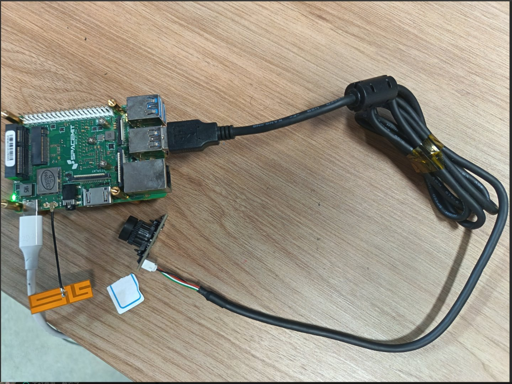
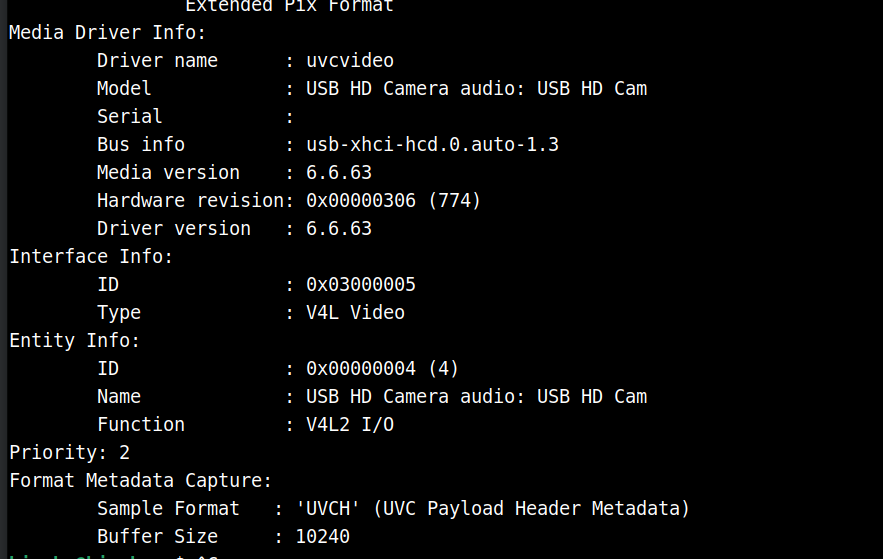

# 3.1.3 Python 使用 USB 相机


## 硬件连接



## 查看设备号

输入： `ls /dev/video*`，输出如下：


拔掉相机，再次输入 `ls /dev/video*`


可以确认设备号为 `/dev/video20` 和 `/dev/video21` ，对于一般USB相机，使用数值较小的设备号即可，本示例中为 `/dev/video20`

**或者使用 v4l2 的工具查看**

终端输入：`v4l2-ctl --list-devices`

出现如下输出：


使用 `v4l2-ctl -d /dev/video20 --all` 查看 `/dev/video20` 的详细信息

输出带有 Format Video Capture 字段一般是用于视频帧捕获的节点


使用 `v4l2-ctl -d /dev/video21 --all` 查看 `/dev/video21` 的详细信息



出现：**UVC Payload Header Metadata 捕获接口** —— 即 **视频元数据捕获接口**，它不用于视频图像帧本身

## 创建虚拟环境

```
python3 -m venv ~/test1
source ~/test1/bin/activate
pip install opencv-python
```


## 捕获并显示

示例代码：

```
import cv2

# 打开摄像头，0 是默认设备编号，如有多个摄像头可改为 1、2 等
cap = cv2.VideoCapture('/dev/video20')

# 检查是否成功打开
if not cap.isOpened():
    print("无法打开摄像头")
    exit()

while True:
    # 读取一帧图像
    ret, frame = cap.read()
    if not ret:
        print("无法接收图像，退出...")
        break

    # 显示图像
    cv2.imshow('USB Camera', frame)

    # 按下 'q' 键退出
    if cv2.waitKey(1) & 0xFF == ord('q'):
        break

# 释放资源
cap.release()
cv2.destroyAllWindows()

```

保存为 `opencv_test.py`

在虚拟环境内执行：

```
python opencv_test.py
```

注意 `VideoCapture()` 里面的设备号要使用 `/dev/video20`，不建议直接使用数字 20
