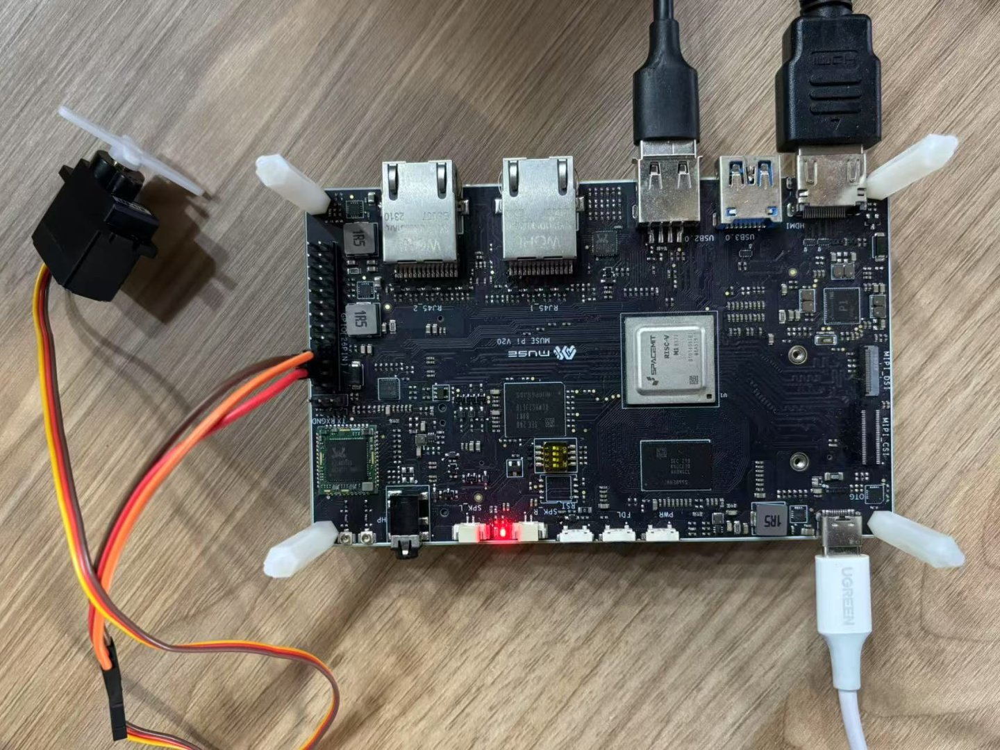

# 3.3.3 PWM 使用说明

本文档介绍如何使用 `gpiozero` 库结合 `lgpio` 引脚工厂，在 Bianbu Robot 开发平台上实现 PWM（Pulse Width Modulation，脉宽调制）功能。PWM 广泛应用于控制舵机、调节 LED 亮度、调速电机等场景。

## 环境准备

确保系统或虚拟环境中已正确安装 `gpiozero` 库：

```bash
pip install gpiozero
```

关于环境配置与引脚工厂的设置方法，请参考 [《3.3.2 GPIO 应用说明》](3.3.2_GPIO_Applications.md)。

## PWM 引脚说明

启用 PWM 功能前，请查阅 [《3.3.1 引脚定义说明》](3.3.1_Pin_Definitions.md)，确认所使用开发板支持的 硬件 PWM 引脚。此类引脚由 SoC 内部定时器控制，具备更高的频率稳定性与精度，适合对时序要求较高的应用（如音频输出、舵机控制）。

> ⚠️ 即使某些 GPIO 引脚不支持硬件 PWM，只要支持基本输出功能，仍可通过 `gpiozero` 实现 软件 PWM，适用于精度要求不高的场景。

此外，请确保目标引脚未被系统服务（如音频、红外）占用。若存在资源冲突，请先释放相关服务。

## PWM 控制示例：舵机驱动

以下示例展示如何通过 GPIO-70 引脚输出 PWM 信号以控制标准舵机的角度。

### 物理连接

| 舵机线色 | 功能   | 连接方式              |
| -------- | ------ | --------------------- |
| 红线     | 电源   | 接开发板 5V 引脚      |
| 黑线     | 地线   | 接开发板 GND          |
| 黄线     | 信号线 | 接开发板 GPIO-70 引脚 |

具体地，连接如图所示：



### 测试代码

```python
# 配置 lgpio 引脚工厂
from gpiozero.pins.lgpio import LGPIOFactory
from gpiozero import Device
Device.pin_factory = LGPIOFactory(chip=0)

# 引入 Servo 控制类
from gpiozero import Servo
from time import sleep

pin_number = 70  # PWM 信号输出引脚

# 初始化 Servo 对象，配置脉宽参数
servo = Servo(
    pin_number,
    min_pulse_width=0.0005,  # 最小脉宽（秒）
    max_pulse_width=0.0025,  # 最大脉宽（秒）
    frame_width=0.02         # PWM 周期（秒）= 20ms（50Hz）
)

# 控制循环：通过用户输入控制舵机角度
while True:
    user_input = input("请输入一个 -1 到 1 之间的浮点数（控制角度）：")
    try:
        value = float(user_input)
        if -1 <= value <= 1:
            servo.value = value
            sleep(0.3)
            servo.detach()  # 停止信号输出，防止舵机抖动
        else:
            print("输入超出范围，请输入 -1 到 1 之间的数值。")
    except ValueError:
        print("无效输入，请输入合法的浮点数。")
```

**控制说明：**

- 输入 `-1` → 对应舵机最小角度（约 0°）
- 输入 `0`  → 对应舵机中位（约 90°）
- 输入 `1`  → 对应舵机最大角度（约 180°）
