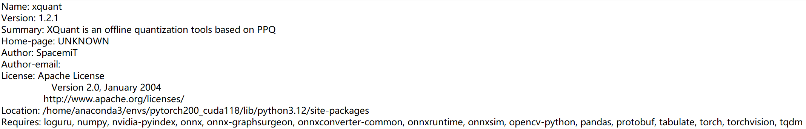
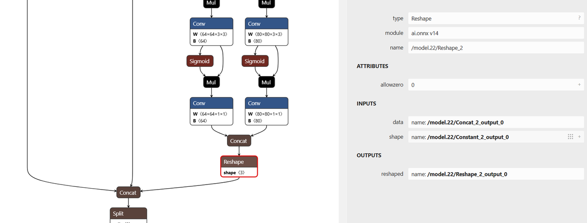

# 4.4 yolov8训练部署全流程

## 模型训练

### 训练环境安装

源代码获取：

```shell
git clone https://github.com/ultralytics/ultralytics
```

依赖安装：

```shell
cd ultralytics
pip install -e .
```

依赖项如果不能下载安装，可以采用镜像网站来下载安装（https://pypi.tuna.tsinghua.edu.cn/simple）


### 模型训练以及导出

```python
from ultralytics import YOLO
#Load a COCO-pretrained YOLOv8n model
model = YOLO("yolov8n.yaml")
#Load a pretrained YOLO model (recommended for training)
model = YOLO("yolov8n.pt")
#Train the model using the 'coco8.yaml' dataset for 100 epochs
results = model.train(data="coco8.yaml", epochs=100)
#Export the model to ONNX format
success = model.export(format="onnx",imgsz=(320,320),simplify=True,opset=13)
```

其中 yolov8n.yaml 为模型的配置文件参数，训练数据的配置文件为 coco8.yaml ，此配置文件涉及到的数据由两部分组成：

```
images ：存放训练集以及验证集的图像数据
lables：存放训练集以及验证集的图像数据对应的标注文件
```

labels里面的标注文件的信息如下所示：

```
0 0.445688 0.480615 0.075125 0.117295
0 0.640086 0.471742 0.0508281 0.0814344
20 0.643211 0.558852 0.129828 0.097623
```

每一行代表一个目标信息，其中第一个整型数字表示该目标的类别信息，后续四个浮点数表示该目标的归一化坐标信息，这四个浮点数的排列顺序为：目标中心点的x坐标，目标中心点的y坐标，目标框x方向的大小，目标框y方向的大小。

**Note**：用户如果是需要在私有数据集上面进行训练微调，建议先加载预训练模型，然后参考coco8.yaml配置文件，准备好相应的训练数据。

## 模型量化

**Note**：注意请在x86平台进行模型量化

### 量化工具安装

量化工具下载：[xquant-1.2.1 下载地址](https://git.spacemit.com/api/v4/projects/33/packages/pypi/files/3bb98cbb937d30f9797032bb44a5779fc01e8b20d2e45e32796c4129ca695704/xquant-1.2.1-py3-none-any.whl)

安装工具：

```shell
pip install xquant-1.2.1-py3-none-any.whl
```

安装完成后可通过以下命令验证安装成功：

```shell
pip show xquant
```

成功后输出：



### 量化文件配置

[Calibration数据下载](https://archive.spacemit.com/spacemit-ai/BRDK/Model_Zoo/Datasets/Coco/Coco.tar.gz)

```json
{
  "model_parameters": {
    "onnx_model": "path/yolov8n.onnx",
    "working_dir": "yolov8",
    "skip_onnxsim": false
  },
  "calibration_parameters": {
    "input_parametres": [
      {
        "mean_value": [0, 0, 0],
        "std_value": [255, 255, 255],
        "color_format": "rgb",
        "data_list_path": "path/calib_list.txt"
      }
    ]
  },
  "quantization_parameters": {
    "truncate_var_names": [
      "/model.22/Reshape_output_0",
      "/model.22/Reshape_1_output_0",
      "/model.22/Reshape_2_output_0"
    ]
  }
}

```

- `onnx_model`：模型路径

- `mean_value` 和 `std_value`：图像归一化参数，需与训练配置保持一致。

- `color_format`：图像通道顺序（如 RGB/BGR）。

- `data_list_path`：校准数据路径文件。


校准图像列表 `calib_list.txt` 内容如下：

```
path/000000428562.jpg
path/000000000632.jpg
path/000000157756.jpg
path/000000044279.jpg
```

path可为相对路径或者绝对路径。

⚠️ 建议校准数据选自模型训练集的子集，并保持数据分布一致。


 `truncate_var_names` 用于指定量化截断点，YOLOv8n 模型中包含后处理（坐标解码）逻辑，建议对模型在后处理节点前进行截断，防止量化误差。

```json
"truncate_var_names": [
  "/model.22/Reshape_output_0",
  "/model.22/Reshape_1_output_0",
  "/model.22/Reshape_2_output_0"
]
```

可使用 [Netron](https://netron.app/) 可视化工具加载 `yolov8n.onnx` 模型确认节点名称：



### 执行量化

运行以下命令进行量化：

```shell
python3 -m xquant --config path/yolov8_xquant_config.json
```

量化完成生成 yolov8n.q.onnx


## 模型推理

模型推理代码下载：

```shell
git clone https://gitee.com/bianbu/spacemit-demo.git
```

进入 yolov8 代码目录:

```
cd examples/CV/yolov8
```

依赖安装

```shell
cd python
sudo apt install python3-pip python3-venv
python3 -m venv name(虚拟环境名)
source name/bin/activate
pip install -r requirements.txt --index-url https://git.spacemit.com/api/v4/projects/33/packages/pypi/simple
```

执行程序:

```shell
python test_yolov8.py --model 量化模型路径 --image 测试图片路径
```

