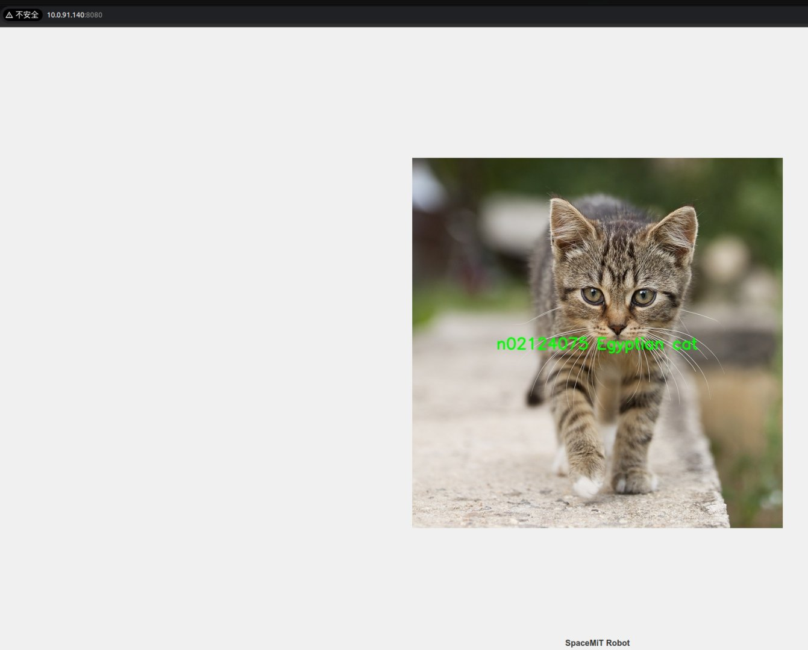

# 5.3.4 图像分类

## mobilenetv2

### 简介

mobilenetv2 图片分类算法示例使用图片或视频作为输入，通过 SpaceMiT 智算核执行算法推理，发布物体类别的 ROS2 消息。

mobilenetv2 支持的目标类型包括人、动物、水果、交通工具等共1000种类型。具体支持的类别详见 COCO的官方标签。

应用场景：mobilenetv2 能够预测给定图片的类别，可实现数字识别、物体识别等功能，主要应用于文字识别、图像检索等领域。

### 支持平台


### 环境准备

**安装依赖项**

```
sudo apt install python3-opencv ros-humble-cv-bridge ros-humble-camera-info-manager \
ros-humble-image-transport python3-spacemit-ort
```


### 查看当前支持的模型配置

**查看已经支持的更多 config_path**

```
ros2 launch br_perception infer_info.launch.py | grep 'classification'
```

输出示例：

```
  - config/classification/resnet18.yaml
  - config/classification/resnet50.yaml
  - config/classification/mobilenet_v2.yaml
```

当你在后续教程中设置 config_path:=config/classification/resnet18.yaml，即可使用resnet18模型

### 推理单张图片

```
# 导入 ROS2 环境
source /opt/bros/humble/setup.bash
cp /opt/bros/humble/share/jobot_infer_py/data/classification/kitten.jpg .
```

**仅打印推理结果：**

```
ros2 launch br_perception infer_img.launch.py config_path:='config/classification/mobilenet_v2.yaml' img_path:='./kitten.jpg'
```

终端输出如下：

```
[INFO] [launch]: All log files can be found below /home/zq-pi3/.ros/log/2025-04-28-14-19-29-545318-spacemit-k1-x-MUSE-Pi-board-527992
[INFO] [launch]: Default logging verbosity is set to INFO
[INFO] [infer_img_node-1]: process started with pid [527993]
[infer_img_node-1] class predict: n02124075 Egyptian cat
[INFO] [infer_img_node-1]: process has finished cleanly [pid 527993]
```

**使用web显示推理结果：**

一个终端：

```
source /opt/bros/humble/setup.bash
ros2 launch br_perception infer_img.launch.py config_path:='config/classification/mobilenet_v2.yaml' img_path:='./kitten.jpg' publish_result_img:=true result_img_topic:='result_img' result_topic:='/inference_result'
```

终端打印如下：

```
[INFO] [launch]: All log files can be found below /home/zq-pi3/.ros/log/2025-04-28-14-23-22-474545-spacemit-k1-x-MUSE-Pi-board-528137
[INFO] [launch]: Default logging verbosity is set to INFO
[INFO] [infer_img_node-1]: process started with pid [528138]
[infer_img_node-1] class predict: n02124075 Egyptian cat
[infer_img_node-1] The image inference results are published cyclically
[infer_img_node-1] The image inference results are published cyclically
```

另一个终端：

```
source /opt/bros/humble/setup.bash
ros2 launch br_visualization websocket_cpp.launch.py image_topic:='/result_img'
```

终端打印如下

```
[INFO] [launch]: Default logging verbosity is set to INFO
[INFO] [websocket_cpp_node-1]: process started with pid [276081]
[websocket_cpp_node-1] Please visit in your browser: 10.0.91.140:8080
[websocket_cpp_node-1] [INFO] [1745548855.705411901] [websocket_cpp_node]: WebSocket Stream Node has started.
[websocket_cpp_node-1] [INFO] [1745548855.706897013] [websocket_cpp_node]: Server running on http://0.0.0.0:8080
[websocket_cpp_node-1] [INFO] [1745548856.281858684] [websocket_cpp_node]: WebSocket client connected.
```

注意"Please visit in your browser:"，浏览器访问 10.0.91.140:8080（不同的ip这个会变） 即可看到推理结果。



最开头的 n02124075 是 ImageNet 的分类序号

result_topic:='/inference_result' 为推理结果发布的话题，你可以使用 ros2 topic echo /inference_result 命令查看

```
ros2 topic echo /inference_result
data: n02124075 Egyptian cat
---
```

消息格式定义为标准消息：std_msgs/msg/String

按 Ctrl + C 可以结束下面这个终端命令运行：

```
ros2 launch br_perception infer_img.launch.py config_path:='config/classification/mobilenet_v2.yaml' img_path:='./1.jpg' publish_result_img:=true result_img_topic:='result_img' result_topic:='/inference_result'
```

你可以换一张其它图片进行推理，改变 img_path 即可，web端的结果会进行更新。


### 推理视频流

```
# 导入 ROS2 环境
source /opt/bros/humble/setup.bash
```

**启动 USB 相机**

```
ros2 launch br_sensors usb_cam.launch.py video_device:="/dev/video20"
```


**使用web可视化结果**

一个终端

```
source /opt/bros/humble/setup.bash
 ros2 launch br_perception infer_video.launch.py config_path:='config/classification/mobilenet_v2.yaml' sub_image_topic:='/image_raw' publish_result_img:='true' result_topic:='/inference_result'
```

另一个终端

```
source /opt/bros/humble/setup.bash
ros2 launch br_visualization websocket_cpp.launch.py image_topic:='/result_img'
```

终端打印如下

```
[INFO] [launch]: Default logging verbosity is set to INFO
[INFO] [websocket_cpp_node-1]: process started with pid [276081]
[websocket_cpp_node-1] Please visit in your browser: 10.0.91.140:8080
[websocket_cpp_node-1] [INFO] [1745548855.705411901] [websocket_cpp_node]: WebSocket Stream Node has started.
[websocket_cpp_node-1] [INFO] [1745548855.706897013] [websocket_cpp_node]: Server running on http://0.0.0.0:8080
[websocket_cpp_node-1] [INFO] [1745548856.281858684] [websocket_cpp_node]: WebSocket client connected.
```

注意"Please visit in your browser:"，浏览器访问 10.0.91.140:8080（不同的ip这个会变） 即可看到推理结果。


**无可视化**

如果你只想要拿到模型推理的结果，如下运行即可：

```
 ros2 launch br_perception infer_video.launch.py config_path:='config/classification/mobilenet_v2.yaml' sub_image_topic:='/image_raw' publish_result_img:='false' result_topic:='/inference_result'
```

打印 /inference_result 话题：

```
ros2 topic echo /inference_result
data: n03788365 mosquito net
---
```

消息格式定义为标准消息：std_msgs/msg/String


**infer_video.launch.py 的参数说明**

| **参数名称**       | 作用                                                   | 默认值                       |
| ------------------ | ------------------------------------------------------ | ---------------------------- |
| config_path        | 配置推理时使用的模型                                   | config/detection/yolov6.yaml |
| sub_image_topic    | 订阅的图像消息话题名                                   | /image_raw                   |
| publish_result_img | 是否以图像消息的形式发布推理结果                       | false                        |
| result_img_topic   | 发布的渲染图像消息名，publish_result_img为true时才有效 | /result_img                  |
| result_topic       | 发布的推理结果消息名                                   | /inference_result            |
