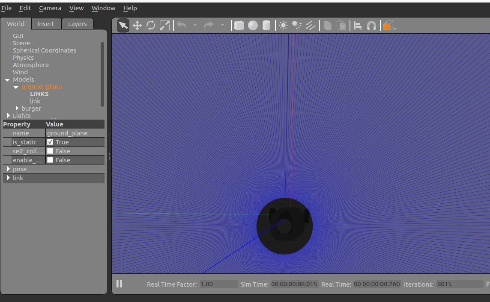
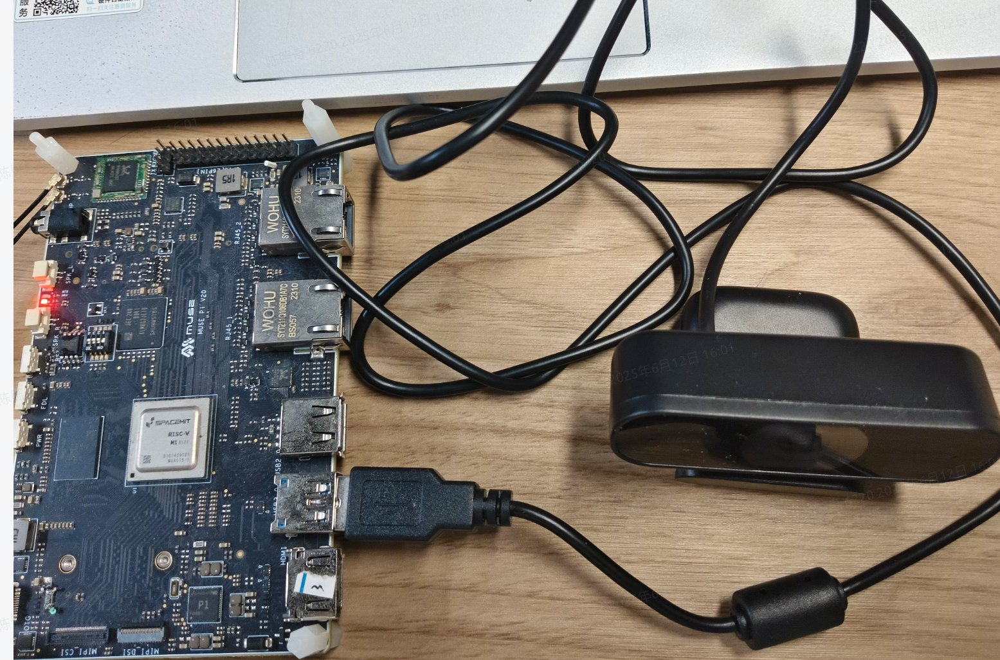
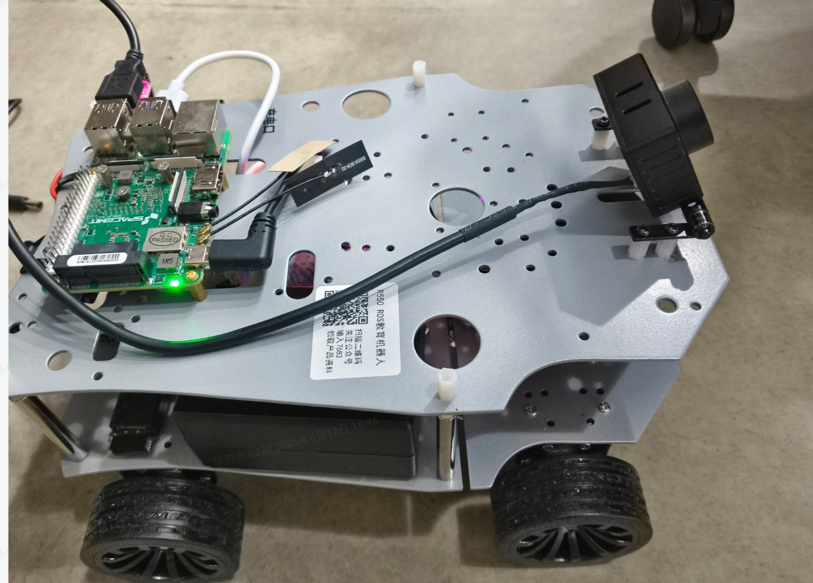

# 5.4.7 小车人体跟随


## 简介
本小节演示小车人体跟随功能，该功能由 USB相机图像采集、人体检测、速度决策等部分组成。为了方便，这里通过 Gazebo 仿真环境观察小车的运动效果。你也可以将它运用于具备 ROS2 底盘速度控制能力的实际小车。

其中 人体跟随算法 运行在 SpaceMiT RISC-V系列板子上。仿真小车模型、Gazebo仿真环境运行在板子同一网段的PC上。

## 支持平台

| 平台类型               | 操作系统                      |
| ---------------------- | ----------------------------- |
| SpaceMiT RISC-V 系列板 | bianbu desktop 24.04 (Humble) |
| x86 平台               | Ubuntu 22.04 (Humble)         |

## 平台要求

### SpaceMiT RISC-V

（1）已烧录 bianbu desktop 24.04 系统镜像；

（2）已完成 Bianbu Robot SDK 安装。

### x86 平台

（1）已安装 Ubuntu 22.04；

（2）已配置 ROS2 Humble 及 Bianbu Robot SDK 环境。

（3）安装小车模型与Gazebo仿真环境：

```
sudo apt install ros-humble-gazebo*
sudo apt install ros-humble-turtlebot3
sudo apt install ros-humble-turtlebot3-gazebo
sudo apt install ros-humble-turtlebot3-bringup
sudo apt install ros-humble-turtlebot3-simulations
```

## 使用介绍

### **启动仿真环境**

输入以下命令加载机器人模型，并启动Gazebo仿真环境。

```shell
source /opt/ros/humble/setup.bash
export TURTLEBOT3_MODEL=burger
ros2 launch turtlebot3_gazebo empty_world.launch.py
```

成功启动后，仿真环境如下图所示：



### 启动人体跟随

在 SpaceMiT RISC-V 板子上启动 人体跟随算法，启动前请确保 USB 相机已经接入。

小车跟随策略是选择距离中心最近的目标，直到跟随到较近的距离后停止，线速度默认 0.1 m/s，角速度默认 0.37 rad/s，可以通过launch文件参数配置。


**硬件连接**



设备号可以如下查看：

```
➜  ~ ls /dev/video*
/dev/video0  /dev/video10  /dev/video12  /dev/video14  /dev/video16  /dev/video18  /dev/video2   /dev/video21  /dev/video4  /dev/video50  /dev/video6  /dev/video8  /dev/video-dec0
/dev/video1  /dev/video11  /dev/video13  /dev/video15  /dev/video17  /dev/video19  /dev/video20  /dev/video3   /dev/video5  /dev/video51  /dev/video7  /dev/video9
```

反复插拔一下即可确认设备号，程序内默认的设备号是 /dev/video20


**启动跟随节点**

一个终端：

```
# 导入 ROS2 环境
source /opt/bros/humble/setup.bash
```

```
ros2 launch br_application agv_person_follow.launch.py
```

输出如下：

```
[INFO] [launch]: All log files can be found below /home/zq-pi/.ros/log/2025-06-12-16-07-34-737169-spacemit-k1-x-MUSE-Pi-board-89537
[INFO] [launch]: Default logging verbosity is set to INFO
[INFO] [agv_follow_node-1]: process started with pid [89544]
[agv_follow_node-1] [INFO] [1749715663.222242636] [agv_follow_node]: AI 跟踪控制服务已启动, 当前状态为暂停
```

**为了适应多任务处理的场景，跟随节点启动了一个可以控制是否跟随的服务。**

你可以在终端快速开启该服务：

```
source /opt/bros/humble/setup.bash
ros2 service call /toggle_follow std_srvs/srv/SetBool "{data: true}"
```

跟踪节点会打印：

```
[agv_follow_node-1] [INFO] [1749715842.691932191] [agv_follow_node]: 收到请求: data=True -> AI 跟踪模块已开启
```

关闭服务可以使用：

```
ros2 service call /toggle_follow std_srvs/srv/SetBool "{data: false}"
```

在代码里使用该服务：

```python
import rclpy
from rclpy.node import Node
from std_srvs.srv import SetBool

class FollowClient(Node):
    def __init__(self):
        super().__init__('follow_control_client')
        self.cli = self.create_client(SetBool, 'toggle_follow')

        # 等待服务启动
        while not self.cli.wait_for_service(timeout_sec=1.0):
            self.get_logger().info('等待 toggle_follow 服务中...')

    def send_request(self, enable: bool):
        req = SetBool.Request()
        req.data = enable
        future = self.cli.call_async(req)
        rclpy.spin_until_future_complete(self, future)

        if future.result() is not None:
            self.get_logger().info(f'响应: success={future.result().success}, message="{future.result().message}"')
        else:
            self.get_logger().error('服务调用失败')

def main():
    rclpy.init()
    client = FollowClient()
    client.send_request(True)  # 发送 True 表示开启跟踪
    client.destroy_node()
    rclpy.shutdown()

if __name__ == '__main__':
    main()
```


跟随节点终端打印：

```
[agv_follow_node-1] cmd_vel -- linear_x:0.0, angular_z:0.0
[agv_follow_node-1] cmd_vel -- linear_x:0.0, angular_z:0.0
[agv_follow_node-1] cmd_vel -- linear_x:0.4, angular_z:0.0
[agv_follow_node-1] cmd_vel -- linear_x:0.4, angular_z:0.0
[agv_follow_node-1] cmd_vel -- linear_x:0.4, angular_z:0.0
[agv_follow_node-1] cmd_vel -- linear_x:0.4, angular_z:0.0
[agv_follow_node-1] cmd_vel -- linear_x:0.4, angular_z:0.0
```

你可以远离相机，或左右摆动，你应该可以看到小车在Gazebo运动。

### 查看检测结果

如果你想查看人体目标检测的结果，需要调整启动launch文件的参数如下：

```
ros2 launch br_application agv_person_follow.launch.py publish_result_img:=true
```

话题发布到 /detection_image

你可以在 PC 上运行 ros2 run rqt_image_view rqt_image_view 来查看。

### 可配置的参数

**agv_person_follow.launch.py 的参数说明**

| **参数名称**       | 作用                 | 默认值             |
| ------------------ | -------------------- | ------------------ |
| video_device       | 设置相机设备号       | /dev/video20       |
| publish_result_img | 是否发布目标检测结果 | False              |
| linear_x           | 跟随时的线速度       | 0.4（单位 m/s）    |
| angular_z          | 跟随时的角速度       | 0.37（单位 rad/s） |

## 实际小车人体跟随



在实际的小车中，相机需要具有一定的仰角，这样识别的效果较好。
