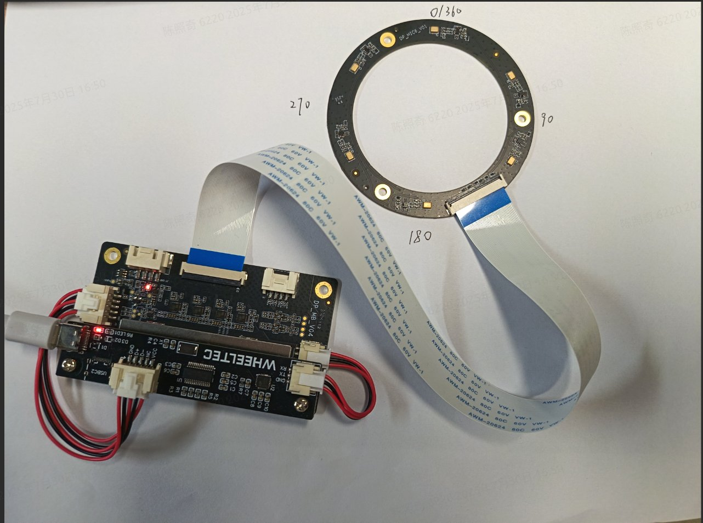
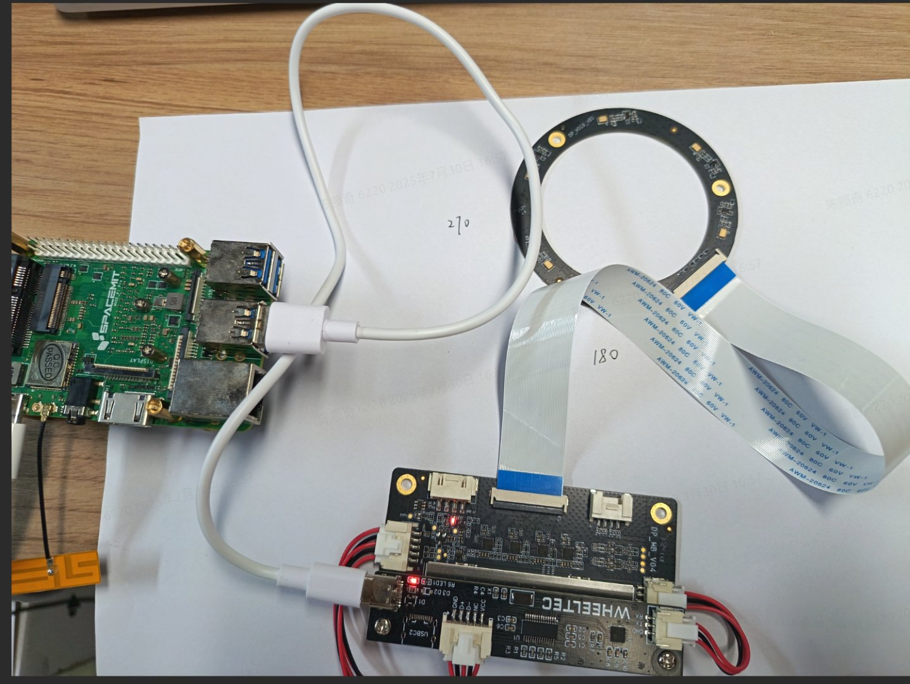

# 5.4.9 声源定位


## 硬件介绍

官方链接：[链接](https://item.m.jd.com/product/10054882134702.html?gx=RnAomTM2b2fan85Hp41wX4inMaW5_TE&gxd=RnAoy2BbbWDZyZwcrIImVA6-xKLxjrc&ad_od=share&utm_source=androidapp&utm_medium=appshare&utm_campaign=t_335139774&utm_term=CopyURL)

本示例使用科大讯飞联名远场麦克风阵列六麦M260C板语音交互模块实现声源定位功能，硬件如下图：



输出的角度为 0 ~ 360


## 硬件连接



## 设置设备规则

```
sudo su

echo  'KERNEL=="ttyACM*", ATTRS{serial}=="0004", ATTRS{idVendor}=="1a86", ATTRS{idProduct}=="55d4", MODE:="0777",SYMLINK+="wheeltec_mic"' >/etc/udev/rules.d/wheeltec_mic.rules

udevadm control --reload-rules
udevadm trigger
```

输入 `ls /dev/wheeltec_mic -lh` 查看是否成功设置


输出如上表示设置成功。


## 启动声源定位

```
ros2 launch br_sensors ring_mic.launch.py
```

在任意方向说：“小微小微”，节点检测到唤醒词后会输出声源角度，如下图所示：


“小微小微” 为默认唤醒词，可以根据官方硬件文档按需求更改。

收到唤醒词后，标志位会置为 1 一次，随后置为 0 ，在订阅话题时，可以根据该标志位判断有无唤醒。


### 话题订阅

话题名为： `angle_topic`

简单的订阅脚本：

```
import rclpy
from rclpy.node import Node
from std_msgs.msg import Int32MultiArray

class AngleSubscriber(Node):
    def __init__(self):
        super().__init__('angle_subscriber')
        self.subscription = self.create_subscription(
            Int32MultiArray,
            'angle_topic',
            self.listener_callback,
            10
        )

    def listener_callback(self, msg):
        if msg.data and len(msg.data) >= 2:
            angle = msg.data[0]
            trigger_flag = msg.data[1]
            self.get_logger().info(f"Received angle: {angle}, trigger: {trigger_flag}")

def main(args=None):
    rclpy.init(args=args)
    node = AngleSubscriber()
    rclpy.spin(node)
    node.destroy_node()
    rclpy.shutdown()

if __name__ == '__main__':
    main()
```

保存为 `angle_sub.py`

```
source /opt/bros/humble/setup.bash
python3 angle_sub.py
```

即可看到消息的订阅和循环打印
