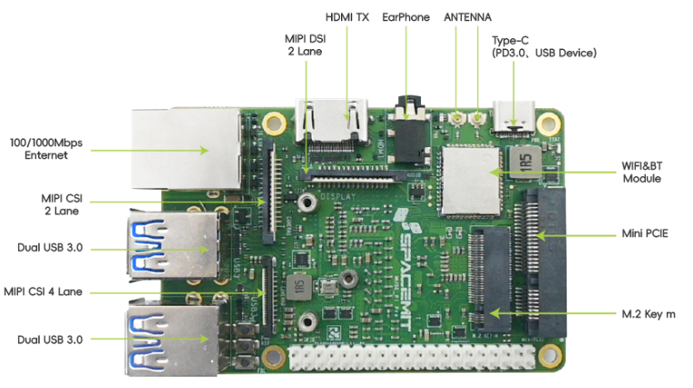
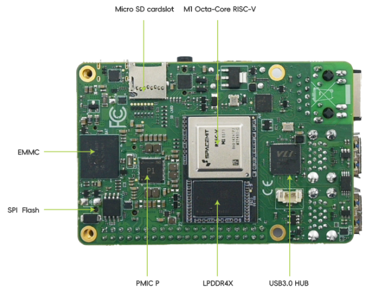
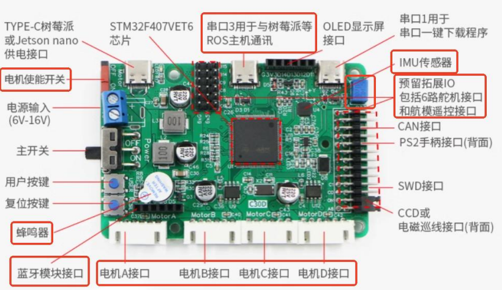
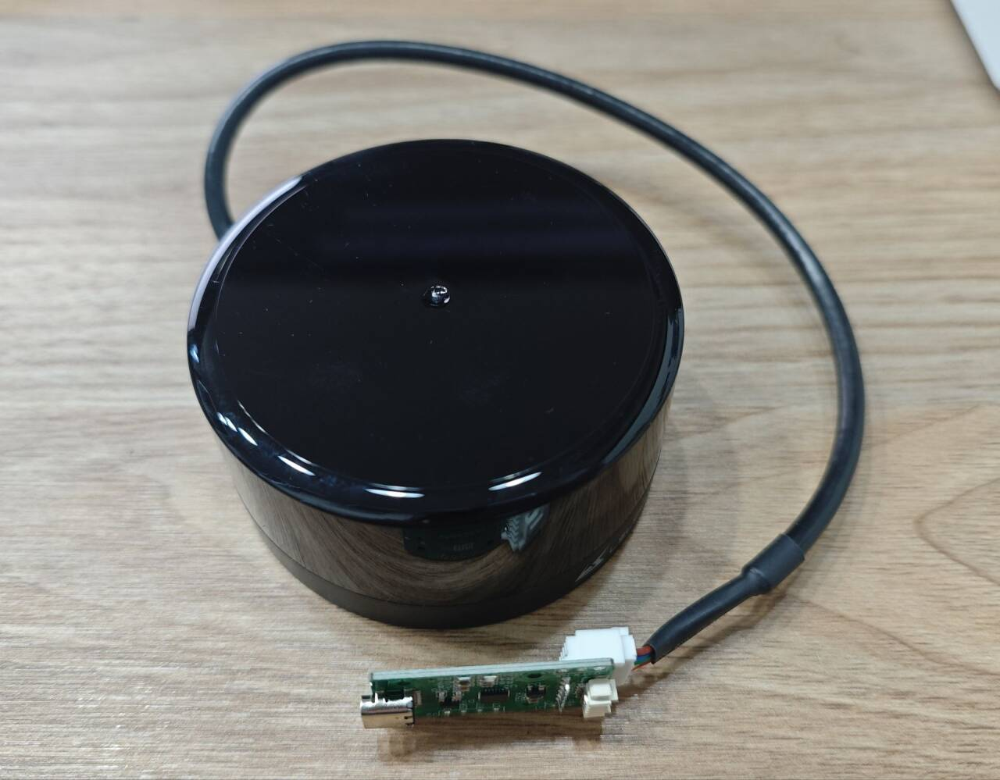
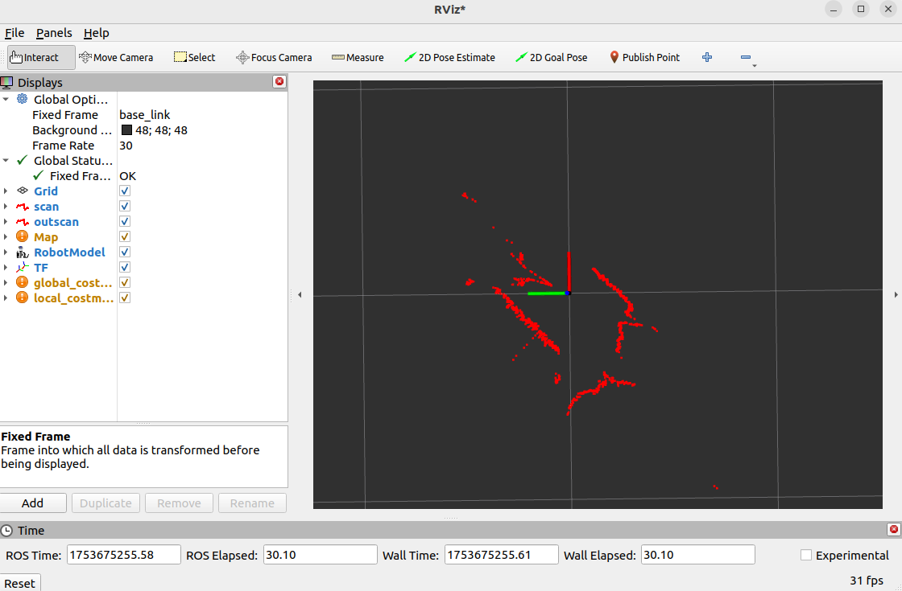
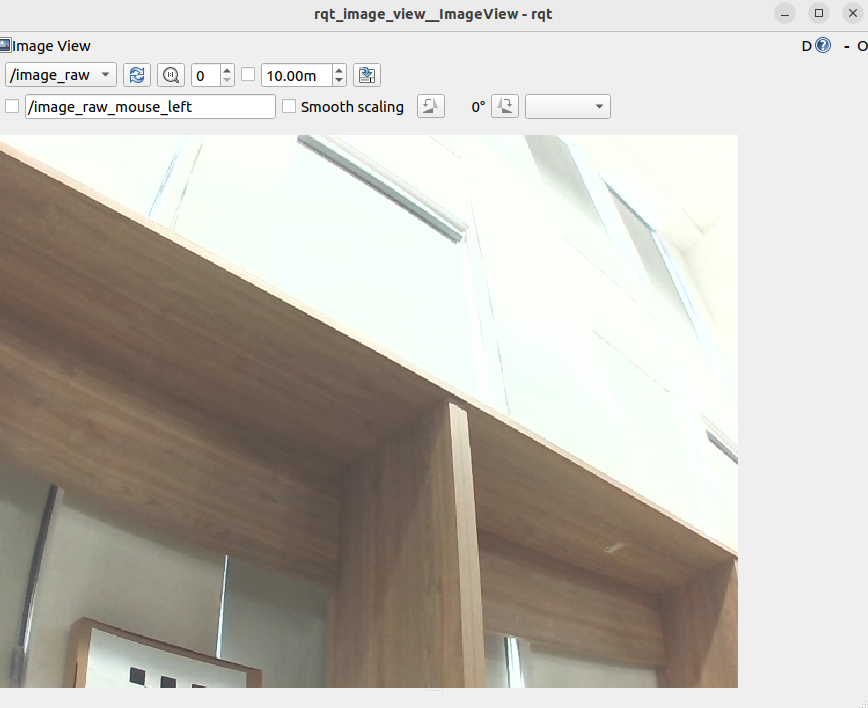

# 5.6.5 轮趣科技ROS差速小车适配

## 案例简介

本案例展示了 K1 开发板适配轮趣科技教育版ROS差速小车的完整流程。一个完整的 ROS 机器人系统通常由四个核心部分组成：运动底盘（执行）、ROS 主控（决策）、传感器（感知）以及电池（能源）。其中，电池集成在运动底盘上，通过电气线路为机器人各个模块供电，运动底盘、ROS 主控与传感器之间也依靠电气线路进行数据通信与协同工作。本案例详细演示了如何将 K1 开发板作为 ROS 主控，与轮趣教育版差速小车对接，并实现对小车的运动控制。

## 硬件清单

- SpaceMit K1 开发板一块
- 轮趣科技教育版 ROS 差速小车一辆

## 环境适配

### K1 开发板

**硬件信息**

K1 开发板将 RISC-V 八核处理器、存储硬盘、通用接口部件和扩展接口布置在同一块电路板上，支持 UEFI 启动以及多种操作系统和应用的运行，是一款完整的计算机系统产品。在本示例中将演示如何将K1 开发板替换轮趣 ROS 小车的树莓派，作为小车的 ROS 主控。

供电：使用运动底盘(STM32)控制器的TypeC-TypeC电源接口直接供电（5V）或使用电池直接供电（12V）。

信号：K1 开发板与各传感器的信号连接全部通过USB接口进行，包括运动底盘、激光雷达、相机。





轮趣 ROS 小车中的各个传感器均与K1开发板连接，具体适配方法在下文各个传感器的小节中介绍。

### 运动底盘

**硬件信息**

轮趣教育版ROS差速小车的运动底盘为STM32的驱控一体控制板。



供电：起源于电池，主要通过T头线或其它分流线输出到其它部件。

信号：起源于 K1 开发板，通过各种专用线材连接，最后控制电机与轮子转动。

**适配方法**

连接好运动底盘到K1开发板的供电线（typeC-typeC）后，启动运动底盘上的开关，等待K1-bainbu-desktop 系统启动。接着接入运动底盘到K1开发板的信号线（typeC-USB）, K1 开发板打开一个新终端，输入以下命令：
```shell
sudo dmesg | tail -20
```
查看类似于以下的输出，确认运动底盘USB设备端口号```/dev/ttyACM0```：
```shell
[ 1673.471036] usb 2-1.1: new full-speed USB device number 8 using xhci-hcd
[ 1673.675568] cdc_acm 2-1.1:1.0: ttyACM0: USB ACM device
```
根据自己实际的端口号，输入以下命令查看设备信息：
```shell
udevadm info -a -n /dev/ttyACM0
```
查看类似于以下的设备信息输出，确认设备的```ATTRS{serial}```：
```shell
ATTRS{product}=="USB Single Serial"
ATTRS{serial}=="0002"
ATTRS{serial}=="xhci-hcd.0.auto"
```
输入以下命令重映射运动底盘的udev规则，固定USB串口设备命名：
```shell
echo 'SUBSYSTEM=="tty", ATTRS{serial}=="0002", MODE:="0777",SYMLINK+="wheeltec_controller"' | sudo tee /etc/udev/rules.d/wheeltec_controller.rules
```
输入以下命令重启udev服务：
```shell
sudo udevadm control --reload-rules
sudo udevadm trigger
```

**测试运行**

编译轮趣科技提供的运动底盘ros2功能包进行测试（注释掉turn_on_wheeltec_robot/package.xml里的<depend>ackermann_msgs</depend>）：
```shell
sudo apt update
sudo apt install ros-humble-turtlesim ros-humble-navigation2 ros-humble-joint-state-publisher ros-humble-robot-localization teleop_twist_keyboard
colcon build --packages-select serial turn_on_wheeltec_robot wheeltec_robot_msg wheeltec_robot_urdf
source install/setup.bash
ros2 launch turn_on_wheeltec_robot turn_on_wheeltec_robot.launch.py
```

打开另一个终端，启动键盘控制节点：
```shell
ros2 run teleop_twist_keyboard teleop_twist_keyboard
```

通过终端显示的键盘按键映射，可以实现键盘控制小车运动。

### 激光雷达

**硬件信息**

轮趣教育版ROS差速小车使用的是镭神智能的激光雷达，型号为M10P。

供电&&信号：通过USB接口与K1开发板连接。



**适配方法**

连接好激光雷达到K1开发板的数据线（typeC-USB）， K1 开发板打开一个新终端，输入以下命令：
```shell
sudo dmesg | tail -20
```
查看类似于以下的输出，确认激光雷达USB设备端口号```/dev/ttyACM1```：
```shell
[ 4562.938371] usb 2-1.3: new full-speed USB device number 9 using xhci-hcd
[ 4563.146987] cdc_acm 2-1.3:1.0: ttyACM1: USB ACM device
```
根据自己实际的端口号，输入以下命令查看设备信息：
```shell
udevadm info -a -n /dev/ttyACM1
```
查看类似于以下的设备信息输出，确认设备的```ATTRS{serial}```：
```shell
ATTRS{product}=="USB Single Serial"
ATTRS{serial}=="5A6D016420"
ATTRS{serial}=="xhci-hcd.0.auto"
```
输入以下命令重映射激光雷达的udev规则，固定USB串口设备命名：
```shell
echo 'SUBSYSTEM=="tty", ATTRS{serial}=="5A6D016420", MODE:="0777",SYMLINK+="wheeltec_lidar"' | sudo tee /etc/udev/rules.d/wheeltec_lidar.rules
```
输入以下命令重启udev服务：
```shell
sudo udevadm control --reload-rules
sudo udevadm trigger
```

**测试运行**

编译轮趣科技提供的激光雷达ros2功能包进行测试：
```shell
colcon build --packages-select wheeltec_lidar_ros2
source install/setup.bash
ros2 launch lslidar_driver lsm10p_uart_launch.py
```
在同网段的PC上可以通过rviz2观察激光雷达的实时数据。打开一个终端发布雷达静态坐标变换：
```shell
ros2 run tf2_ros static_transform_publisher 0 0 0 0 0 0 base_link laser
```
打开另一个终端：
```shell
ros2 run rviz2 rviz2
```
修改Fixed Frame 为laser，点击add -> by topic -> /scan ，点击ok。观察激光雷达数据如下所示：



### 相机

**硬件信息**

轮趣教育版ROS差速小车使用的是单目RGB相机，型号为C70。

供电&&信号：通过USB接口与K1开发板连接。


**适配方法**

连接好相机到K1开发板的USB接口数据线， K1 开发板打开一个新终端，输入以下命令：
```shell
v4l2-ctl --list-devices
```
查看类似于以下的输出，确认相机USB设备端口号```/dev/video20```：
```shell
Integrated Webcam: Integrated W (usb-xhci-hcd.0.auto-1.4):
	/dev/video20
	/dev/video21
	/dev/media1
```

**测试运行**

安装相机usb-cam包：
```shell
sudo apt install ros-humble-usb-cam
source /opt/ros/humble/setup.bash
ros2 run usb_cam usb_cam_node_exe --ros-args -p video_device:=/dev/video20
```
打开一个新终端，输入以下命令查看输出图像话题：
```shell
ros2 topic echo /image_raw
```
也可以在同网段的PC上输入以下命令，查看实时图像：
```shell
ros2 run rqt_image_view rqt_image_view 
```
