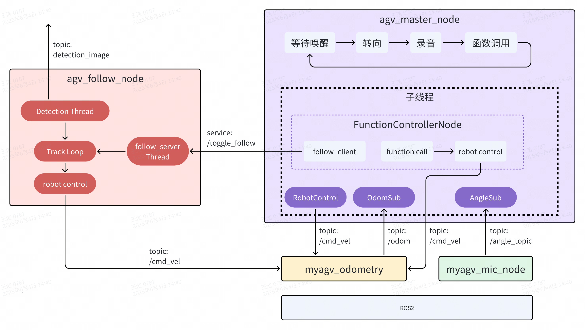

# 5.6.1 小车人体跟随

[点击观看视频](https://archive.spacemit.com/ros2/Video_examples/agv-follow.mp4)

## 案例简介

本案例展示了 K1 平台驱动 AGV 小车完成多模态交互与自主移动的能力。系统通过深度集成 ROS2 框架，实现了高精度的路径规划、动态避障及稳定的人体跟随功能。采用 Function Call 技术架构，支持用户通过自然语音指令与 AGV 小车进行实时交互，构建了智能化的人机协作系统。该解决方案充分融合了环境感知、运动控制和语音交互等关键技术，展现了家庭服务和工业级 AGV 的智能化应用前景。

## 硬件清单

- 基于 K1 芯片的开发板一块（配套电源）
- 轮趣教育版 ROS 小车一辆
- 单目相机一个
- 环形麦克风一个
- USB 声卡或者扬声器一个

## 案例框架和控制流程



上图展示了 AGV 小车跟随案例在 ROS2 系统中的整体框架与流程控制，主要由以下四个节点组成：

1）`agv_master_node`：主控节点，负责整体流程控制。

- 监听 `/angle_topic` 话题获取是否唤醒和唤醒角度信息；
- 发送 `/cmd_vel` 话题控制小车转向目标角度；
- 调用 `spacemit_audio/record.py` 执行录音，根据录音执行函数调用（由 FunctionControllerNode 节点管理）；
- 根据语音结果决定是否启动跟随（通过服务 `/toggle_follow` 触发）；
- 其它控制指令直接通过 `/cmd_vel` 发布。

2）`agv_follow_node`：视觉跟随节点，实现对目标行人的跟踪控制。

- 视觉线程检测图像中最接近中心的人，发布 `/detection_image` 话题给主线程；
- 主线程根据监测信息计算并发布 `/cmd_vel` 控制速度；
- 服务线程监听 `/toggle_follow` 服务来控制是否启用跟随。

3）`myagv_mic_node`：麦克风节点，进行声源定位和语音唤醒。

- 进行声源检测，发布 `/angle_topic`（包含角度 + 是否唤醒）。

4）`myagv_odometry`：底盘节点，提供小车位置（`/odom`）和接受控制（`/cmd_vel`）。

- 根据 `/cmd_vel` 控制小车移动；
- 发布 `/odom` 供主控节点判断方向；
- 可替换为真实或仿真底盘控制模块。

## 环境搭建

### 下载主程序代码

```
git clone https://github.com/elephantrobotics/jobot-ai-elephant.git ~/
```

### 安装系统依赖

```
sudo apt update
sudo apt install -y \
  libopenblas-dev \
  portaudio19-dev \
  python3-dev \
  ffmpeg \
  python3-spacemit-ort \
  libcjson-dev \
  libasound2-dev
```

### 安装 ROS 依赖

1）安装依赖包

```
sudo apt install -y ros-dev-tools ros-humble-ros-base python3-venv ros-humble-xacro \
  ros-humble-joint-state-publisher ros-humble-'tf2*' \
  ros-humble-'nav*' ros-humble-slam-toolbox ros-humble-tf-transformations
```

2）构建小车的 ROS 包

```
mkdir -p ~/agv_ws/src
cd ~/agv_ws/src
git clone https://gitee.com/cookieee/agv-elephant-ros2-pkgs.git

cd ~/agv_ws/
source /opt/ros/humble/setup.zsh
colcon build
```

### 安装 Python 依赖

1）创建 Python 虚拟环境

```
virtualenv ~/audio-env
```

2）配置 pip 源为进迭时空镜像源

```
pip config set global.extra-index-url https://git.spacemit.com/api/v4/projects/33/packages/pypi/simple
pip config set --extra-index-url https://mirrors.tuna.tsinghua.edu.cn/pypi/web/simple
```

3）安装 Python 依赖

```
cd ~/jobot-ai-elephant/spacemit_audio
source ~/audio-env/bin/activate
pip install -r requirements.txt

# 额外安装opencv依赖
pip install lap transforms3d cython-bbox opencv-python==4.6.8.1
```

### 配置 udev

1）配置udev规则将硬件设备映射到系统设备索引

```Bash
echo 'KERNEL=="ttyACM*", ATTRS{idVendor}=="1a86", ATTRS{idProduct}=="55d4",MODE:="0777",SYMLINK+="wheeltec_mic"' >/etc/udev/rules.d/myagv_mic.rules

echo 'KERNEL=="ttyACM*", ATTRS{idVendor}=="1a86", ATTRS{idProduct}=="55d3",MODE:="0777",SYMLINK+="agv_odom"' >/etc/udev/rules.d/myagv_odom.rules

echo  'KERNEL=="ttyUSB*", ATTRS{idVendor}=="1a86", ATTRS{idProduct}=="7523",MODE:="0777",SYMLINK+="agv_lidar"' >/etc/udev/rules.d/myagv_lidar.rules
```

2）使设置生效

```
sudo udevadm control --reload-rules
sudo udevadm trigger
```

### 编译 ydlidar_sdk

```Bash
git clone https://github.com/YDLIDAR/YDLidar-SDK.git ~
cd ~/YDLidar-SDK
mkdir build && cd build
cmake ..
cmake --build . -- -j8
sudo cmake --install .
```

### 音频权限设置

执行下述命令将当前用户加入 audio 用户组，从而赋予用户访问和管理音频设备的权限：

```
sudo usermod -aG audio $USER
```

## 启动程序

### 启动 ROS

1）获取 ROS 环境

```Bash
source /opt/ros/humble/setup.zsh
source ~/agv_ws/install/setup.zsh
```

2）启动底盘控制系统

```Bash
ros2 launch myagv_odometry myagv_only_move.launch.py
```

3）启动语音唤醒服务

```Bash
ros2 run jobot_mic myagv_mic_node
```

### 启动 Python 节点

1）获取 ROS 环境

```Bash
source /opt/ros/humble/setup.zsh
```

2）激活 Python 虚拟环境

```
source ~/audio-env/bin/activate
```

3）启动跟踪节点

```Bash
cd ~/jobot-ai-elephant
python agv_follow_node.py
```

4）启动AI pipeline节点

```Bash
cd ~/jobot-ai-elephant
python agv_master_node.py
```

### 注意事项

- 唤醒词：小微小微
  每次唤醒时，小车会先停止当前运动，然后旋转到用户方向，随后开始录音，录音的最大时长 5 秒。

- 提示词：跟我走、停止跟随、原地旋转、向前走、向后走、向前走两步、向后走两步、向左转、向右转