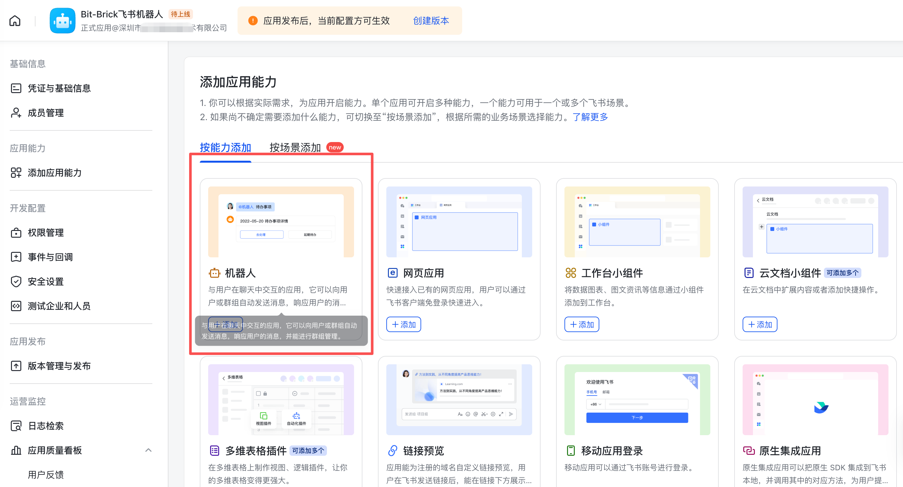
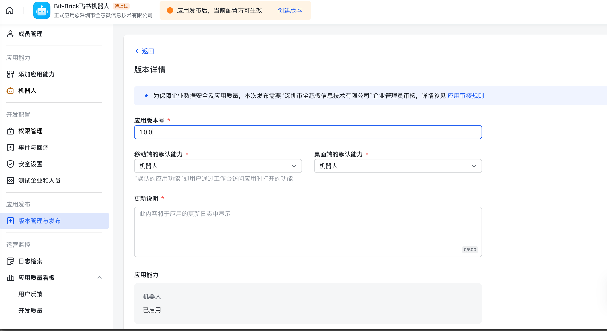
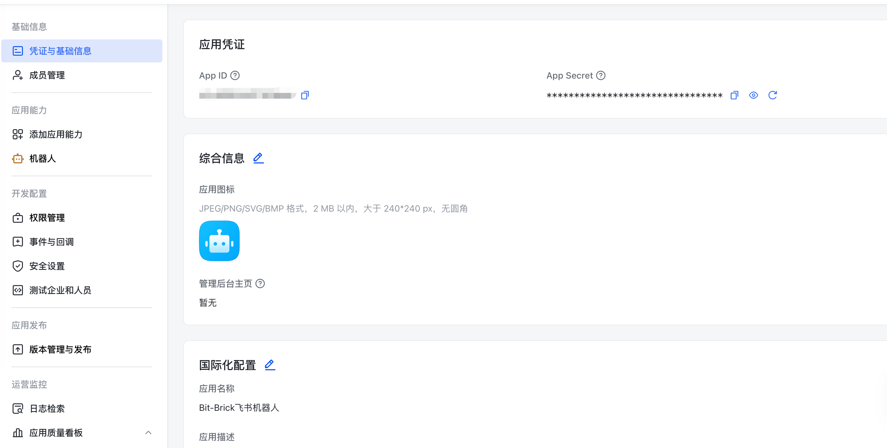
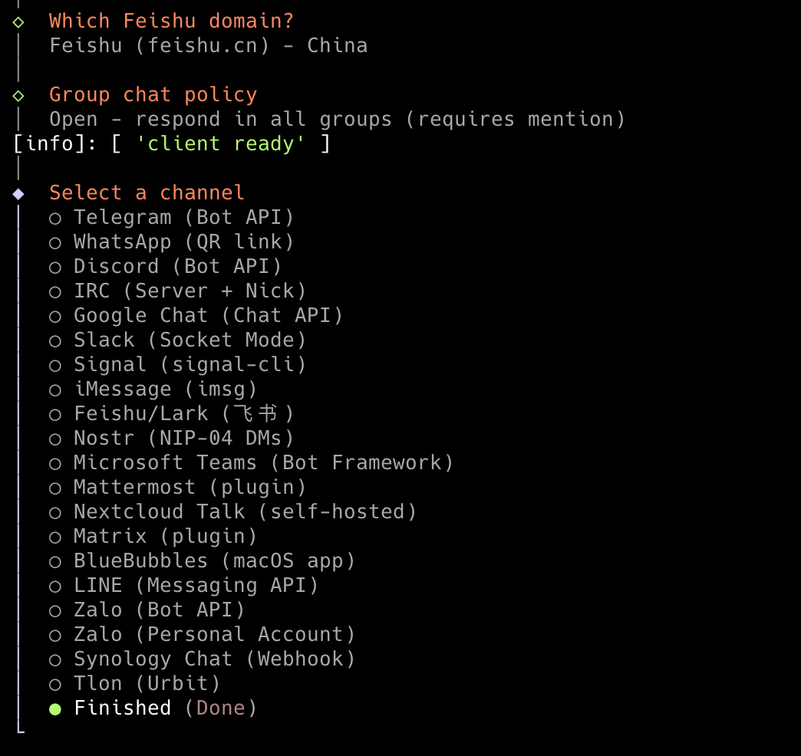
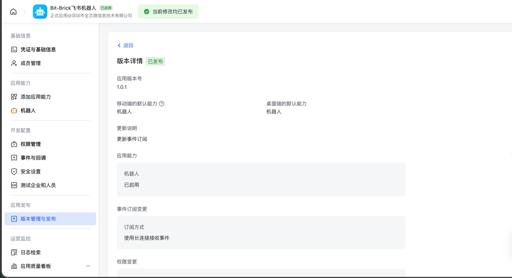
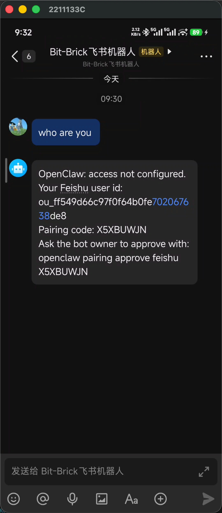
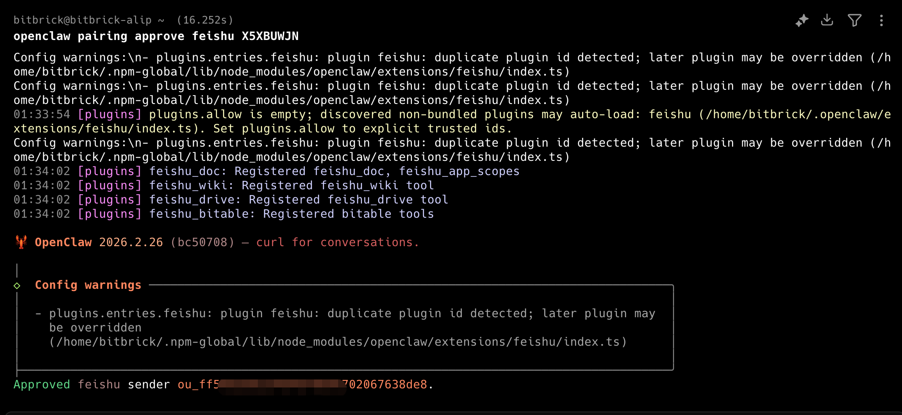
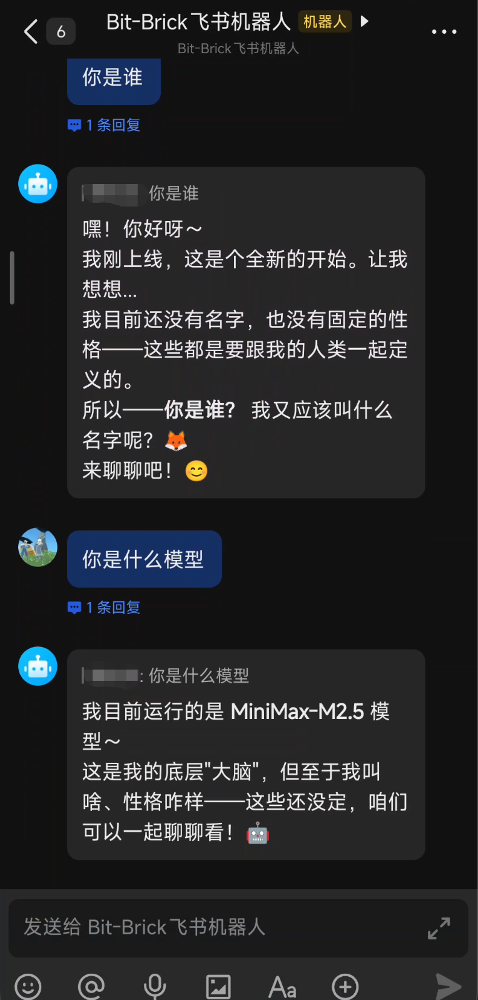

# OpenClaw 配置飞书通道

参考：https://docs.openclaw.ai/zh-CN/channels/feishu

OpenClaw飞书通道允许您通过飞书与OpenClaw进行自然语言交互。配置完成后，您可以在飞书中向OpenClaw发送消息，OpenClaw会理解您的意图并执行相应的操作。

## 配置步骤

### 1. 创建飞书应用

1. 进入[飞书开发者平台](https://open.feishu.cn/)，注册并登录账户
2. 进入[开发者后台](https://open.feishu.cn/app)创建一个新的应用


### 2. 添加机器人和权限

**添加机器人**：选择 **添加应用能力** → **按能力添加** → **机器人** → **添加**



**配置权限**：在权限管理页面，选择 **批量导入/导出权限** → **导入权限**，复制以下权限列表到文本框中，然后点击 **导入权限**


```
{
	"scopes": {
		"tenant": [
			"aily:file:read",
			"aily:file:write",
			"application:application.app_message_stats.overview:readonly",
			"application:application:self_manage",
			"application:bot.menu:write",
			"cardkit:card:write",
			"contact:user.employee_id:readonly",
			"corehr:file:download",
			"docs:document.content:read",
			"event:ip_list",
			"im:chat",
			"im:chat.access_event.bot_p2p_chat:read",
			"im:chat.members:bot_access",
			"im:message",
			"im:message.group_at_msg:readonly",
			"im:message.group_msg",
			"im:message.p2p_msg:readonly",
			"im:message:readonly",
			"im:message:send_as_bot",
			"im:resource",
			"sheets:spreadsheet",
			"wiki:wiki:readonly"
		],
		"user": ["aily:file:read", "aily:file:write", "im:chat.access_event.bot_p2p_chat:read"]
	}
}
```


### 3. 创建初始版本并发布

创建并发布一个初始版本（具体内容可以随意填写），这样才能进行后续的事件订阅配置。




### 4. 配置OpenClaw飞书通道

1. 进入飞书机器人的 **凭证与基础信息** 页面，复制 **应用凭证** 信息



2. 运行OpenClaw配置命令并按以下步骤操作：

```
openclaw configure
```

- 选择 **本地（Local）**
- 选择 **Channels**
- 选择 **Configure/link**
- 选择 **Feishu/Lark（飞书）**
- 选择 **Download from npm** 进行npm安装
- 输入飞书应用的 **App ID** 和 **App Secret**


3. 按如下选择继续配置：
   - 选择 **Feishu（feishu.cn）- China**（中国站点）
   - 选择 **Open** - 在所有群组中响应（需要@机器人）
   - 选择 **Finished**（完成通道选择）
   - 选择 **Yes** 配置DM访问策略
   - 选择 **Pairing**（推荐）
   - 选择 **Continue**（完成）



### 5. 配置事件订阅

在飞书后台的 **事件订阅** 页面进行以下配置：

1. 选择 **使用长连接接收事件**（WebSocket模式）
2. 添加事件：**im.message.receive_v1**（用于接收消息）

> **注意**：如果网关未启动或通道未添加，长连接设置将保存失败。


### 6. 发布新版本

在飞书后台的 **版本管理与发布** 页面：

1. 选择 **创建版本**
2. 填写 **版本号** 和 **说明**
3. 点击 **保存**，然后 **确认发布**



您将在飞书界面收到应用更新提醒，点击 **打开应用** 进入聊天界面。


### 7. 配对和验证

1. 打开聊天界面，发送任意消息，机器人会回复一个配对码



2. 在命令行运行OpenClaw配对命令，输入收到的配对码



3. 在聊天界面向机器人发送消息进行测试，验证集成是否成功




!