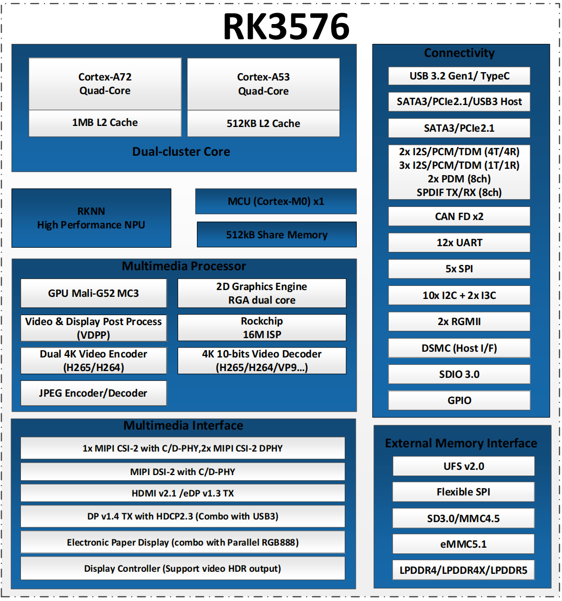

# K1 Pro Processor Brief  

## RK3576
**A low power, high performance AIoT processor**

### Features

#### CPU
- Quad Cortex-A72 and quad Cortex-A53
- 1MB unified L2 cache for Cortex-A72
- 512KB unified L2 cache for Cortex-A53
- ARM Cortex M0 for user application

#### GPU
- ARM Mali G52 MC3
- OpenGL ES 1.1, 2.0 and 3.2, OpenCL 2.1, Vulkan 1.2

#### NPU
- 6 TOPS@INT8
- Support int4/int8/int16/FP16/BF16/TF32
- Support deep learning frameworks: TensorFlow, Caffe, Tflite, Pytorch, Onnx NN, Android NN, etc

#### Memory
- 32-bit LPDDR4/LPDDR4x/LPDDR5
- eMMC 5.1, SDIO 3.0 and SFC
- UFS v2.0

#### Multimedia
- H.265 HEVC Main10 L5.1 yuv444: 4K 120fps
- H.264 AVC High10 L5.1 yuv422: 4K 60fps
- H.264 MVC up to 1080P 60fps
- VP9 Profile0/2 L5.1: 4K 120fps
- AVS2 Profile0/2 L10.2.6: 4K 120fps
- AV1 Main10 L5.3: 4K 120fps
- 4K@60fps video encoders for H.264/H.265

#### Video Input
- 16M Pixel ISP with HDR & 3DNR
- Triple MIPI CSI-2 with 4-lane interfaces
- 16-bit DVP interface, up to 150MHz

#### Display
- Multiple display up to (4K@120 + 2.5K@60 + 2K@60)
- HDMI v2.1 / eDP v1.3 Combo interface
- MIPI DSI, 4 lanes
- DP v1.4 and USB 3.0 combo (Type-C) interface
- Parallel output interface
- EBC output interface
- Picture Quality post-process module

#### Audio Interface
- 5x SAI interfaces, support I2S/TDM/PCM mode
- SPDIF TX and SPDIF RX
- PDM0/PDM1 with 8 channels
- Dual 2-ch and dual 4-ch ASRC
- Digital Audio Codec with 2 channels

#### High Speed Interface
- PCIe2.1/SATA3 combo interface with one data lane
- PCIe2.1/SATA3/USB3.0 combo interface with one data lane
- 2x RGMII interfaces

#### Industry
- 2x CAN FD
- 16-bit DSMC (Double Data Rate Serial Memory Controller)

#### Security
- ARM TrustZone security extension
- Secure boot and JTAG
- Key ladder
- Crypto (RSA 4096, AES 256, SHA-512…)
- HDCP 2.x for HDMI and DP/eDP

#### SDK
- Linux and Android

#### Package Information
- FCCSP698L (16.1 x 17.2mm, pitch: 0.6mm)

### Applications
- Intelligent Cabin
- Meeting Bar
- OTT
- Virtual Desktop Infrastructure (VDI)
- Smart Whiteboard
- NVR
- ARM PC
- E-ink Screen
- HMI
- Tablet
- Robot Vacuum
- Advertising Machine
- Large Monitor
- Cash Register
- Gateway

### Block Diagram

## 参考 
[RK3576 Brief Datasheet](https://www.rock-chips.com/uploads/pdf/2024.3.18/191/RK3576%20Brief%20Datasheet%20V1.2-20240311.pdf)