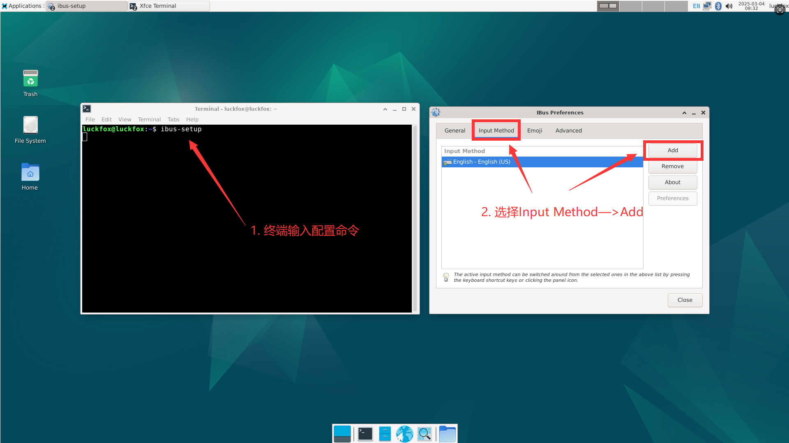
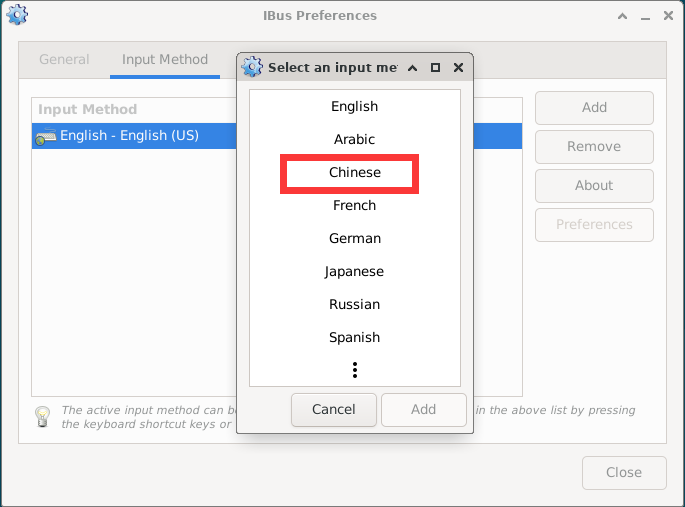

# 系统配置 

## 1. 语言设置

1. 使用 Vim 编辑 `/etc/locale.gen` 文件，将不需要的语言环境注释掉并启用所需的语言环境。

2. 中文切换成英文，在文件中执行以下操作：

```bash
# 注释掉 zh_CN.UTF-8 UTF-8 这一行
# 取消注释 en_US.UTF-8 UTF-8 这一行
```

3. 使用 `dpkg-reconfigure` 命令以非交互方式重新生成语言环境文件：

```bash
dpkg-reconfigure -f noninteractive locales
```

## 2. 自启动配置

本小节以自启以 GPIO 程序为例，该程序绝对路径是 `/home/linaro/gpio.py`，请结合自己实际文件和路径修改对应位置。

### 2.1 桌面自启动

1. 首先我们使用如下命令新建一个 `startup.sh`：（K1 Pro 默认在 `/home/linaro`）

```bash
touch startup.sh
```

2. 打开 `startup.sh` 脚本文件，填入如下内容：

```bash
#!/bin/sh
sudo python3 gpio.py
```

3. 赋予 `startup.sh` 脚本文件权限：

```bash
sudo chmod 777 startup.sh
```

4. 新建自启文件：

```bash
cd .config && mkdir autostart
cd autostart && sudo nano start.desktop
```

5. 填入如下内容：

```ini
[Desktop Entry]
Type=Application
Exec=/home/linaro/startup.sh
```

6. 重启：

```bash
sudo reboot
```

### 2.2 在rc.local脚本中添加自启动

1. 打开 `/etc/rc.local` 脚本在 `exit 0` 前面增加一行：

```bash
sudo python3 /home/linaro/gpio.py &
```

1. 重启 ：

```bash
sudo reboot
```

### 2.3 系统管理器设置自启动

1. 在 `/etc/systemd/system/gpio.service` 新建一个自启服务对应的配置文件，填入如下内容：

```ini
[Unit]
Description=start oled

[Service]
Type=simple
Restart=always
RestartSec=5
ExecStart=/home/linaro/gpio.py

[Install]
WantedBy=multi-user.target
```

2. 启用一个服务，使它在系统启动时自动启动：

```bash
sudo systemctl enable gpio.service
```

3. 重启：

```bash
sudo systemctl restart gpio.service
```

4. 重启 Omni3576：

```bash
sudo reboot
```

5. 如果想要禁用一个服务，使它在系统启动时不会自动启动：

```bash
sudo systemctl disable gpio.service
```

## 3. 中文输入法安装

1. 安装桌面终端软件。

```bash
sudo apt update
sudo apt install xfce4-terminal
```

2. 安装 IBUS 输入法及相关组件。

```bash
sudo apt update
sudo apt install ibus-gtk ibus-gtk3 ibus ibus-libpinyin ibus-wayland at-spi2-core
```

3. 启动 IBUS 输入法后台服务。

```bash
ibus-daemon
```

4. 配置中文输入法。

   - 在弹出的设置窗口中：

<span style={{ 
  display: 'flex', 
  justifyContent: 'center',
  margin: '10px 0'
}}>
    
</span>

    - 选择 Chinese -> Intelligent Pinyin

<span style={{ 
  display: 'flex', 
  justifyContent: 'center',
  margin: '10px 0'
}}>
    
</span>

<span style={{ 
  display: 'flex', 
  justifyContent: 'center',
  margin: '10px 0'
}}>
    
</span>
5. 重启开发板
   ```
   sudo reboot
   ```

   - 然后 **左键单击右上角键盘图标**，选择 **中文（Chinese）**。

<span style={{ 
  display: 'flex', 
  justifyContent: 'center',
  margin: '10px 0'
}}>
    
</span>
6. 安装 `im-config` 配置工具，并设置 IBUS 为默认输入法框架

```bash
sudo apt install im-config
im-config -n ibus
```