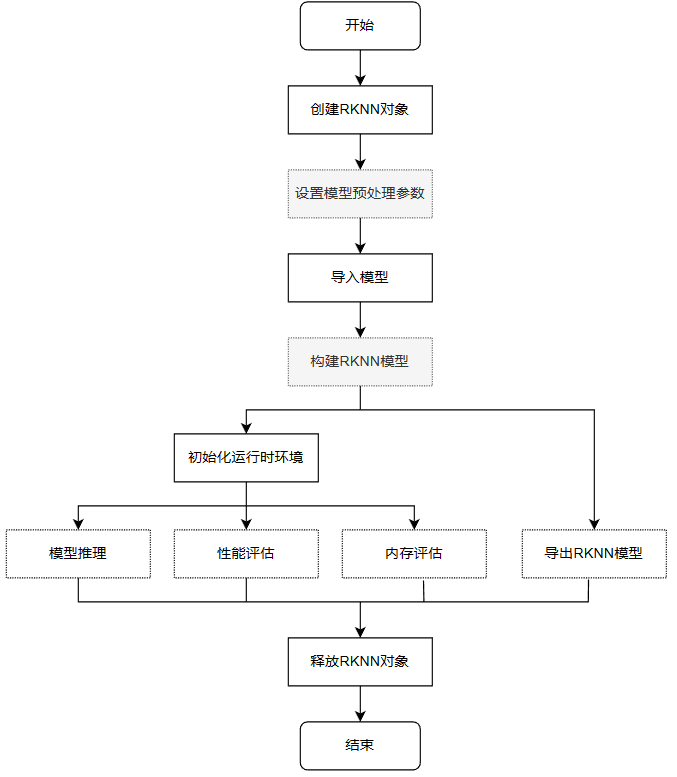

# RKNN Toolkit2

RKNN Toolkit2开发套件(Python接口)运行在PC平台（x86/arm64），提供了模型转换、量化功能、模型推理、性能和内存评估、量化精度分析、模型加密等功能。更详细的功能说明参考下RKNN-Toolkit2工程文件的 [《RKNN-Toolkit2用户使用指南》](https://github.com/airockchip/rknn-toolkit2/tree/master/doc) 。

本章将简单介绍在PC（Ubuntu系统）上使用RKNN-Toolkit2进行模型转换、模型推理、性能评估等测试。


**重要**

测试环境：K1 Pro，镜像系统是Debian，PC环境使用ubuntu20.04, 教程编写时的RKNN-Toolkit2是1.5.0版本，板卡npu驱动是0.8.8。


## 1. Toolkit2安装

安装Toolkit2，可以使用python的包管理器pip3安装，或者直接使用docker构建Toolkit2环境。相关依赖库和docker文件从瑞芯微官方 [RKNN-Toolkit2工程](https://github.com/airockchip/rknn-toolkit2) （获取的RKNN-Toolkit2文件中包含RKNN Toolkit Lite2）。

下面测试是使用python的venv虚拟环境中安装Toolkit2，也可以参考前面开发环境章节使用 [Anaconda](https://www.anaconda.com/download/) 或者 [miniconda](https://docs.conda.io/en/latest/miniconda.html) 创建环境, 其中miniconda是Anaconda的轻量版。

```python
# 安装python工具，ubuntu20.04默认是安装了python3.8.10
# 虚拟环境这里选择使用python3.8-venv，也可以安装Anaconda/nimiconda,然后使用conda管理环境。
sudo apt update
sudo apt-get install python3-dev python3-pip python3.8-venv gcc

#安装相关库和软件包
sudo apt-get install libxslt1-dev zlib1g-dev libglib2.0 libsm6 \
libgl1-mesa-glx libprotobuf-dev gcc
```

安装RKNN-Toolkit2：

```python
# 创建目录，由于测试使用的ubuntu20.04已经安装的包可能和安装运行RKNN-Toolkit2所需的包版本不同,
# 为避免其他问题，这里使用python venv隔离环境。
mkdir project-Toolkit2 && cd project-Toolkit2
# toolkit2_1.5是环境名称，可以自行修改
python3 -m venv toolkit2_1.5

# 激活进入环境
source toolkit2_1.5/bin/activate

# 从官方RKNN-Toolkit2仓库拉取最新版本或者从配套例程获取(教程测试时toolkit2版本是1.5.0)，或者配套网盘获取
git clone https://github.com/rockchip-linux/rknn-toolkit2.git
# 或者 git clone https://github.com/airockchip/rknn-toolkit2.git
#git clone https://gitee.com/LubanCat/lubancat_ai_manual_code.git
#cd lubancat_ai_manual_code/dev_env/rknn_toolkit2

# 配置pip源
pip3 config set global.index-url https://pypi.tuna.tsinghua.edu.cn/simple/

# 安装依赖库，根据rknn-toolkit2\doc\requirements_cp38-1.4.0.txt
pip3 install numpy
pip3 install -r doc/requirements_cp38-1.5.0.txt

# 安装rknn_toolkit2
# 根据系统的python版本和架构（最新版本支持arm64和x86）选择不同的whl文件安装：
pip3 install packages/rknn_toolkit2-1.5.0+1fa95b5c-cp38-cp38-linux_x86_64.whl
```

检测是否安装成功：

```python
(toolkit2_1.5) llh@YH-LONG:~$ python3
Python 3.8.17 (default, Jul  5 2023, 21:04:15)
[GCC 11.2.0] :: Anaconda, Inc. on linux
Type "help", "copyright", "credits" or "license" for more information.
>>> from rknn.api import RKNN
>>>
```

输入quit()或者使用快捷键Ctrl+D退出。

## 2. RKNN Toolkit2接口使用

这小节熟悉下Toolkit-lite2工具，该工具在PC平台上使用，提供python接口简化模型的部署和运行。用户通过该工具可以便捷地完成一些功能：

• **模型转换**，Toolkit-lite2工具导入原始的Caffe、TensorFlow、TensorFlow Lite、ONNX、Pytorch、MXNet等模型转换成RKNN模型()， 也支持导入RKNN模型然后在NPU平台 上加载推理等。
• **量化功能**，支持将浮点模型量化为定点模型，目前支持的量化方法为非对称量化（asymmetric_quantized-8），并支持混合量化功能。
• **模型推理**，能够在PC上模拟NPU运行RKNN模型并获取推理结果；或将RKNN模型分发到指定的NPU设备上进行推理并获取推理结果。
• **性能和内存评估**，连接板卡，将RKNN模型分发到指定NPU设备上运行，然后评估模型在实际设备上运行时的性能和内存占用情况。
• **量化精度分析**，该功能将给出模型量化后每一层推理结果与浮点模型推理结果的余弦距离，以分析量化误差是如何出现的，为提高量化模型的精度提供思路。
• **模型加密功能**，使用指定的加密等级将RKNN模型整体加密，因为RKNN模型的解密是在NPU驱动中完成的，所以使用加密模型时，与普通RKNN模型一样加载即可，NPU驱动会自动对其进行解密。

使用Toolkit-lite2，可以运行在PC上，通过模拟器运行模型，然后进行推理，或者模型转换等操作；也可以运行在连接的板卡NPU上， 将RKNN模型传到NPU设备上运行，再从NPU设备上获取推理结果、性能信息等等。

Toolkit-lite2运行模型时的一个简单的流程示意：

<span style={{ 
  display: 'flex', 
  justifyContent: 'center',
  margin: '10px 0'
}}>

</span>

流程简单描述：

• 创建RKNN对象，初始化RKNN环境
• 设置模型预处理参数，如果是运行在PC上，通过模拟器运行模型时需要调用config接口设置模型的预处理参数；如果运行在连接的板卡NPU上并且导入RKNN模型，不需要配置。
• 导入模型，如果是运行在PC上，通过模拟器运行模型时使用load_caffe、load_tensorflow等接口导入对应的非RKNN模型，通过；如果运行在连接的板卡NPU使用接口load_rknn导入RKNN模型。
• 构建RKNN模型，如果是运行在PC上，通过模拟器运行模型，需要调用build接口构建RKNN模型，然后可以导出RKNN模型或者初始化运行环境进行推理等操作；如果运行在连接的板卡NPU上不需要。
• 初始化运行时环境，如果需要模型推理或性能评估，必须先调用init_runtime初始化运行时环境，要指定模型的运行平台（模拟器或者连接板卡的硬件NPU）。
• 初始化运行环境后，可以调用inference接口进行推理，使用eval_perf接口对模型性能进行评估，或者使用eval_memory接口获取模型在硬件平台上运行时的内存使用情况（模型必须运行在硬件平台上）。
• 最后调用release接口释放RKNN对象。

使用load_rknn导入rknn模型时，不能调用accuracy_analysis精度分析，需要导入非rknn模型，然后构建模型时设置量化。

详细的接口说明参考下RKNN-Toolkit2工程中doc/目录下的用户手册，详细使用例程请参考RKNN-Toolkit2工程中examples/functions目录下例程。

### 2.1. 模型转换和模型推理

这小节展示下在PC上通过模拟器运行模型，进行模型的转换和推理。

配套例程可以也可以使用教程配套例程，或者从 [RKNN-Toolkit2工程](https://github.com/airockchip/rknn-toolkit2) 文件中example目录下的onnx/yolov5中获取。

在已经搭建好RKNN-Toolkit2的运行环境中，执行下面命令:

```python
# 切换到配套例程examples/onnx/yolov5目录下（使用教程配套例程）
(toolkit2_1.5) llh@YH-LONG:~$ cd lubancat_ai_manual_code/dev_env/rknn-toolkit2/examples/conversion/yolov5
# 运行test.py，模型转换和模型推理
(toolkit2_1.5) llh@YH-LONG:~/examples/conversion/yolov5$ python3 test.py
W __init__: rknn-toolkit2 version: 1.5.0+1fa95b5c
--> Config model
W config: 'target_platform' is None, use rk3566 as default, Please set according to the actual platform!
done
--> Loading model
Loading : 100%|████████████████████████████████████████████████| 124/124 [00:00<00:00, 16907.57it/s]
done
--> Building model
Analysing : 100%|███████████████████████████████████████████████| 142/142 [00:00<00:00, 5817.91it/s]
Quantizating : 100%|█████████████████████████████████████████████| 142/142 [00:00<00:00, 292.11it/s]
W build: The default input dtype of 'images' is changed from 'float32' to 'int8' in rknn model for performance!
                    Please take care of this change when deploy rknn model with Runtime API!
W build: The default output dtype of '269' is changed from 'float32' to 'int8' in rknn model for performance!
                    Please take care of this change when deploy rknn model with Runtime API!
W build: The default output dtype of '271' is changed from 'float32' to 'int8' in rknn model for performance!
                    Please take care of this change when deploy rknn model with Runtime API!
W build: The default output dtype of '273' is changed from 'float32' to 'int8' in rknn model for performance!
                    Please take care of this change when deploy rknn model with Runtime API!
done
--> Export rknn model
done
--> Init runtime environment
W init_runtime: Target is None, use simulator!
done
--> Running model
W inference: The 'data_format' has not been set and defaults is nhwc!
Analysing : 100%|███████████████████████████████████████████████| 146/146 [00:00<00:00, 5202.22it/s]
Preparing : 100%|███████████████████████████████████████████████| 146/146 [00:00<00:00, 1102.45it/s]
W inference: The dims of input(ndarray) shape (640, 640, 3) is wrong, expect dims is 4! Try expand dims to (1, 640, 640, 3)!
done
class: person, score: 0.8838784694671631
box coordinate left,top,right,down: [209.6862335205078, 243.11955797672272, 285.13685607910156, 507.7035621404648]
class: person, score: 0.8669421076774597
box coordinate left,top,right,down: [477.6677174568176, 241.00597953796387, 561.1506419181824, 523.3208637237549]
class: person, score: 0.826057493686676
box coordinate left,top,right,down: [110.24830067157745, 235.76190769672394, 231.76915538311005, 536.1012514829636]
class: person, score: 0.32633310556411743
box coordinate left,top,right,down: [80.75779604911804, 354.98213291168213, 121.49669003486633, 516.5315389633179]
class: bus , score: 0.6890695095062256
box coordinate left,top,right,down: [91.16828817129135, 134.78936767578125, 556.8909769654274, 460.78936767578125]
```

在test.py主程序中：

```python
if __name__ == '__main__':

    # 创建RKNN对象
    rknn = RKNN(verbose=True)

    # 设置模型转换参数，这里可以指定平台，添加target_platform='rk3588'配置，默认rk3566
    # mean_values是设置输入的均值，std_values是输入的归一化值
    print('--> Config model')
    rknn.config(mean_values=[[0, 0, 0]], std_values=[[255, 255, 255]])
    print('done')

    # 导入onnx模型，使用model指定onnx模型路径
    print('--> Loading model')
    ret = rknn.load_onnx(model=ONNX_MODEL)
    if ret != 0:
        print('Load model failed!')
        exit(ret)
    print('done')

    # 构建RKNN模型，这里设置do_quantization为true开启量化，dataset是指定用于量化校正的数据集
    print('--> Building model')
    ret = rknn.build(do_quantization=QUANTIZE_ON, dataset=DATASET)
    if ret != 0:
        print('Build model failed!')
        exit(ret)
    print('done')

    # 导出RKNN模型，使用export_path指定导出模型路径，这里默认设置RKNN_MODEL
    print('--> Export rknn model')
    ret = rknn.export_rknn(RKNN_MODEL)
    if ret != 0:
        print('Export rknn model failed!')
        exit(ret)
    print('done')

    # 调用init_runtime接口初始化运行时环境，默认是在PC上模拟仿真
    print('--> Init runtime environment')
    ret = rknn.init_runtime()
    # ret = rknn.init_runtime('rk3566')
    if ret != 0:
        print('Init runtime environment failed!')
        exit(ret)
    print('done')

    # 设置输出，用于模型推理
    img = cv2.imread(IMG_PATH)
    # img, ratio, (dw, dh) = letterbox(img, new_shape=(IMG_SIZE, IMG_SIZE))
    img = cv2.cvtColor(img, cv2.COLOR_BGR2RGB)
    img = cv2.resize(img, (IMG_SIZE, IMG_SIZE))

    # 进行推理，没有设置target默认使用模拟器，之后对输出数据后处理并保存结果
    print('--> Running model')
    outputs = rknn.inference(inputs=[img])
    np.save('./onnx_yolov5_0.npy', outputs[0])
    np.save('./onnx_yolov5_1.npy', outputs[1])
    np.save('./onnx_yolov5_2.npy', outputs[2])
    print('done')

    # 省略...
```

该例程将配置并导入onnx模型（yolov5s.onnx），对模型进行量化之后导出RKNN模型（yolov5s.rknn）， 随后初始化运行环境，使用模拟器模拟推理获取输出数据，对输出数据后处理，最终得到结果图片：

<span style={{ 
  display: 'flex', 
  justifyContent: 'center',
  margin: '10px 0'
}}>

</span>

### 2.2. 性能和内存评估

这小节将使用RKNN-Toolkit2，在连接的板卡NPU上运行，进行性能和内存评估或者推理等操作。

RKNN Toolkit2运行在PC上，通过PC的USB连接NPU设备。 RKNN Toolkit2将RKNN模型传到NPU设备上运行，再从NPU设备上获取推理结果、性能信息等

在开始例程前我们需要以下操作：

1. **连接板卡**：
```python
# 在板卡上执行命令：
cat@lubancat:~$ ./adbd &
[1] 41260
cat@lubancat:~$ install_listener('tcp:5037','*smartsocket*')
using port=5555

# PC端安装adb
(toolkit2_1.5) llh@YH-LONG:~$ sudo apt install -y adb

# 开启adb server
(toolkit2_1.5) llh@YH-LONG:~$ adb start-server

# 连接板子，IP根据具体板子，默认5555端口
(toolkit2_1.5) llh@YH-LONG:~$ adb connect 192.168.103.131
already connected to 192.168.103.131:5555

# 查看连接的设备
(toolkit2_1.5) llh@YH-LONG:~$ adb devices
List of devices attached
192.168.103.131:5555    device
```

2. **启动rknn_server服务**：
```python
# 在板卡上执行restart_rknn.sh或者直接执行rknn_server
cat@lubancat:~$ rknn_server
start rknn server, version:1.5.0 (17e11b1 build: 2023-05-18 21:43:39)
I NPUTransfer: Starting NPU Transfer Server, Transfer version 2.1.0 (b5861e7@2020-11-23T11:50:51)
```
接下来获取配套例程，然后测试例程（测试使用RKNN模型，使用前面小节导出的rknn模型）：

```
(toolkit2_1.5) llh@YH-LONG:~$ cd lubancat_ai_manual_code/dev_env/rknn-toolkit2/examples/evaluation/yolov5
(toolkit2_1.5) llh@YH-LONG:~/rknn-toolkit2/examples/evaluation/yolov5$ python3 test.py
W __init__: rknn-toolkit2 version: 1.5.0+1fa95b5c
--> Loading model
done
--> Init runtime environment
W init_runtime: Flag perf_debug has been set, it will affect the performance of inference!
W init_runtime: Flag eval_mem has been set, it will affect the performance of inference!
I NPUTransfer: Starting NPU Transfer Client, Transfer version 2.1.0 (b5861e7@2020-11-23T11:50:36)
D RKNNAPI: ==============================================
D RKNNAPI: RKNN VERSION:
D RKNNAPI:   API: 1.5.0 (17e11b1 build: 2023-05-18 21:43:54)
D RKNNAPI:   DRV: rknn_server: 1.5.0 (17e11b1 build: 2023-05-18 21:43:39)
D RKNNAPI:   DRV: rknnrt: 1.5.0 (e6fe0c678@2023-05-25T08:09:20)
D RKNNAPI: ==============================================
D RKNNAPI: Input tensors:
D RKNNAPI:   index=0, name=images, n_dims=4, dims=[1, 640, 640, 3], n_elems=1228800, size=1228800, w_stride = 0, size_with_stride = 0, fmt=NHWC, type=INT8, qnt_type=AFFINE, zp=-128, scale=0.003922
D RKNNAPI: Output tensors:
D RKNNAPI:   index=0, name=269, n_dims=4, dims=[1, 255, 80, 80], n_elems=1632000, size=1632000, w_stride = 0, size_with_stride = 0, fmt=NCHW, type=INT8, qnt_type=AFFINE, zp=83, scale=0.093136
D RKNNAPI:   index=1, name=271, n_dims=4, dims=[1, 255, 40, 40], n_elems=408000, size=408000, w_stride = 0, size_with_stride = 0, fmt=NCHW, type=INT8, qnt_type=AFFINE, zp=48, scale=0.089854
D RKNNAPI:   index=2, name=273, n_dims=4, dims=[1, 255, 20, 20], n_elems=102000, size=102000, w_stride = 0, size_with_stride = 0, fmt=NCHW, type=INT8, qnt_type=AFFINE, zp=46, scale=0.078630
done
--> eval_perf
W eval_perf: The result of eval_perf is also saved to eval_perf.csv!
===================================================================================================================
                            Performance
        #### The performance result is just for debugging, ####
        #### may worse than actual performance!            ####
===================================================================================================================
ID   OpType           DataType Target InputShape                                   OutputShape            DDR Cycles     NPU Cycles     Total Cycles   Time(us)       MacUsage(%)    WorkLoad(0/1/2)-ImproveTherical        Task Number    Task Size      Regcmd Size    RW(KB)         FullName
1    InputOperator    UINT8    CPU    \                                            (1,3,640,640)          0              0              0              14             \              0.0%/0.0%/0.0% - Up:0.0%               0              0              0              4598.19        InputOperator:images
2    ConvRelu         UINT8    NPU    (1,3,640,640),(32,3,6,6),(32)                (1,32,320,320)         851599         345600         851599         4041           8.55           100.0%/0.0%/0.0% - Up:0.0%             68             67456          69632          4918.31        Conv:Conv_0
3    ConvRelu         INT8     NPU    (1,32,320,320),(64,32,3,3),(64)              (1,64,160,160)         416796         460800         460800         924            49.87          100.0%/0.0%/0.0% - Up:0.0%             42             41664          43008          2407.16        Conv:Conv_2
4    ConvRelu         INT8     NPU    (1,64,160,160),(32,64,1,1),(32)              (1,32,160,160)         277747         51200          277747         433            11.82          100.0%/0.0%/0.0% - Up:0.0%             17             16864          17408          1604.09        Conv:Conv_4
5    ConvRelu         INT8     NPU    (1,32,160,160),(32,32,1,1),(32)              (1,32,160,160)         421114         25600          421114         390            6.56           100.0%/0.0%/0.0% - Up:0.0%             10             9920           10240          2432.09        Conv:Conv_6
6    ConvReluAdd      INT8     NPU    (1,32,160,160),(32,32,3,3),(32),(1,32,160,160) (1,32,160,160)         416796         230400         416796         474            48.61          100.0%/0.0%/0.0% - Up:0.0%             10             9920           10240          2407.16        Conv:Conv_8
7    ConvRelu         INT8     NPU    (1,64,160,160),(32,64,1,1),(32)              (1,32,160,160)         554287         51200          554287         430            11.91          100.0%/0.0%/0.0% - Up:0.0%             22             17904          18688          3201.22        Conv:Conv_11
8    Concat           INT8     NPU    (1,32,160,160),(1,32,160,160)                (1,64,160,160)         555661         0              555661         638            \              100.0%/0.0%/0.0% - Up:0.0%             17             7664           8960           3209.16        Concat:Concat_13
9    ConvRelu         INT8     NPU    (1,64,160,160),(64,64,1,1),(64)              (1,64,160,160)         439662         102400         439662         645            15.88          100.0%/0.0%/0.0% - Up:0.0%             21             20832          21504          2539.22        Conv:Conv_14
10   ConvRelu         INT8     NPU    (1,64,160,160),(128,64,3,3),(128)            (1,128,80,80)          209700         460800         460800         817            56.40          100.0%/0.0%/0.0% - Up:0.0%             30             29760          30720          1211.09        Conv:Conv_16
11   ConvRelu         INT8     NPU    (1,128,80,80),(64,128,1,1),(64)              (1,64,80,80)           139569         51200          139569         277            18.48          100.0%/0.0%/0.0% - Up:0.0%             12             11904          12288          806.06         Conv:Conv_18
12   ConvRelu         INT8     NPU    (1,64,80,80),(64,64,1,1),(64)                (1,64,80,80)           216101         25600          216101         213            12.02          100.0%/0.0%/0.0% - Up:0.0%             9              8928           9216           1248.06        Conv:Conv_20
13   ConvReluAdd      INT8     NPU    (1,64,80,80),(64,64,3,3),(64),(1,64,80,80)   (1,64,80,80)           139569         230400         230400         347            66.40          100.0%/0.0%/0.0% - Up:0.0%             9              8928           9216           806.06         Conv:Conv_22
14   ConvRelu         INT8     NPU    (1,64,80,80),(64,64,1,1),(64)                (1,64,80,80)           216101         25600          216101         214            11.96          100.0%/0.0%/0.0% - Up:0.0%             9              8928           9216           1248.06        Conv:Conv_25
15   ConvReluAdd      INT8     NPU    (1,64,80,80),(64,64,3,3),(64),(1,64,80,80)   (1,64,80,80)           209700         230400         230400         349            66.02          100.0%/0.0%/0.0% - Up:0.0%             9              8928           9216           1211.09        Conv:Conv_27
16   ConvRelu         INT8     NPU    (1,128,80,80),(64,128,1,1),(64)              (1,64,80,80)           277249         51200          277249         276            18.55          100.0%/0.0%/0.0% - Up:0.0%             17             12944          13568          1601.22        Conv:Conv_30
17   Concat           INT8     NPU    (1,64,80,80),(1,64,80,80)                    (1,128,80,80)          280344         0              280344         372            \              100.0%/0.0%/0.0% - Up:0.0%             17             7664           8960           1619.09        Concat:Concat_32
18   ConvRelu         INT8     NPU    (1,128,80,80),(128,128,1,1),(128)            (1,128,80,80)          275014         102400         275014         365            28.05          100.0%/0.0%/0.0% - Up:0.0%             12             11904          12288          1588.31        Conv:Conv_33
19   ConvRelu         INT8     NPU    (1,128,80,80),(256,128,3,3),(256)            (1,256,40,40)          109787         460800         460800         684            67.37          100.0%/0.0%/0.0% - Up:0.0%             42             41664          43008          634.06         Conv:Conv_35
20   ConvRelu         INT8     NPU    (1,256,40,40),(128,256,1,1),(128)            (1,128,40,40)          72209          51200          72209          182            28.13          100.0%/0.0%/0.0% - Up:0.0%             9              8928           9216           417.03         Conv:Conv_37
21   ConvRelu         INT8     NPU    (1,128,40,40),(128,128,1,1),(128)            (1,128,40,40)          129002         25600          129002         136            18.82          100.0%/0.0%/0.0% - Up:0.0%             6              5952           6144           745.03         Conv:Conv_39
22   ConvReluAdd      INT8     NPU    (1,128,40,40),(128,128,3,3),(128),(1,128,40,40) (1,128,40,40)          72209          230400         230400         330            69.82          100.0%/0.0%/0.0% - Up:0.0%             6              5952           6144           417.03         Conv:Conv_41
23   ConvRelu         INT8     NPU    (1,128,40,40),(128,128,1,1),(128)            (1,128,40,40)          129002         25600          129002         133            19.25          100.0%/0.0%/0.0% - Up:0.0%             6              5952           6144           745.03         Conv:Conv_44
24   ConvReluAdd      INT8     NPU    (1,128,40,40),(128,128,3,3),(128),(1,128,40,40) (1,128,40,40)          72209          230400         230400         352            65.45          100.0%/0.0%/0.0% - Up:0.0%             6              5952           6144           417.03         Conv:Conv_46
25   ConvRelu         INT8     NPU    (1,128,40,40),(128,128,1,1),(128)            (1,128,40,40)          129002         25600          129002         214            11.96          100.0%/0.0%/0.0% - Up:0.0%             6              5952           6144           745.03         Conv:Conv_49
26   ConvReluAdd      INT8     NPU    (1,128,40,40),(128,128,3,3),(128),(1,128,40,40) (1,128,40,40)          109787         230400         230400         334            68.98          100.0%/0.0%/0.0% - Up:0.0%             6              5952           6144           634.06         Conv:Conv_51
27   ConvRelu         INT8     NPU    (1,256,40,40),(128,256,1,1),(128)            (1,128,40,40)          138730         51200          138730         179            28.60          100.0%/0.0%/0.0% - Up:0.0%             14             9968           10496          801.22         Conv:Conv_54
28   Concat           INT8     NPU    (1,128,40,40),(1,128,40,40)                  (1,256,40,40)          149958         0              149958         214            \              100.0%/0.0%/0.0% - Up:0.0%             17             7664           8960           866.06         Concat:Concat_56
29   ConvRelu         INT8     NPU    (1,256,40,40),(256,256,1,1),(256)            (1,256,40,40)          504912         102400         504912         235            43.57          100.0%/0.0%/0.0% - Up:0.0%             9              8928           9216           2916.06        Conv:Conv_57
30   ConvRelu         INT8     NPU    (1,256,40,40),(512,256,3,3),(512)            (1,512,20,20)          74287          460800         460800         747            61.69          100.0%/0.0%/0.0% - Up:0.0%             12             11904          12288          429.03         Conv:Conv_59
31   ConvRelu         INT8     NPU    (1,512,20,20),(256,512,1,1),(256)            (1,256,20,20)          45890          51200          51200          150            34.13          100.0%/0.0%/0.0% - Up:0.0%             6              5952           6144           265.03         Conv:Conv_61
32   ConvRelu         INT8     NPU    (1,256,20,20),(256,256,1,1),(256)            (1,256,20,20)          151857         25600          151857         101            25.35          100.0%/0.0%/0.0% - Up:0.0%             6              5952           6144           877.03         Conv:Conv_63
33   ConvReluAdd      INT8     NPU    (1,256,20,20),(256,256,3,3),(256),(1,256,20,20) (1,256,20,20)          74287          230400         230400         315            73.14          100.0%/0.0%/0.0% - Up:0.0%             6              5952           6144           429.03         Conv:Conv_65
34   ConvRelu         INT8     NPU    (1,512,20,20),(256,512,1,1),(256)            (1,256,20,20)          69471          51200          69471          148            34.59          100.0%/0.0%/0.0% - Up:0.0%             11             6992           7424           401.22         Conv:Conv_68
35   Concat           INT8     NPU    (1,256,20,20),(1,256,20,20)                  (1,512,20,20)          113764         0              113764         123            \              100.0%/0.0%/0.0% - Up:0.0%             17             7664           8960           657.03         Concat:Concat_70
36   ConvRelu         INT8     NPU    (1,512,20,20),(512,512,1,1),(512)            (1,512,20,20)          74287          102400         102400         206            49.71          100.0%/0.0%/0.0% - Up:0.0%             6              5952           6144           429.03         Conv:Conv_71
37   ConvRelu         INT8     NPU    (1,512,20,20),(256,512,1,1),(256)            (1,256,20,20)          58952          51200          58952          144            35.56          100.0%/0.0%/0.0% - Up:0.0%             11             6992           7424           340.47         Conv:Conv_73
38   MaxPool          INT8     NPU    (1,256,20,20)                                (1,256,20,20)          58952          0              58952          86             \              100.0%/0.0%/0.0% - Up:0.0%             2              416            512            340.47         MaxPool:MaxPool_75
39   MaxPool          INT8     NPU    (1,256,20,20)                                (1,256,20,20)          58952          0              58952          83             \              100.0%/0.0%/0.0% - Up:0.0%             2              416            512            340.47         MaxPool:MaxPool_76
40   MaxPool          INT8     NPU    (1,256,20,20)                                (1,256,20,20)          138941         0              138941         84             \              100.0%/0.0%/0.0% - Up:0.0%             2              416            512            802.44         MaxPool:MaxPool_77
41   Concat           INT8     NPU    (1,256,20,20),(1,256,20,20),(1,256,20,20),(1,256,20,20) (1,1024,20,20)         281551         0
281551         203            \              100.0%/0.0%/0.0% - Up:0.0%             29             14288          16640          1626.06        Concat:Concat_78
42   ConvRelu         INT8     NPU    (1,1024,20,20),(512,1024,1,1),(512)          (1,512,20,20)          74287          204800         204800         365            56.11          100.0%/0.0%/0.0% - Up:0.0%             12             11904          12288          429.03         Conv:Conv_79
43   ConvRelu         INT8     NPU    (1,512,20,20),(256,512,1,1),(256)            (1,256,20,20)          87446          51200          87446          147            34.83          100.0%/0.0%/0.0% - Up:0.0%             11             6992           7424           505.03         Conv:Conv_81
44   ConvTranspose    INT8     NPU    (1,256,20,20),(256,1,4,4),(256)              (1,256,40,40)          277249         6400           277249         170            3.76           100.0%/0.0%/0.0% - Up:0.0%             1              992            1024           1601.22        ConvTranspose:Resize_84_2deconv
45   Concat           INT8     NPU    (1,256,40,40),(1,256,40,40)                  (1,512,40,40)          184766         0              184766         458            \              100.0%/0.0%/0.0% - Up:0.0%             17             7664           8960           1067.09        Concat:Concat_85
46   ConvRelu         INT8     NPU    (1,512,40,40),(128,512,1,1),(128)            (1,128,40,40)          72209          102400         102400         362            28.29          100.0%/0.0%/0.0% - Up:0.0%             12             11904          12288          417.03         Conv:Conv_86
47   ConvRelu         INT8     NPU    (1,128,40,40),(128,128,1,1),(128)            (1,128,40,40)          94372          25600          94372          201            12.74          100.0%/0.0%/0.0% - Up:0.0%             6              5952           6144           545.03         Conv:Conv_88
48   ConvRelu         INT8     NPU    (1,128,40,40),(128,128,3,3),(128)            (1,128,40,40)          184766         230400         230400         392            58.78          100.0%/0.0%/0.0% - Up:0.0%             6              5952           6144           1067.09        Conv:Conv_90
49   ConvRelu         INT8     NPU    (1,512,40,40),(128,512,1,1),(128)            (1,128,40,40)          138730         102400         138730         356            28.76          100.0%/0.0%/0.0% - Up:0.0%             17             12944          13568          801.22         Conv:Conv_92
50   Concat           INT8     NPU    (1,128,40,40),(1,128,40,40)                  (1,256,40,40)          149958         0              149958         277            \              100.0%/0.0%/0.0% - Up:0.0%             17             7664           8960           866.06         Concat:Concat_94
51   ConvRelu         INT8     NPU    (1,256,40,40),(256,256,1,1),(256)            (1,256,40,40)          109787         102400         109787         228            44.91          100.0%/0.0%/0.0% - Up:0.0%             9              8928           9216           634.06         Conv:Conv_95
52   ConvRelu         INT8     NPU    (1,256,40,40),(128,256,1,1),(128)            (1,128,40,40)          173674         51200          173674         168            30.48          100.0%/0.0%/0.0% - Up:0.0%             14             9968           10496          1003.03        Conv:Conv_97
53   ConvTranspose    INT8     NPU    (1,128,40,40),(128,1,4,4),(128)              (1,128,80,80)          554287         12800          554287         405            3.16           100.0%/0.0%/0.0% - Up:0.0%             1              992            1024           3201.22        ConvTranspose:Resize_100_2deconv
54   Concat           INT8     NPU    (1,128,80,80),(1,128,80,80)                  (1,256,80,80)          349961         0              349961         739            \              100.0%/0.0%/0.0% - Up:0.0%             17             7664           8960           2021.16        Concat:Concat_101
55   ConvRelu         INT8     NPU    (1,256,80,80),(64,256,1,1),(64)              (1,64,80,80)           139569         102400         139569         477            21.47          100.0%/0.0%/0.0% - Up:0.0%             21             20832          21504          806.06         Conv:Conv_102
56   ConvRelu         INT8     NPU    (1,64,80,80),(64,64,1,1),(64)                (1,64,80,80)           146841         25600          146841         282            9.08           100.0%/0.0%/0.0% - Up:0.0%             9              8928           9216           848.06         Conv:Conv_104
57   ConvRelu         INT8     NPU    (1,64,80,80),(64,64,3,3),(64)                (1,64,80,80)           349961         230400         349961         406            56.75          100.0%/0.0%/0.0% - Up:0.0%             9              8928           9216           2021.16        Conv:Conv_106
58   ConvRelu         INT8     NPU    (1,256,80,80),(64,256,1,1),(64)              (1,64,80,80)           277249         102400         277249         409            25.04          100.0%/0.0%/0.0% - Up:0.0%             26             21872          22784          1601.22        Conv:Conv_108
59   Concat           INT8     NPU    (1,64,80,80),(1,64,80,80)                    (1,128,80,80)          280344         0              280344         431            \              100.0%/0.0%/0.0% - Up:0.0%             17             7664           8960           1619.09        Concat:Concat_110
60   ConvRelu         INT8     NPU    (1,128,80,80),(128,128,1,1),(128)            (1,128,80,80)          421633         102400         421633         430            23.81          100.0%/0.0%/0.0% - Up:0.0%             12             11904          12288          2435.09        Conv:Conv_111
61   Conv             INT8     NPU    (1,128,80,80),(255,128,1,1),(255)            (1,255,80,80)          421444         204000         421444         645            31.63          100.0%/0.0%/0.0% - Up:0.0%             17             12944          13568          2434.00        Conv:Conv_141
62   OutputOperator   INT8     CPU    (1,255,80,80)                                \                      0              0              0              148            \              0.0%/0.0%/0.0% - Up:0.0%               0              0              0              1178.12        OutputOperator:269
63   ConvRelu         INT8     NPU    (1,128,80,80),(128,128,3,3),(128)            (1,128,40,40)          138730         230400         230400         486            47.41          100.0%/0.0%/0.0% - Up:0.0%             23             18896          19712          801.22         Conv:Conv_113
64   Concat           INT8     NPU    (1,128,40,40),(1,128,40,40)                  (1,256,40,40)          109787         0              109787         208            \              100.0%/0.0%/0.0% - Up:0.0%             17             7664           8960           634.06         Concat:Concat_115
65   ConvRelu         INT8     NPU    (1,256,40,40),(128,256,1,1),(128)            (1,128,40,40)          72209          51200          72209          165            31.03          100.0%/0.0%/0.0% - Up:0.0%             9              8928           9216           417.03         Conv:Conv_116
66   ConvRelu         INT8     NPU    (1,128,40,40),(128,128,1,1),(128)            (1,128,40,40)          94372          25600          94372          123            20.81          100.0%/0.0%/0.0% - Up:0.0%             6              5952           6144           545.03         Conv:Conv_118
67   ConvRelu         INT8     NPU    (1,128,40,40),(128,128,3,3),(128)            (1,128,40,40)          109787         230400         230400         315            73.14          100.0%/0.0%/0.0% - Up:0.0%             6              5952           6144           634.06         Conv:Conv_120
68   ConvRelu         INT8     NPU    (1,256,40,40),(128,256,1,1),(128)            (1,128,40,40)          138730         51200          138730         167            30.66          100.0%/0.0%/0.0% - Up:0.0%             14             9968           10496          801.22         Conv:Conv_122
69   Concat           INT8     NPU    (1,128,40,40),(1,128,40,40)                  (1,256,40,40)          149958         0              149958         202            \              100.0%/0.0%/0.0% - Up:0.0%             17             7664           8960           866.06         Concat:Concat_124
70   ConvRelu         INT8     NPU    (1,256,40,40),(256,256,1,1),(256)            (1,256,40,40)          149958         102400         149958         222            46.13          100.0%/0.0%/0.0% - Up:0.0%             9              8928           9216           866.06         Conv:Conv_125
71   Conv             INT8     NPU    (1,256,40,40),(255,256,1,1),(255)            (1,255,40,40)          149947         102000         149947         227            44.93          100.0%/0.0%/0.0% - Up:0.0%             14             9968           10496          866.00         Conv:Conv_143
72   OutputOperator   INT8     CPU    (1,255,40,40)                                \                      0              0              0              45             \              0.0%/0.0%/0.0% - Up:0.0%               0              0              0              1664.06        OutputOperator:271
73   ConvRelu         INT8     NPU    (1,256,40,40),(256,256,3,3),(256)            (1,256,20,20)          69471          230400         230400         398            57.89          100.0%/0.0%/0.0% - Up:0.0%             17             12944          13568          401.22         Conv:Conv_127
74   Concat           INT8     NPU    (1,256,20,20),(1,256,20,20)                  (1,512,20,20)          74287          0              74287          124            \              100.0%/0.0%/0.0% - Up:0.0%             17             7664           8960           429.03         Concat:Concat_129
75   ConvRelu         INT8     NPU    (1,512,20,20),(256,512,1,1),(256)            (1,256,20,20)          45890          51200          51200          145            35.31          100.0%/0.0%/0.0% - Up:0.0%             6              5952           6144           265.03         Conv:Conv_130
76   ConvRelu         INT8     NPU    (1,256,20,20),(256,256,1,1),(256)            (1,256,20,20)          134542         25600          134542         102            25.10          100.0%/0.0%/0.0% - Up:0.0%             6              5952           6144           777.03         Conv:Conv_132
77   ConvRelu         INT8     NPU    (1,256,20,20),(256,256,3,3),(256)            (1,256,20,20)          74287          230400         230400         319            72.23          100.0%/0.0%/0.0% - Up:0.0%             6              5952           6144           429.03         Conv:Conv_134
78   ConvRelu         INT8     NPU    (1,512,20,20),(256,512,1,1),(256)            (1,256,20,20)          69471          51200          69471          145            35.31          100.0%/0.0%/0.0% - Up:0.0%             11             6992           7424           401.22         Conv:Conv_136
79   Concat           INT8     NPU    (1,256,20,20),(1,256,20,20)                  (1,512,20,20)          113764         0              113764         123            \              100.0%/0.0%/0.0% - Up:0.0%             17             7664           8960           657.03         Concat:Concat_138
80   ConvRelu         INT8     NPU    (1,512,20,20),(512,512,1,1),(512)            (1,512,20,20)          74287          102400         102400         207            49.47          100.0%/0.0%/0.0% - Up:0.0%             6              5952           6144           429.03         Conv:Conv_139
81   Conv             INT8     NPU    (1,512,20,20),(255,512,1,1),(255)            (1,255,20,20)          74454          51000          74454          147            34.69          100.0%/0.0%/0.0% - Up:0.0%             11             6992           7424           430.00         Conv:Conv_145
82   OutputOperator   INT8     CPU    (1,255,20,20)                                \                      0              0              0              19             \              0.0%/0.0%/0.0% - Up:0.0%               0              0              0              100.00         OutputOperator:273
Total Operator Elapsed Time(us): 27987
Total Memory RW Amount(MB): 88.4914
Operator Time-Consuming Ranking:
OpType           Call Number     CPU Time(us)    NPU Time(us)    Total Time(us)    Time Ratio(%)
ConvRelu         50              0               19301           19301             68.96
Concat           13              0               4112            4112              14.69
ConvReluAdd      7               0               2501            2501              8.93
Conv             3               0               1019            1019              3.64
ConvTranspose    2               0               575             575               2.05
MaxPool          3               0               253             253               0.9
OutputOperator   3               212             0               212               0.75
InputOperator    1               14              0               14                0.05

===================================================================================================================

done
--> eval_memory
======================================================
            Memory Profile Info Dump
======================================================
NPU model memory detail(bytes):
    Total Weight Memory: 6.99 MiB
    Total Internal Tensor Memory: 5.86 MiB
    Total Memory: 18.16 MiB

INFO: When evaluating memory usage, we need consider
the size of model, current model size is: 8.11 MiB
======================================================

done
```

test.py主程序：
```python
if __name__ == '__main__':
    # 创建RKNN
    # 如果测试遇到问题，请开启verbose=True，查看调试信息。
    #rknn = RKNN(verbose=True)
    rknn = RKNN()

    # 导入RKNN模型，path参数指定rknn模型路径
    print('--> Loading model')
    ret = rknn.load_rknn(path=RKNN_MODEL)
    if ret != 0:
        print('Load model failed!')
        exit(ret)
    print('done')

    # 初始化运行时环境，指定连接的板卡NPU平台,device_id指定前面adb连接的板卡设备ID
    # perf_debug开启进行性能评估时开启debug模式，eval_mem进入内存评估模式
    print('--> Init runtime environment')
    ret = rknn.init_runtime(target='rk3588', device_id='192.168.103.131:5555', perf_debug=True, eval_mem=True)
    if ret != 0:
        print('Init runtime environment failed!')
        exit(ret)
    print('done')

    # 模型性能进行评估，默认is_print是true，打印内存使用情况
    print('--> eval_perf')
    rknn.eval_perf()
    print('done')

    # 调试，模型性能进行评估,默认is_print是true，打印内存使用情况
    print('--> eval_memory')
    rknn.eval_memory()
    print('done')

    rknn.release()
```
上面程序初始化运行时环境进行了内存和性能评估，也可以在NPU设备上推理，实际添加参考下前面小节在PC模拟器上推理。

更多rknn-toolkit2的功能测试例程，参考下
https://github.com/rockchip-linux/rknn-toolkit2/tree/master/examples/functions。


# 3. 板卡信息查看和设置

## 3.1. 对于rk3576
1、NPU频率查询和设置
```
# 查看驱动版本
cat /sys/kernel/debug/rknpu/version

# 查看电源状态
cat /sys/kernel/debug/rknpu/power

# 查看NPU使用率，需要root权限
cat /sys/kernel/debug/rknpu/load

# 查看NPU可用的频率,然后设置频率
cat /sys/class/devfreq/fdab0000.npu/available_frequencies

echo userspace > /sys/class/devfreq/fdab0000.npu/governor

echo 1000000000 > /sys/class/devfreq/fdab0000.npu/userspace/set_freq

# 查看NPU当前工作频率
cat /sys/kernel/debug/rknpu/freq
```
3.3.3. NPU其他相关
```
# 查看librknnrt库版本
strings /usr/lib/librknnrt.so | grep "librknnrt version"

# 查看rknn_server版本
strings /usr/bin/rknn_server | grep build

# 查看NPU驱动版本
dmesg | grep -i rknpu

# 或者
sudo cat /sys/kernel/debug/rknpu/version
```
关于NPU驱动更新，需要编译内核然后更新板卡内核，板卡可以直接使用命令更新或者烧录网盘的最新镜像。
```
sudo apt update

# 请根据实际板卡的内核版本
sudo apt install linux-image-5.10.160

sudo apt install linux-image-5.10.198
```
3.4. 参考链接

https://github.com/airockchip/rknn-toolkit2

https://github.com/rockchip-linux/rknn-toolkit2

https://github.com/rockchip-linux/rknpu2