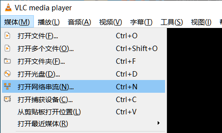

#   Gstreamer工具以及MPP插件

本章节主要介绍Gstreamer工具及相关插件测试方法。

##  1. Gstreamer简介

GStreamer是一个开源的多媒体框架，用于构建音频和视频处理应用程序。它提供了丰富的功能，可以处理各种格式的媒体流，包括录制、播放、编辑和流式传输。通过其插件架构，GStreamer支持许多编解码器和容器格式，使开发者能够轻松地构建复杂的多媒体应用，适用于桌面、嵌入式系统和服务器环境。

##  2. Gstreamer常用命令

###  2.1. gst-launch-1.0

`gst-launch-1.0`是GStreamer框架中的一个命令行工具，用于快速创建和测试多媒体管道。它允许用户构建数据流管道，以处理音频和视频数据，进行实时流处理、编码、解码、转码等操作。简单示例如下：

```bash
# 使用videotestsrc生成一段视频，并使用xvimagesink显示
gst-launch-1.0 videotestsrc ! xvimagesink
```

###  2.2. gst-play-1.0

`gst-play-1.0`是GStreamer的一个简单媒体播放器工具，旨在快速播放音频和视频文件。它支持多种媒体格式，并能够使用 GStreamer 的插件架构进行扩展。通过命令行参数，用户可以轻松地播放本地文件或流式媒体，非常适合测试和演示多媒体功能。

```bash
# 播放test.mp4，并通过xvimagesink显示
gst-play-1.0 test.mp4 --videosink=xvimagesink
```

###  2.3. gst-inspect-1.0

`gst-inspect-1.0` 是 GStreamer 的一个工具，用于查看 GStreamer 中可用的插件、元素和它们的属性。通过这个工具，用户可以获取有关特定插件的信息，例如支持的格式、属性、信号和功能。

```bash
# 不带任何参数，列出所有插件
gst-inspect-1.0

# 列出xvimagesink插件的所有信息
gst-inspect-1.0 xvimagesink
```

##  3. Gstreamer常用插件

###  3.1. Source

GStreamer的Source插件用于生成和提供媒体数据流。它们可以从不同的数据源读取音频或视频，比如文件、网络、设备等。常见的Source插件包括文件源（如 `filesrc`）、网络源（如 `tcpserversrc`）、设备源（如 `v4l2src`），这些插件允许开发者灵活地构建多媒体管道，以满足不同的应用需求。通过配置Source插件，用户可以轻松获取和处理多种类型的媒体数据。

####  3.1.1. filesrc

从文件读取数据，示例如下：

```bash
# 创建/tmp/test
echo 666 > /tmp/test

# 读取文件数据到/tmp/test2
gst-launch-1.0 filesrc location=/tmp/test ! filesink location=/tmp/test2

# 查看
cat /tmp/test2
```

####  3.1.2. videotestsrc

生成视频数据，示例如下：

```bash
# 使用默认格式输出视频
gst-launch-1.0 videotestsrc ! xvimagesink

# 使用指定格式输出视频
gst-launch-1.0 videotestsrc ! "video/x-raw,width=1920,height=1080,format=(string)NV12" ! xvimagesink
```

####  3.1.3. v4l2src

从摄像头获取视频数据，示例如下：

```bash
# 如果不指定摄像头编号，默认使用系统的第一个视频设备/dev/video0
gst-launch-1.0 v4l2src ! video/x-raw,width=1920,height=1080,format=NV12 ! xvimagesink

# 如果需要使用特定的摄像头，可以通过device属性指定设备，例如
gst-launch-1.0 v4l2src device=/dev/video0 ! video/x-raw,width=1920,height=1080,format=NV12 ! xvimagesink
```

####  3.1.4. rtspsrc和rtspclientsink

`rtspsrc`和`rtspclientsink`是GStreamer中用于处理RTSP流的两个不同元素。

- `rtspsrc`：这是一个源元素，用于接收RTSP流。它可以从RTSP服务器拉取音视频流，并将其传递给管道的下游元素进行处理。
- `rtspclientsink`：这是一个接收元素，用于将处理后的音视频流发送到RTSP服务器。

系统默认没有安装插件，需要进行安装：

```bash
# 安装插件
sudo apt install gstreamer1.0-rtsp
```

具体使用方法，参考本章节推流、拉流部分。

###  3.2. Sink

GStreamer的Sink插件用于接收和处理媒体数据流，通常用于输出到不同的目标，例如文件、音频设备、视频显示等。常见的Sink插件包括文件接收器（如`filesink`）、音频输出（如`alsasink`）、视频显示（如`ximagesink`）。这些插件使开发者能够灵活地将媒体数据导出到所需的格式或设备，方便实现多媒体播放和录制功能。

####  3.2.1. filesink

将收到的数据保存为文件，示例如下：

```bash
# 创建/tmp/test
echo 666 > /tmp/test

# 读取文件数据到/tmp/test2
gst-launch-1.0 filesrc location=/tmp/test ! filesink location=/tmp/test2

# 查看
cat /tmp/test2
```

####  3.2.2. fakesink

将收到的数据全部丢弃，示例如下：

```bash
gst-launch-1.0 filesrc location=/tmp/test ! fakesink
```

####  3.2.3. xvimagesink

视频Sink，接收视频并显示，使用X11接口实现，示例如下：

```bash
gst-launch-1.0 videotestsrc ! xvimagesink
```

####  3.2.4. kmssink

视频Sink，接收视频并显示，使用kms接口实现，需要独占硬解图层，示例如下：

```bash
gst-launch-1.0 videotestsrc ! kmssink

# 常用命令
connector-id #指定屏幕
plane-id #指定硬件图层
render-rectangle #指定渲染范围
```

####  3.2.5. waylandsink

视频Sink，接收视频并显示，使用wayland接口实现，示例如下：

```bash
gst-launch-1.0 videotestsrc ! waylandsink
```

####  3.2.6. rkximagesink

视频Sink，接收视频并显示，使用drm接口实现零拷贝等功能，性能较好，但需要独占硬解图层。示例如下：

```bash
gst-launch-1.0 videotestsrc ! rkximagesink
```

####  3.2.7. fpsdisplaysink

视频Sink，接收视频并统计帧率，同时会将视频中转至下一级Sink显示，示例如下：

```bash
# 日志等级为TRACE(7)即可查看实时帧率，设置为DEBUG(5)则只显示最大/最小帧率
GST_DEBUG=fpsdisplaysink:7 gst-play-1.0 --flags=3 --videosink="fpsdisplaysink \video-sink=xvimagesink signal-fps-measurements=true text-overlay=false \sync=false" test.mp4

# 信息输出如下
Press 'k' to see a list of keyboard shortcuts.
Now playing /home/cat/test.mp4
0:00:00.111413754  7044   0x5580fc5d90 DEBUG         fpsdisplaysink fpsdisplaysink.c:440:fps_display_sink_start:<fpsdisplaysink0> Use text-overlay? 0
Redistribute latency...
0:00:02.035048410  7044   0x7f6004e2d0 DEBUG         fpsdisplaysink fpsdisplaysink.c:372:display_current_fps:<fpsdisplaysink0> Updated max-fps to 44.703224
0:00:02.036371046  7044   0x7f6004e2d0 DEBUG         fpsdisplaysink fpsdisplaysink.c:376:display_current_fps:<fpsdisplaysink0> Updated min-fps to 44.703224
0:00:02.037667141  7044   0x7f6004e2d0 LOG           fpsdisplaysink fpsdisplaysink.c:381:display_current_fps:<fpsdisplaysink0> Signaling measurements: fps:44.703224 droprate:0.000000 avg-fps:44.703224
0:00:02.552749637  7044   0x7f6004e2d0 DEBUG         fpsdisplaysink fpsdisplaysink.c:372:display_current_fps:<fpsdisplaysink0> Updated max-fps to 46.356696
0:00:02.554009567  7044   0x7f6004e2d0 LOG           fpsdisplaysink fpsdisplaysink.c:381:display_current_fps:<fpsdisplaysink0> Signaling measurements: fps:46.356696 droprate:0.000000 avg-fps:45.532539
```

##  4. Rockchip MPP插件

基于MPP的硬件编解码插件，基于Gstreamer原有`GstVideoDecoder`类和`GstVideoEncoder`类开发。

### 解码支持的格式

- JPEG
- MPEG
- VP8
- VP9
- H264
- H265

### 编码支持的格式

- JPEG
- H264
- H265
- VP8

具体参考：[docs/cn/Linux/Multimedia/Rockchip_User_Guide_Linux_Gstreamer_CN.pdf](https://pan.baidu.com/s/1E121Hr0UmuABaypravRqKQ?pwd=6suk)

默认系统已经安装mpp插件：

```bash
# 查看mpp插件
gst-inspect-1.0 | grep mpp

# 信息输出如下
rockchipmpp:  mpph264enc: Rockchip Mpp H264 Encoder
rockchipmpp:  mpph265enc: Rockchip Mpp H265 Encoder
rockchipmpp:  mppvp8enc: Rockchip Mpp VP8 Encoder
rockchipmpp:  mppjpegenc: Rockchip Mpp JPEG Encoder
rockchipmpp:  mppvideodec: Rockchip's MPP video decoder
rockchipmpp:  mppjpegdec: Rockchip's MPP JPEG image decoder
```

###  4.1. gstmppdec说明

包含插件`mppvideodec`，`mppjpegdec`，以下以`mppvideodec`为例进行说明。

#### 主要属性说明

- `rotation`：旋转角度，默认为0°，可选0°，90°，180°，270°。
- `width`：宽度，默认为0，不进行缩放。
- `height`：高度，默认为0，不进行缩放。
- `crop-rectangle`：裁剪，使用方式为`<x, y, w, h>`，即裁剪源`<x, y>`为起点，宽高为`w * h`的图像送至下级。
- `arm-afbc`：AFBC压缩格式，默认不开启，开启后可以降低DDR带宽占用，部分芯片解码效率会有明显提高。
- `format`：输出格式，默认为0 “auto”，不进行格式转换。
- `fast-mode`：开启MPP Fast Mode，可以使部分解码流程并行，提升解码效率。默认开启。
- `ignore-error`：忽略MPP解码错误，强制输出解码帧。默认开启。

###  4.2. gstmppenc说明

包含插件`mpph264enc`，`mppvp8enc`，`mppjpegenc`等，以下以`mpph264enc`为例进行说明。

#### 主要属性说明

- `width`：宽度，默认为0，不进行缩放。
- `height`：高度，默认为0，不进行缩放。
- `rc-mode`：码率控制模式，可选VBR，CBR和Fixed QP。
- `bps`：目标码率，在Fixed QP模式下忽略。
- `bps-max`：最高码率，在Fixed QP模式下忽略。
- `bps-min`：最低码率，在Fixed QP模式下忽略。
- `gop`：Group Of Picture，即两I帧的间隔。
- `level`：表示 SPS 中的 `level_idc` 参数。
- `profile`：表示 SPS 中的 `profile_idc` 参数。
- `rotation`：旋转输入buffer，可选0°，90°，180°，270°。

###  4.3. 播放视频

```bash
# 获取音频播放设备
aplay -l

# 播放并指定音频设备
gst-play-1.0 --flags=3 --videosink="fpsdisplaysink video-sink=xvimagesink signal-fps-measurements=true text-overlay=false sync=false" \
--audiosink="alsasink device=hw:1,0" test.mp4
```

###  4.4. 多路视频播放

```bash
# 使用xvimagesink的render-rectangle指定不同的渲染位置
gst-launch-1.0 filesrc location=/home/cat/test.mp4 ! parsebin ! mppvideodec ! \
xvimagesink render-rectangle='<0,0,400,400>' &

gst-launch-1.0 filesrc location=/home/cat/test.mp4 ! parsebin ! mppvideodec ! \
xvimagesink render-rectangle='<0,500,400,400>' &
```

###  4.5. 编码预览

使用`tee`插件，将摄像头采集的数据拷贝为两路，其中一路送至`mpph264enc`进行编码，而后送至`filesink`保存文件。另一路送至`autovideosink`显示。注意在`tee`插件后需要加上`queue`插件，会对数据进行缓存，防止出现卡死的情况。

```bash
# 编码预览，并将视频流保存到/home/cat/out.h264
gst-launch-1.0 v4l2src ! 'video/x-raw,width=1920,height=1080,format=NV12' ! tee name=tv ! queue ! \
mpph264enc ! 'video/x-h264' ! h264parse ! 'video/x-h264' ! filesink location=/home/cat/out.h264 tv. ! queue ! autovideosink
```

###  4.6. 拆分码流

部分插件如`qtdemux`，会出现多个Source Pad的情况，如音频流、视频流、字幕流等，则可以将该插件命名，并提取出需要的码流。如将`qtdemux`命名为`qt`，则`qt.audio_0`就是第一个音频流，`qt.video_0`就是第一个视频流，可提取后分别做处理。同样建议在分流后加上`queue`插件。不同插件码流命名方式不同，可以通过`gst-inspect`命令查看命名方式，或直接使用类似 `qt. ！ queue ! mppvidedec` 的形式进行构建，Gstreamer会与后级插件协商格式。

```bash
gst-launch-1.0 filesrc location=test.mp4 ! qtdemux name=qt qt.audio_0 ! queue ! \
filesink location=audio.bin qt.video_0 ! queue ! filesink location=video.bin
```

##  5. AFBC

AFBC全称ARM Frame Buffer Compression，是一种压缩格式，用于节省带宽。目前`mppvideodec`插件支持AFBC的编码格式有：H264，H265，VP9，支持的色彩格式有NV12，NV12 10bit，NV16。开启方法如下：

```bash
# 开启全局AFBC，适用于使用gst-play-1.0等无法直接操作mppvideodec的情况
export GST_MPP_VIDEODEC_DEFAULT_ARM_AFBC=1

# 单独开启AFBC
gst-launch-1.0 filesrc location=test.mp4 ! parsebin ! mppvideodec arm-afbc=true \
! waylandsink
```

以下实际对比开启AFBC与没有开启AFBC的帧率区别：

### 没有开启AFBC时测试如下：

```bash
# 通过fpsdisplaysink获取帧率
GST_DEBUG=fpsdisplaysink:7 gst-play-1.0 --flags=3 --videosink="fpsdisplaysink \video-sink=xvimagesink signal-fps-measurements=true text-overlay=false  \sync=false" test.mp4

# 信息输出如下
Press 'k' to see a list of keyboard shortcuts.
Now playing /home/cat/test.mp4
0:00:00.104522663  1713   0x557e075f90 DEBUG         fpsdisplaysink fpsdisplaysink.c:440:fps_display_sink_start:<fpsdisplaysink0> Use text-overlay? 0
Redistribute latency...
0:00:01.759775739  1713   0x7f7004f6d0 DEBUG         fpsdisplaysink fpsdisplaysink.c:372:display_current_fps:<fpsdisplaysink0> Updated max-fps to 49.268096
0:00:01.760865346  1713   0x7f7004f6d0 DEBUG         fpsdisplaysink fpsdisplaysink.c:376:display_current_fps:<fpsdisplaysink0> Updated min-fps to 49.268096
0:00:01.762249521  1713   0x7f7004f6d0 LOG           fpsdisplaysink fpsdisplaysink.c:381:display_current_fps:<fpsdisplaysink0> Signaling measurements: fps:49.268096 droprate:0.000000 avg-fps:49.268096
0:00:02.268088250  1713   0x7f7004f6d0 DEBUG         fpsdisplaysink fpsdisplaysink.c:376:display_current_fps:<fpsdisplaysink0> Updated min-fps to 45.237944
0:00:02.269162983  1713   0x7f7004f6d0 LOG           fpsdisplaysink fpsdisplaysink.c:381:display_current_fps:<fpsdisplaysink0> Signaling measurements: fps:45.237944 droprate:0.000000 avg-fps:47.251046
0:00:02.822329583  1713   0x7f7004f6d0 LOG           fpsdisplaysink fpsdisplaysink.c:381:display_current_fps:<fpsdisplaysink0> Signaling measurements: fps:46.915589 droprate:0.000000 avg-fps:47.132638
```

可见，在没有开启AFBC时，帧率在45-50帧。

### 开启AFBC时测试如下：

```bash
# 开启全局AFBC
export GST_MPP_VIDEODEC_DEFAULT_ARM_AFBC=1

# 通过fpsdisplaysink获取帧率
GST_DEBUG=fpsdisplaysink:7 gst-play-1.0 --flags=3 --videosink="fpsdisplaysink \video-sink=xvimagesink signal-fps-measurements=true text-overlay=false  \sync=false" test.mp4

# 信息输出如下
Press 'k' to see a list of keyboard shortcuts.
Now playing /home/cat/test.mp4
0:00:00.104146271  1868   0x55a0d01790 DEBUG         fpsdisplaysink fpsdisplaysink.c:440:fps_display_sink_start:<fpsdisplaysink0> Use text-overlay? 0
Redistribute latency...
0:00:01.670561179  1868   0x7f84044f70 DEBUG         fpsdisplaysink fpsdisplaysink.c:372:display_current_fps:<fpsdisplaysink0> Updated max-fps to 69.251621
0:00:01.671678203  1868   0x7f84044f70 DEBUG         fpsdisplaysink fpsdisplaysink.c:376:display_current_fps:<fpsdisplaysink0> Updated min-fps to 69.251621
0:00:01.673051588  1868   0x7f84044f70 LOG           fpsdisplaysink fpsdisplaysink.c:381:display_current_fps:<fpsdisplaysink0> Signaling measurements: fps:69.251621 droprate:0.000000 avg-fps:69.251621
0:00:02.175685861  1868   0x7f84044f70 DEBUG         fpsdisplaysink fpsdisplaysink.c:372:display_current_fps:<fpsdisplaysink0> Updated max-fps to 69.281343
0:00:02.176746888  1868   0x7f84044f70 LOG           fpsdisplaysink fpsdisplaysink.c:381:display_current_fps:<fpsdisplaysink0> Signaling measurements: fps:69.281343 droprate:0.000000 avg-fps:69.266479
0:00:02.688069779  1868   0x7f84044f70 DEBUG         fpsdisplaysink fpsdisplaysink.c:372:display_current_fps:<fpsdisplaysink0> Updated max-fps to 72.214109
0:00:02.689163762  1868   0x7f84044f70 LOG           fpsdisplaysink fpsdisplaysink.c:381:display_current_fps:<fpsdisplaysink0> Signaling measurements: fps:72.214109 droprate:0.000000 avg-fps:70.258145
0:00:03.193409405  1868   0x7f84044f70 DEBUG         fpsdisplaysink fpsdisplaysink.c:372:display_current_fps:<fpsdisplaysink0> Updated max-fps to 75.213708
0:00:03.194469849  1868   0x7f84044f70 LOG           fpsdisplaysink fpsdisplaysink.c:381:display_current_fps:<fpsdisplaysink0> Signaling measurements: fps:75.213708 droprate:0.000000 avg-fps:71.492593
```

可见，在开启AFBC时，帧率在69-75帧。

##  6. 字幕

开启字幕会出现卡顿，通常字幕合成需要从视频中截取部分图像并转为RGB，再合成字幕后再转回源格式，才能进行送显，即解码的耗时还需考虑字幕合成的耗时，导致整体帧率下降。使用`gst-play-1.0`命令测试可以通过 `--flags=3` 关闭字幕。字幕需要自行使用QT等框架独立于视频层实现。

##  7. 图层指定

使用`rkximagesink`或`kmssink`时，需要独占一个硬件图层，并且插件会自动寻找图层播放，但自动寻找的图层可能无法满足需求，因此需要手动指定图层，方法如下：

```bash
gst-play-1.0 --flags=3 test.mp4 --videosink="kmssink plane-id=117"
```

目标图层的ID，可通过 `/sys/kernel/debug/dri/0/state` 节点确认，可以使用如下命令列出所有图层：

```bash
# 列出所有图层
cat /sys/kernel/debug/dri/0/state | grep "plane\["

# 信息输出如下
plane[57]: Smart0-win0
plane[73]: Smart1-win0
plane[89]: Esmart1-win0
plane[103]: Esmart0-win0
plane[117]: Cluster0-win0
plane[131]: Cluster1-win0
```

其中`plane[xx]`即为`plane-id`。通常不同图层支持的格式不同，如Cluster支持AFBC，但Esmart不支持AFBC，具体可查阅datasheet或TRM了解。

##  8. 视频推流/拉流

###  8.1. 本地推流/拉流

以下测试USB摄像头，摄像头接口为`device=/dev/video9`，需要先运行接收端命令，然后再运行服务端（注意如果是ssh需要指定`export DISPLAY=:0`环境变量）

```bash
# 板卡接收端
gst-launch-1.0 udpsrc port=1234 ! "application/x-rtp, payload=96" ! rtph264depay ! decodebin ! autovideosink sync=false

# 板卡服务端测试1
gst-launch-1.0 v4l2src device=/dev/video9  !  video/x-raw,width=640,height=480,framerate=30/1 ! videoconvert ! video/x-raw,format=UYVY !  mpph264enc ! queue ! h264parse ! rtph264pay ! udpsink host=127.0.0.1 port=1234

# 板卡服务端测试2
gst-launch-1.0 v4l2src device=/dev/video9  ! image/jpeg !  mppjpegdec ! videoconvert ! video/x-raw,height=1080,width=1920,frame=30/1,format=NV12 !  mpph264enc ! queue ! h264parse ! rtph264pay ! udpsink host=127.0.0.1 port=1234
```

**说明如下：**

- 接收端，命令通过`udpsrc`从指定的端口（1234）接收RTP数据流，使用`rtph264depay`解封装RTP数据，接着通过`decodebin`解码视频流，最后将解码后的视频输出到自动选择的视频窗口（`autovideosink`）。
- 服务端测试1：使用`v4l2src`直接捕获原始视频流，输出为YUYV格式，并进行H.264编码，然后通过`rtph264pay`封装成RTP数据包，最后使用`udpsink`将数据推送到指定的地址（`127.0.0.1:1234`）。
- 服务端测试2：同样使用`v4l2src`，但输入的是JPEG格式的图像，通过解码后再转换成NV12格式，并进行H.264编码，然后通过`rtph264pay`封装成RTP数据包，最后使用`udpsink`将数据推送到指定的地址（`127.0.0.1:1234`）。

以下测试ov8858 mipi摄像头，摄像头接口为`device=/dev/video0`，需要先运行接收端命令，然后再运行服务端（注意如果是ssh需要指定`export DISPLAY=:0`环境变量）

```bash
# 板卡接收端
gst-launch-1.0 udpsrc port=1234 ! "application/x-rtp, payload=96" ! rtph264depay ! decodebin ! autovideosink sync=false

# 板卡服务端测试1
gst-launch-1.0 v4l2src device=/dev/video0 ! video/x-raw,width=640,height=480,framerate=23/1 ! videoconvert ! video/x-raw,format=UYVY !  mpph264enc ! queue ! h264parse ! rtph264pay ! udpsink host=127.0.0.1 port=1234

# 板卡服务端测试2
gst-launch-1.0 v4l2src device=/dev/video0 ! video/x-raw,width=1280,height=960,framerate=23/1 ! videoconvert ! video/x-raw,format=NV12 !  mpph264enc ! queue ! h264parse ! rtph264pay ! udpsink host=127.0.0.1 port=1234
```

以上和usb相似，只是ov8858不支持输出JPEG格式，测试1和测试2分辨率和格式不同。

###  8.2. RTSP推流/拉流

系统默认没有安装插件，需要进行安装：

```bash
# 安装插件
sudo apt install gstreamer1.0-rtsp
```

推流前需要启动RTSP服务器，需要运行`mediamtx`。

访问：[mediamtx](#)，下载`mediamtx_vx.x.x_linux_arm64v8.tar.gz`。

将`mediamtx_v1.9.1_linux_arm64v8.tar.gz`传到板卡解压并运行：

```bash
tar xvf mediamtx_v1.9.1_linux_arm64v8.tar.gz

# 运行mediamtx
sudo ./mediamtx &

# 信息输出如下
2024/09/18 16:24:54 INF MediaMTX v1.9.1
2024/09/18 16:24:54 INF configuration loaded from /home/cat/mediamtx.yml
2024/09/18 16:24:54 INF [RTSP] listener opened on :8554 (TCP), :8000 (UDP/RTP), :8001 (UDP/RTCP)
2024/09/18 16:24:54 INF [RTMP] listener opened on :1935
2024/09/18 16:24:54 INF [HLS] listener opened on :8888
2024/09/18 16:24:54 INF [WebRTC] listener opened on :8889 (HTTP), :8189 (ICE/UDP)
2024/09/18 16:24:54 INF [SRT] listener opened on :8890 (UDP)
```

将视频流发送到RTSP服务器，简单示例如下：

以下测试USB摄像头，摄像头接口为`device=/dev/video9`

```bash
gst-launch-1.0 v4l2src device=/dev/video9  ! image/jpeg !  mppjpegdec ! videoconvert ! video/x-raw,height=1080,width=1920,frame=30/1,format=NV12 ! tee name=t \
t. ! queue ! videoconvert ! autovideosink \
t. ! videoconvert ! mpph264enc ! queue ! h264parse  ! rtspclientsink location=rtsp://127.0.0.1:8554/live
```

以下测试mipi摄像头，摄像头接口为`device=/dev/video0`

```bash
gst-launch-1.0 v4l2src device=/dev/video0  !  video/x-raw,width=1920,height=1080,framerate=23/1 ! tee name=t \
t. ! queue ! videoconvert ! autovideosink \
t. ! videoconvert ! mpph264enc ! queue ! h264parse  ! rtspclientsink location=rtsp://127.0.0.1:8554/live
```

从RTSP服务器中获取视频流，简单示例如下：

```bash
# 指定为实际推流板卡ip
gst-launch-1.0 rtspsrc location=rtsp://192.168.103.101:8554/live ! rtph264depay ! h264parse ! mppvideodec ! xvimagesink
```

或者使用VLC工具，打开左上角媒体->打开网络串流，

<span style={{ 
  display: 'flex', 
  justifyContent: 'center',
  margin: '10px 0'
}}>

</span>
然后根据推流板卡实际IP输入RTSP地址。

<span style={{ 
  display: 'flex', 
  justifyContent: 'center',
  margin: '10px 0'
}}>

</span>
如果链接成功则会出现摄像头画面。
