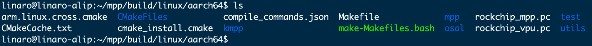

#   视频编解码——基于mpp库

##  1. MPP 介绍

瑞芯微提供的媒体处理软件平台（Media Process Platform，简称MPP）是适用于瑞芯微芯片系列的通用媒体处理软件平台。该平台对应用软件屏蔽了芯片相关的复杂底层处理，其目的是为了屏蔽不同芯片的差异，为使用者提供统一的视频媒体处理接口（Media Process Interface，缩写MPI）。MPP提供的功能包括：

- **视频解码**  
  H.265 / H.264 / H.263 / VP9 / VP8 / MPEG-4 / MPEG-2 / MPEG-1 / VC1 / MJPEG / AV1

- **视频编码**  
  H.265 / H.264 / VP8 / MJPEG

- **视频处理**  
  视频拷贝，缩放，色彩空间转换，场视频解交织（Deinterlace）

以下为RK官方MPP文档的GitHub链接，包含了中文/英文的MPP开发指南：  
[https://github.com/rockchip-linux/mpp/tree/develop/doc](https://github.com/rockchip-linux/mpp/tree/develop/doc)

##  2. 获取和编译RKMPP库

###  2.1. 测试环境

- RK官方MPP库地址：[https://github.com/rockchip-linux/mpp](https://github.com/rockchip-linux/mpp)

###  2.2. 安装相关依赖工具

```bash
sudo apt update
sudo apt install -y git cmake
```

###  2.3. 拉取RK官方MPP仓库

```bash
git clone https://github.com/rockchip-linux/mpp.git
```

###  2.4. 编译

1. 进入aarch64相应的编译路径：

   ```bash
   cd mpp/build/linux/aarch64/
   ```

2. 修改交叉编译配置文件，指定编译器gcc和g++（一般默认就好）：

   ```bash
   vim arm.linux.cross.cmake
   ```
    
<span style={{ 
  display: 'flex', 
  justifyContent: 'center',
  margin: '10px 0'
}}>

</span>

3. 运行bash脚本后编译（编译过程大概需要4分钟）：

   ```bash
   ./make-Makefiles.bash
   make
   ```

4. 编译结束后，你将会发现目录下多了很多文件。
    
<span style={{ 
  display: 'flex', 
  justifyContent: 'center',
  margin: '10px 0'
}}>

</span>
5. 进入`test`目录，目录下便是编译生成的一些测试程序。
  
<span style={{ 
  display: 'flex', 
  justifyContent: 'center',
  margin: '10px 0'
}}>

</span>
   

##  3. 视频解码

解码器demo为`mpi_dec_test`系列程序，包括使用`decode_put_packet`和`decode_get_frame`接口的单线程`mpi_dec_test`、多线程的`mpi_dec_mt_test`以及多实例的`mpi_dec_multi_test`。

###  3.1. 测试环境

- 测试操作系统：Debian 12

###  3.2. `mpi_dec_test`的命令参数

####  3.2.1. 终端查看`mpi_dec_test`的命令参数

1. 打开两个终端，其中一个终端输入以下命令，来监控日志输出：

   ```bash
   sudo tail -f /var/log/syslog
   ```

2. 另一个终端执行`mpi_dec_test`测试程序：

   ```bash
   mpi_dec_test
   ```

3. 执行完测试程序后，会在日志中打印如下帮助文档：
    
<span style={{ 
  display: 'flex', 
  justifyContent: 'center',
  margin: '10px 0'
}}>

</span>

####  3.2.2. `mpi_dec_test`的命令参数描述说明

| 命令参数 | 描述说明 |
|----------|----------|
| `-i`     | 输入的码流文件。 |
| `-o`     | 输出的图像文件。 |
| `-w`     | 图像宽度，单位为像素。 |
| `-h`     | 图像高度，单位为像素。 |
| `-t`     | 码流文件的协议类型。 |
| `-f`     | 图像色彩空间格式以及内存排布方式，默认为NV12。 |
| `-n`     | 最大解码帧数。测试时若码流较长，可仅输出前n帧。 |
| `-s`     | MPP实例数，默认为1。 |
| `-v`     | 日志选项：`q`为静默标志；`f`为fps显示标志。 |
| `-slt`   | 输出帧对应的校验文件。 |
| `-help`  | 打开帮助文档。 |

**小技巧**  
1. `mpi_dec_test`的命令参数中，输入文件（`i`）和码流类型（`t`）为强制要求配置的参数，其他参数如输出文件（`o`）、图像宽度（`w`）、图像高度（`h`）和解码帧数（`n`）等为可选参数，可以根据不同的测试需求进行配置。
2. `mpi_dec_test`的命令参数中，输出帧对应的校验文件（`slt`）将输出帧数据转换为对应的循环冗余校验码（具体逻辑见`utils/utils.c`）。校验文件的大小往往只有几kB，在芯片的slt测试中，将输出帧文件的对比转换成校验文件的对比，可以显著缩短测试周期。

####  3.2.3. MPP解码支持的码流文件协议类型说明

MPP支持的解码类型：  
MPEG2/4、H.263/4/5、VP8/9和JPEG等，id后的数字为不同编码格式对应的参数值。
 
<span style={{ 
  display: 'flex', 
  justifyContent: 'center',
  margin: '10px 0'
}}>

</span>

**小技巧**  
1. MPP库支持的输入文件的编码格式（`t`）为MPEG2/4、H.263/4/5、VP8/9和JPEG等，id后的数字为不同编码格式对应的参数值。参数值来源于OMX的定义，值得注意的是，HEVC和AVS格式的参数值与其他格式的有显著区别。

###  3.3. 解码Demo

这里以解码《test.mp4》视频为例，演示一下解码的过程。

**小技巧**  
mp4解码过程主要分为两步，第一步是将mp4转换成mpp库支持解码的纯视频类型（如：h264），第二步是使用mpp库对转换后的视频进行解码。

####  3.3.1. mp4转h264

mp4转h264，这里使用FFmpeg工具实现，关于FFmpeg工具的其他使用，可参考对应章节。

```bash
sudo apt update && sudo apt install -y ffmpeg # 安装ffmpeg工具
ffmpeg -i test.mp4 -c:v libx264 01.h264
```

**提示**  
其中，`test.mp4`是要转换的源文件名，`01.h264`是输出文件名。

####  3.3.2. h264解码

这步主要是对`01.h264`文件进行解码。打开两个终端，其中一个终端输入以下命令，来监控日志输出：

```bash
sudo tail -f /var/log/syslog
```

另一个终端执行解码程序：

```bash
mpi_dec_test -i 01.h264 -t 7 -n 60 -o 01.yuv
```

**提示**  
上述命令的作用是将`01.h264`解码，并保存为`01.yuv`。其中`-i`表示输入文件，`-t 7`表示输入码流文件的协议类型是H.264，`-n 60`表示解码60帧，`-o`表示输出文件。

部分解码日志输出如下：  
（此处省略日志内容）

##  4. 视频编码

编码器demo为`mpi_enc_test`系列程序，包括单线程的`mpi_enc_test`及多实例的`mpi_enc_multi_test`。

###  4.1. 测试环境

- 测试操作系统：Debian 12

###  4.2. `mpi_enc_test`的命令参数

####  4.2.1. 终端查看`mpi_enc_test`的命令参数

1. 打开两个终端，其中一个终端输入以下命令，来监控日志输出：

   ```bash
   sudo tail -f /var/log/syslog
   ```

2. 另一个终端执行`mpi_enc_test`测试程序：

   ```bash
   mpi_enc_test
   ```

3. 执行完测试程序后，会在日志中打印如下帮助文档：
    
<span style={{ 
  display: 'flex', 
  justifyContent: 'center',
  margin: '10px 0'
}}>

</span>

####  4.2.2. `mpi_enc_test`的命令参数描述说明

| 命令参数 | 描述说明 |
|----------|----------|
| `-i`     | 输入的图像文件。 |
| `-o`     | 输出的码流文件。 |
| `-w`     | 图像宽度，单位为像素。 |
| `-h`     | 图像高度，单位为像素。 |
| `-hstride` | 垂直方向相邻两行之间的距离，单位为byte。 |
| `-vstride` | 图像分量之间的以行数间隔数，单位为1。 |
| `-f`     | 图像色彩空间格式以及内存排布方式，默认为NV12。 |
| `-t`     | 码流文件的协议类型。 |
| `-tsrc`  | 源码流格式，仅在测试整体编解码性能时使用。 |
| `-n`     | 最大解码帧数。测试时若码流较长，可仅输出前n帧。 |
| `-g`     | gop参考模式，对应不同的TSVC码流。 |
| `-rc`    | 码率控制模式。0:VBR; 1:CBR; 2:FIXQP; 3:AVBR。 |
| `-bps`   | 码率约束参数。命令格式：`bps_target:bps_min:bps_max`。 |
| `-fps`   | 输入/输出帧率控制，默认为30。该命令参数仅说明输入帧率和输出帧率之间的比例关系，与实际帧率无关。 |
| `-qc`    | 质量控制。 |
| `-s`     | MPP实例数，默认为1。 |
| `-v`     | 日志选项：`q`为静默标志；`f`为fps显示标志。 |
| `-ini`   | 额外的编码配置文件ini（暂未生效）。 |
| `-slt`   | 输出码流对应的校验文件。 |

**小技巧**  
1. `mpi_enc_test`的命令参数中，图像宽度（`w`）、图像高度（`h`）和码流类型（`t`）为强制要求配置的参数，其他参数如输入文件（`i`）、输出文件（`o`）、编码帧数（`n`）和色彩空间格式及内存排布方式（`f`）等为可选参数。如果没有指定输入文件，`mpi_enc_test`会生成默认的彩条图像进行编码。
2. `mpi_enc_test`的命令参数提供了多样化的码率控制方案，用户可以通过码率控制模式（`rc`）和码率约束参数（`bps`）对输出码流的码率进行控制。码率控制模式（`rc`）分为可变码率模式（VBR）、固定码率模式（CBR）、qp修正的码率模式（FIXQP）和自适应码率模式（AVBR），默认模式为VBR；码率约束参数（`bps`）则是为MPP内部配置码率边界提供参考。
3. `mpi_enc_test`的命令参数中，日志选项（`v`）为`q`时，MPP日常日志关闭；日志选项（`v`）为`f`时，每秒会打印一次平均帧率和当前帧率。

####  4.2.3. MPP编码支持的码流文件协议类型说明

MPP支持的编码类型：  
H.265 / H.264 / VP8 / MJPEG等，id后的数字为不同编码格式对应的参数值。

**小技巧**  
1. MPP库支持的输入文件的编码格式（`t`）为H.265 / H.264 / VP8 / MJPEG等，id后的数字为不同编码格式对应的参数值。

####  4.2.4. 图像色彩空间格式以及内存排布方式说明

图像的色彩空间格式分为YUV和RGB两类。MPP支持多种内存排布方式（`f`），id后的数字为不同内存排布方式对应的参数值，值得注意的是，YUV和RGB格式的参数值有显著区别。

###  4.3. 编码Demo

这里以编码上述解码出的`01.yuv`文件为例，演示一下编码的过程。

**小技巧**  
这里主要演示如何通过mpp库将yuv文件编码成h265，以及如何使用ffmpeg将h265转成mp4。

####  4.3.1. yuv编码成h265

打开两个终端，其中一个终端输入以下命令，来监控日志输出：

```bash
sudo tail -f /var/log/syslog
```

另一个终端执行编码程序：

```bash
mpi_enc_test -i 01.yuv -w 1920 -h 1080 -t 16777220 -o 01.h265 -n 20
```

**提示**  
上述命令的作用是将`01.yuv`编码，并保存为`01.h265`。其中`-i`表示输入文件，`-w 1920`表示指定像素宽度为1920，`-h 1080`表示指定像素高度为1080，`-t 16777220`表示输出码流文件的协议类型是H.265，`-n 60`表示解码60帧，`-o`表示输出文件。

部分编码日志输出如下：  
 
<span style={{ 
  display: 'flex', 
  justifyContent: 'center',
  margin: '10px 0'
}}>

</span>

####  4.3.2. h265转mp4

h265转mp4，这里使用FFmpeg工具实现。

```bash
sudo apt update && sudo apt install -y ffmpeg # 安装ffmpeg工具
ffmpeg -i 01.h265 -c:v libx265 -c:a aac -f mp4 0101.mp4
```

**提示**  
其中，`01.h265`是要转码的H.265视频文件名，`0101.mp4`是转码后的MP4文件名，`-c:v libx265`将视频编码为H.265格式，`-c:a aac`将音频编码为AAC格式，`-f mp4`指定输出格式为MP4。

##  5. 实用工具

MPP提供了一些单元测试用的工具程序，这种程序可以对软硬件平台以及MPP库本身进行测试：

- **`mpp_info_test`**  
  用于读取和打印MPP库的版本信息，在反馈问题时，可以把打印出来信息附上。

- **`mpp_buffer_test`**  
  用于测试内核的内存分配器是否正常。

- **`mpp_mem_test`**  
  用于测试C库的内存分配器是否正常。

- **`mpp_runtime_test`**  
  用于测试一些软硬件运行时环境是否正常。

- **`mpp_platform_test`**  
  用于读取和测试芯片平台信息是否正常。
