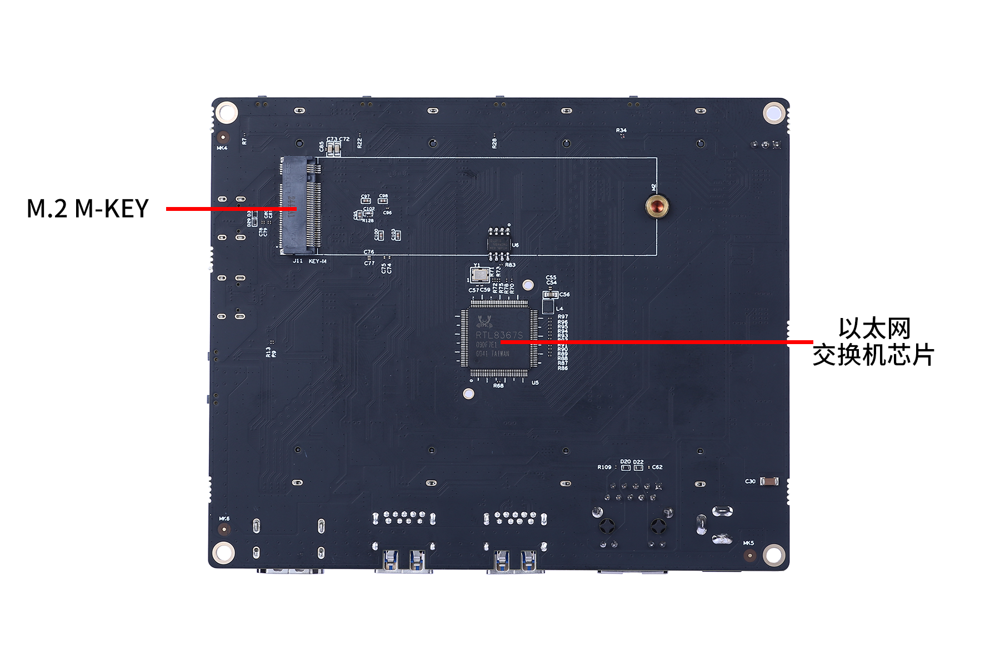

# Bit-Brick Cluster K1使用手册

本章内容为您介绍Cluster K1及其使用方法。

## 一、产品概述

Bit-Brick Cluster K1是一款高性能的计算扩展设备，旨在通过将多个核心板连接成一个集群，实现计算能力的大幅提升，满足各类对计算性能要求较高的应用场景。Cluster K1一次最大可挂载 4 枚核心板，并配备了丰富的外设接口，方便用户接入各种外部设备，拓展系统功能。

## 二、工作原理

Cluster K1采用以太网交换机芯片作为连接枢纽，构建起四块核心板之间的网络连接。以太网交换机芯片作为整个集群网络的核心组件，能够为每个核心板提供独立的网络端口，实现数据包的快速转发。当核心板接入集群板后，通过路由器为每个核心板分配唯一的网络地址，每个核心板都能通过以太网交换机芯片与其他核心板进行通信，数据传输更加高效稳定。

## 三、集群板资源介绍

| 资源名称          | 说明                                                                 |
|-------------------|----------------------------------------------------------------------|
| 以太网交换机芯片  | 1x，用于连接各核心板，实现数据包的快速转发                           |
| 千兆以太网口      | 1x，用于网络连接                                                     |
| USB3.0接口        | 1x，用于高速数据传输                                                 |
| USB2.0接口        | 1x，用于数据传输                                                     |
| USB2.0 OTG接口    | 1x，用于连接外部设备                                                 |
| HDMI接口          | 1x，用于视频输出                                                     |
| 电源接口          | 1x，用于为集群板供电                                                 |
| 3Pin风扇电源接口  | 1x，用于连接风扇，提供散热                                           |
| Type-C调试串口    | 1x，用于调试和日志输出                                               |
| M.2 M-KEY接口     | 1x，用于扩展存储或其他功能                                           |
| 核心板插槽        | 4x，用于挂载核心板                                                   |
| Download键        | 用于下载程序                                                         |
| Reset键           | 用于重置系统                                                         |
| Power键           | 用于控制电源                                                         |

## 四、使用方法

### （一）核心板挂载

1. **准备工作**：确保集群板处于断电状态，并准备好待挂载的核心板。
2. **安装核心板**：将核心板对准集群板上的相应插槽，平稳插入，确保核心板与插槽充分接触。注意在插入过程中避免用力过猛，以免损坏核心板或插槽。
3. **固定核心板**：使用配套的固定装置，将核心板牢固固定在集群板上，防止在使用过程中出现松动。
   

### （二）外设连接

根据需求，将相应的外部设备连接到集群板的对应外设接口上。连接完成后，检查设备连接是否牢固。

### （三）系统启动

完成核心板挂载和外设连接后，接通集群板电源，系统将自动启动。在启动过程中，用户可通过串口或其他调试设备，观察系统启动日志，确保系统正常启动。

> **注**：仅master槽位的核心板具有HDMI显示，可以通过显示屏及键鼠来控制该槽位核心板，其余槽位的核心板需要使用串口工具或远程连接进行控制。

## 五、注意事项

1. 在进行核心板挂载及不支持热插拔的设备的连接操作时，务必确保集群板处于断电状态，以避免因带电操作而损坏设备。
2. 定期检查核心板和外设的连接情况，确保连接牢固，防止因松动导致设备故障。
3. 保持核心板及集群板接口清洁，以避免接触不良导致设备故障。
4. 如遇系统故障或异常情况，应及时记录故障现象，并联系专业技术人员进行处理。
