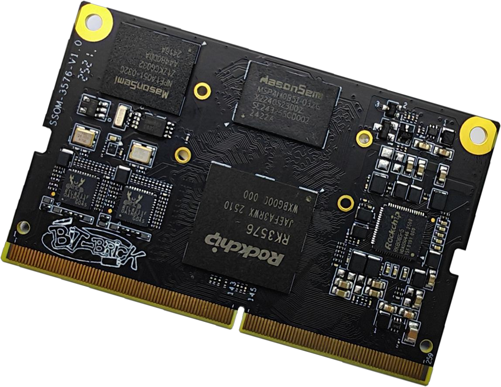
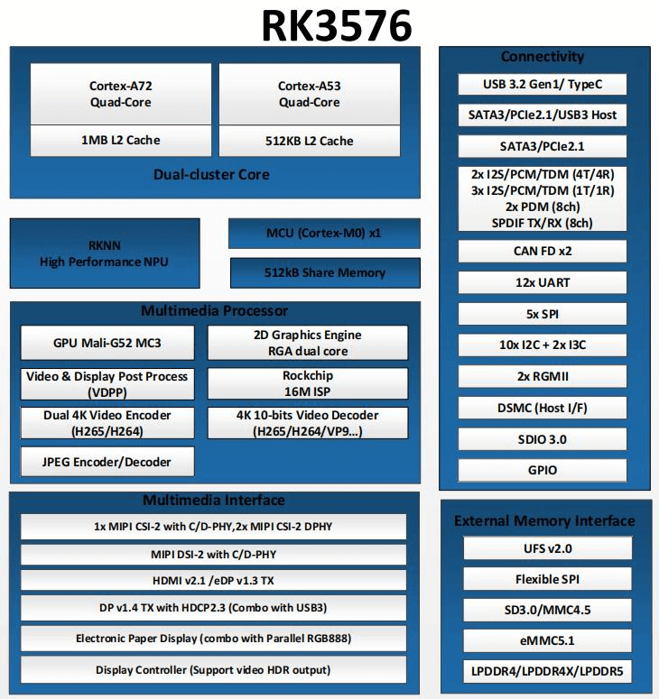
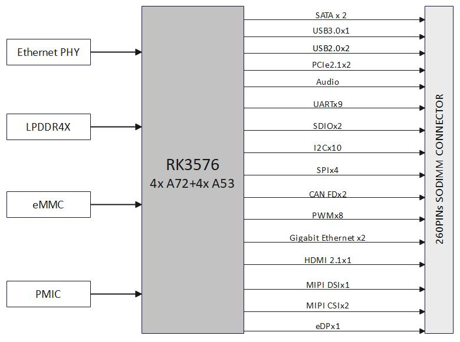
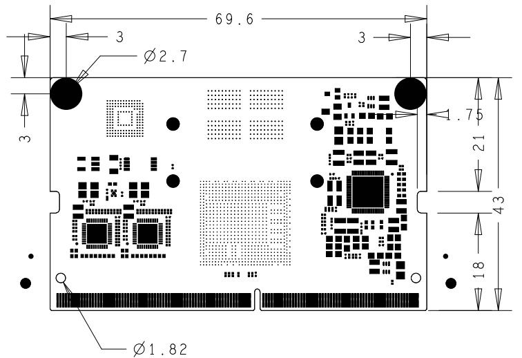

# Bit Brick SSOM-3576 Datasheet

## 1. Product Introduction

Bit-Brick SSOM-3576 is a high-performance System-on-Module (SoM) built around the Rockchip RK3576 processor, designed for intelligent terminals, industrial control systems, and edge computing applications,etc.

The module features a heterogeneous octa-core CPU architecture, integrates quad-core Cortex-A72 and quad-core Cortex-A53, with clock speeds up to 2.2GHz. It integrates an ARM Mali-G52 MP4 GPU, delivering robust capabilities for multitasking and advanced graphics processing. A built-in Neural Processing Unit (NPU) with 6 TOPS of AI computing power enables efficient on-device inference for AI workloads, supporting applications such as computer vision and intelligent interaction at the edge.

The module incorporates a rich set of high-speed interfaces, including Gigabit Ethernet, PCIe 2.1, USB 3.0, and MIPI DSI/CSI, facilitating flexible peripheral expansion and system integration. It supports ultra-high-definition video decoding up to 4K@120fps and multi-display configurations, including both mirrored and independent output modes, addressing a wide range of multimedia and display-centric use cases.

With its low power consumption, high stability, and excellent scalability, the SSOM-3576 is ideally suited for deployment in smart retail terminals, industrial panel PCs, AI-powered vision systems, and smart home control hubs, offering developers a reliable and efficient embedded hardware platform.

## 2. Processor Functional Block Diagram

## 3. Hardware Functional Block Diagram

## 4. Specifications

<table>
  <tr>
    <th rowspan="4" >Processor</th>
    <td>CPU</td>
    <td>RK3576, 8-core 64-bit (4xCortex-A72 + 4xCortex-A53) with 8nm advanced process, and the main frequency can reach up to 2.2GHz</td>
  </tr>
  <tr>
    <td>GPU</td>
    <td>ARM Mali-G52 MC3 GPU, support OpenGL ES 1.1, 2.0 and 3.2/OpenCL 2.1/Vulkan 1.2</td>
  </tr>
  <tr>
    <td>NPU</td>
    <td>6 TOPS@INT8, support INT4/INT8/INT16/FP16/BF16/TF32, support deep learning frameworks such as TensorFlow, PyTorch, Caffe, etc.</td>
  </tr>
  <tr>
    <td>VPU</td>
    <td>Decoder: 8K@30fps or 4K@120fps (H.265 HEVC/VP9/AVS2/AV1), 4K@60fps (H.264 AVC); 1080P@60fps (H.264 MVC); Encoder: 4K@60fps (H.265/H.264)</td>
  </tr>
  <tr>
    <th rowspan="2">Memory</th>
    <td>RAM</td>
    <td>4GB/8GB LPDDR4X SDRAM (optional)</td>
  </tr>
  <tr>
    <td>Flash</td>
    <td>32GB/64GB eMMC (optional)</td>
  </tr>
  <tr>
    <th rowspan="2" >Multimedia</th>
    <td>Video</td>
    <td>Output: 1x HDMI2.1(4K@120fps)/eDP(4K@60fps) combo; 1x MIPI-DSI(2560x1600@60fps) Input: 1x 16MP ISP with HDR & 3DNR; 1x DVP, support HDCP2.3; 1x MIPI-CSI DC PHY; 2x MIPI DPHY</td>
  </tr>
  <tr>
    <td>Audio</td>
    <td>5x SAI, support I2S/TDM/PCM mode; SPDIF TX/RX; 2x 8-channel PDM</td>
  </tr>

  <tr>
    <th rowspan="13" >IO</th>
    <td>PCIe</td>
    <td>2x PCIe2.1</td>
  </tr>
  <tr>
    <td>Ethernet 2x</td>
    <td>Gigabit Ethernet</td>
  </tr>
  <tr>
    <td>USB 1x</td>
    <td>USB3.0; 2x USB2.0</td>
  </tr>
  <tr>
    <td>UART</td>
    <td>9x</td>
  </tr>
  <tr>
    <td>SDIO</td>
    <td>2x</td>
  </tr>
  <tr>
    <td>I2C</td>
    <td>10x</td>
  </tr>
  <tr>
    <td>SPI</td>
    <td>4x</td>
  </tr>
  <tr>
    <td>CAN FD</td>
    <td>2x</td>
  </tr>
  <tr>
    <td>PWM</td>
    <td>8x</td>
  </tr>
  <tr>
    <td>MIPI DSI</td>
    <td>1x</td>
  </tr>
  <tr>
    <td>MIPI CSI</td>
    <td>2x</td>
  </tr>
  <tr>
    <td>SATA</td>
    <td>2x</td>
  </tr>
  <tr>
    <td>eDP</td>
    <td>1x</td>
  </tr>
  <tr>
    <td>Power supply Power</td>
    <td>Supply Voltage</td>
    <td>DC 4V</td>
  </tr>
  <tr>
    <td>Operating Environment</td>
    <td>Operating Temperature</td>
    <td>-20 ~ 75 °C</td>
  </tr>
  <tr>
    <td>Operating Humidity</td>
    <td>95% relative humidity, non-condensing</td>
  </tr>
  <tr>
    <td>Mechanical Dimensions (W x D)</td>
    <td colspan="2">69.6 x 43mm</td>
  </tr>
  <tr>
    <td>Operation System</td>
    <td colspan="2">Linux/Android</td>
  </tr>
  <tr>
    <td>Certifications</td>
    <td colspan="2">CE/FCC Class B</td>
  </tr>
</table>

## 5. Dimension Specifications

Size:69.6mm X 43.0mm

## 6. Pin Definitions

<table>
  <tr>
    <td>Pin Number</td>
    <td>Default Corresponding GPIO</td>
    <td>Pin Number</td>
    <td>Definition</td>
  </tr>
  <tr>
    <td>1</td>
    <td>GND</td>
    <td>2</td>
    <td>GND</td>
  </tr>
  <tr>
    <td>3</td>
    <td>PHY1_LED1/CFG_LDO0</td>
    <td>4</td>
    <td>CSI1_DP0</td>
  </tr>
  <tr>
    <td>5</td>
    <td>PHY1_LED2/CFG_LDO1</td>
    <td>6</td>
    <td>CSI1_DN0</td>
  </tr>
  <tr>
    <td>7</td>
    <td>GND</td>
    <td>8</td>
    <td>GND</td>
  </tr>
  <tr>
    <td>9</td>
    <td>PHY1_MDI0+</td>
    <td>10</td>
    <td>CSI1_CKP</td>
  </tr>
  <tr>
    <td>11</td>
    <td>PHY1_MDI0-</td>
    <td>12</td>
    <td>CSI1_CKN</td>
  </tr>
  <tr>
    <td>13</td>
    <td>GND</td>
    <td>14</td>
    <td>GND</td>
  </tr>
  <tr>
    <td>15</td>
    <td>PHY1_MDI1+</td>
    <td>16</td>
    <td>CSI1_DP1</td>
  </tr>
  <tr>
    <td>17</td>
    <td>PHY1_MDI1-</td>
    <td>18</td>
    <td>CSI1_DN1</td>
  </tr>
  <tr>
    <td>19</td>
    <td>GND</td>
    <td>20</td>
    <td>GND</td>
  </tr>
  <tr>
    <td>21</td>
    <td>PHY1_MDI2+</td>
    <td>22</td>
    <td>CSI1_DP2</td>
  </tr>
  <tr>
    <td>23</td>
    <td>PHY1_MDI2-</td>
    <td>24</td>
    <td>CSI1_DN2</td>
  </tr>
  <tr>
    <td>25</td>
    <td>GND</td>
    <td>26</td>
    <td>GND</td>
  </tr>
  <tr>
    <td>27</td>
    <td>PHY1_MDI3+</td>
    <td>28</td>
    <td>CSI1_DP3</td>
  </tr>
  <tr>
    <td>29</td>
    <td>PHY1_MDI3-</td>
    <td>30</td>
    <td>CSI1_DN3</td>
  </tr>
  <tr>
    <td>31</td>
    <td>GND</td>
    <td>32</td>
    <td>GND</td>
  </tr>
  <tr>
    <td>33</td>
    <td>PHY0_LED1/CFG_LDO0</td>
    <td>34</td>
    <td>CSI3_DP0</td>
  </tr>
  <tr>
    <td>35</td>
    <td>PHY0_LED2/CFG_LDO1</td>
    <td>36</td>
    <td>CSI3_DN0</td>
  </tr>
  <tr>
    <td>37</td>
    <td>GND</td>
    <td>38</td>
    <td>GND</td>
  </tr>
  <tr>
    <td>39</td>
    <td>PHY0_MDI0+</td>
    <td>40</td>
    <td>CSI3_CKP</td>
  </tr>
  <tr>
    <td>41</td>
    <td>PHY0_MDI0-</td>
    <td>42</td>
    <td>CSI3_CKN</td>
  </tr>
  <tr>
    <td>43</td>
    <td>GND</td>
    <td>44</td>
    <td>GND</td>
  </tr>
  <tr>
    <td>45</td>
    <td>PHY0_MDI1+</td>
    <td>46</td>
    <td>CSI3_DP1</td>
  </tr>
  <tr>
    <td>47</td>
    <td>PHY0_MDI1-</td>
    <td>48</td>
    <td>CSI3_DN1</td>
  </tr>
  <tr>
    <td>49</td>
    <td>GND</td>
    <td>50</td>
    <td>GND</td>
  </tr>
  <tr>
    <td>51</td>
    <td>PHY0_MDI2+</td>
    <td>52</td>
    <td>CSI3_DP2</td>
  </tr>
  <tr>
    <td>53</td>
    <td>PHY0_MDI2-</td>
    <td>54</td>
    <td>CSI3_DN2</td>
  </tr>
  <tr>
    <td>55</td>
    <td>GND</td>
    <td>56</td>
    <td>GND</td>
  </tr>
  <tr>
    <td>57</td>
    <td>PHY0_MDI3+</td>
    <td>58</td>
    <td>CSI3_DP3</td>
  </tr>
  <tr>
    <td>59</td>
    <td>PHY0_MDI3-</td>
    <td>60</td>
    <td>CSI3_DN3</td>
  </tr>
  <tr>
    <td>61</td>
    <td>GND</td>
    <td>62</td>
    <td>GND</td>
  </tr>
  <tr>
    <td>63</td>
    <td>ETH_CLK0_25M_OUT_M0 GPIO3_A4_d</td>
    <td>64</td>
    <td>CSI2_CKP</td>
  </tr>
  <tr>
    <td>65</td>
    <td>ETH_CLK1_25M_OUT_M0 GPIO2_D6_d</td>
    <td>66</td>
    <td>CSI2_CKN</td>
  </tr>
  <tr>
    <td>67</td>
    <td>GND</td>
    <td>68</td>
    <td>GND</td>
  </tr>
  <tr>
    <td>69</td>
    <td>USB3_OTG0_SSTX1P</td>
    <td>70</td>
    <td>CSI1_PWDN (GPIO4_A4_d)</td>
  </tr>
  <tr>
    <td>71</td>
    <td>USB3_OTG0_SSTX1N</td>
    <td>72</td>
    <td>CSI1_RST (GPIO4_A6_d)</td>
  </tr>
  <tr>
    <td>73</td>
    <td>GND</td>
    <td>74</td>
    <td>GND</td>
  </tr>
  <tr>
    <td>75</td>
    <td>EDP_TX_AUXP</td>
    <td>76</td>
    <td>I2C4_SCL_M3_MIPI_CAM0/2 (GPIO3_C0_d)</td>
  </tr>
  <tr>
    <td>77</td>
    <td>EDP_TX_AUXN</td>
    <td>78</td>
    <td>I2C4_SDA_M3_MIPI_CAM0/2 (GPIO3_B7_d)</td>
  </tr>
  <tr>
    <td>79</td>
    <td>GND</td>
    <td>80</td>
    <td>GND</td>
  </tr>
  <tr>
    <td>81</td>
    <td>USB2_OTG0_DP</td>
    <td>82</td>
    <td>CSI3_RST (GPIO3_D4_d)</td>
  </tr>
  <tr>
    <td>83</td>
    <td>USB2_OTG0_DM</td>
    <td>84</td>
    <td>CSI3_PWDN (GPIO3_C7_d)</td>
  </tr>
  <tr>
    <td>85</td>
    <td>GND</td>
    <td>86</td>
    <td>GND</td>
  </tr>
  <tr>
    <td>87</td>
    <td>USB2_OTG1_DP</td>
    <td>88</td>
    <td>CSI_MCLK (GPIO3_D7_d)</td>
  </tr>
  <tr>
    <td>89</td>
    <td>USB2_OTG1_DM</td>
    <td>90</td>
    <td>USB2_PWREN (GPIO2_B7_d)</td>
  </tr>
  <tr>
    <td>91</td>
    <td>GND</td>
    <td>92</td>
    <td>GND</td>
  </tr>
  <tr>
    <td>93</td>
    <td>USB3_OTG0_SSRX1P</td>
    <td>94</td>
    <td>USB3_PWREN (GPIO3_A1_d)</td>
  </tr>
  <tr>
    <td>95</td>
    <td>USB3_OTG0_SSRX1N</td>
    <td>96</td>
    <td>LCD_BL_PWM1_CH1_M0 (GPIO0_B5_d)</td>
  </tr>
  <tr>
    <td>97</td>
    <td>GND</td>
    <td>98</td>
    <td>GND</td>
  </tr>
  <tr>
    <td>99</td>
    <td>MIPI_DSI1_D3N</td>
    <td>100</td>
    <td>I2C3_SCL_M2 (GPIO3_D5_d)</td>
  </tr>
  <tr>
    <td>101</td>
    <td>MIPI_DSI1_D3P</td>
    <td>102</td>
    <td>I2C3_SDA_M2 (GPIO3_D6_d)</td>
  </tr>
  <tr>
    <td>103</td>
    <td>GND</td>
    <td>104</td>
    <td>GND</td>
  </tr>
  <tr>
    <td>105</td>
    <td>MIPI_DSI1_D2N</td>
    <td>106</td>
    <td>USB1_PWREN (GPIO2_B6_d)</td>
  </tr>
  <tr>
    <td>107</td>
    <td>MIPI_DSI1_D2P</td>
    <td>108</td>
    <td>GPIO3_B0 (GPIO3_B0_d)</td>
  </tr>
  <tr>
    <td>109</td>
    <td>GND</td>
    <td>110</td>
    <td>GPIO3_D0 (GPIO3_D0_d)</td>
  </tr>
  <tr>
    <td>111</td>
    <td>MIPI_DSI1_CLKN</td>
    <td>112</td>
    <td>GMAC1_MCLKINOUT_M0 (GPIO2_D7_d)</td>
  </tr>
  <tr>
    <td>113</td>
    <td>MIPI_DSI1_CLKP</td>
    <td>114</td>
    <td>GPIO3_A0_d</td>
  </tr>
  <tr>
    <td>115</td>
    <td>GND</td>
    <td>116</td>
    <td>PCIE0_CLKREQn_M0 (GPIO2_B2_d)</td>
  </tr>
  <tr>
    <td>117</td>
    <td>MIPI_DSI1_D1N</td>
    <td>118</td>
    <td>PCIE1_PERSTn (GPIO2_A6_d)</td>
  </tr>
  <tr>
    <td>119</td>
    <td>MIPI_DSI1_D1P</td>
    <td>120</td>
    <td>PCIE0_PERSTn (GPIO2_B1_d)</td>
  </tr>
  <tr>
    <td>121</td>
    <td>GND</td>
    <td>122</td>
    <td>PCIE0_WAKEN_M0 (GPIO0_D2_d)</td>
  </tr>
  <tr>
    <td>123</td>
    <td>MIPI_DSI1_D0N</td>
    <td>124</td>
    <td>SDMMC0_PWREN_H (GPIO0_B6_d)</td>
  </tr>
  <tr>
    <td>125</td>
    <td>MIPI_DSI1_D0P</td>
    <td>126</td>
    <td>CLK1_32K_OUT_WIFI (GPIO1_D5_d)</td>
  </tr>
  <tr>
    <td>127</td>
    <td>GND</td>
    <td>128</td>
    <td>GND</td>
  </tr>
  <tr>
    <td>129</td>
    <td>HDMI_TXCN</td>
    <td>130</td>
    <td>GPIO0_C3_d</td>
  </tr>
  <tr>
    <td>131</td>
    <td>HDMI_TXCP</td>
    <td>132</td>
    <td>GPIO0_C4_d</td>
  </tr>
  <tr>
    <td>133</td>
    <td>GND</td>
    <td>134</td>
    <td>GND</td>
  </tr>
  <tr>
    <td>135</td>
    <td>HDMI_TX0N</td>
    <td>136</td>
    <td>HDMI_CEC (GPIO4_C0_d)</td>
  </tr>
  <tr>
    <td>137</td>
    <td>HDMI_TX0P</td>
    <td>138</td>
    <td>HDMI_HPD (GPIO4_C1_d)</td>
  </tr>
  <tr>
    <td>139</td>
    <td>GND</td>
    <td>140</td>
    <td>LCD_BL_EN (GPIO0_D1_d)</td>
  </tr>
  <tr>
    <td>141</td>
    <td>HDMI_TX1N</td>
    <td>142</td>
    <td>LCD_PWREN_H (GPIO0_C6_d)</td>
  </tr>
  <tr>
    <td>143</td>
    <td>HDMI_TX1P</td>
    <td>144</td>
    <td>LCD_RST_3V3 (GPIO0_C7_d)</td>
  </tr>
  <tr>
    <td>145</td>
    <td>GND</td>
    <td>146</td>
    <td>GND</td>
  </tr>
  <tr>
    <td>147</td>
    <td>HDMI_TX2N</td>
    <td>148</td>
    <td>SDMMC0_D1 (GPIO2_A1_d)</td>
  </tr>
  <tr>
    <td>149</td>
    <td>HDMI_TX2P</td>
    <td>150</td>
    <td>SDMMC0_CLK (GPIO2_A5_d)</td>
  </tr>
  <tr>
    <td>151</td>
    <td>GND</td>
    <td>152</td>
    <td>SDMMC0_D3 (GPIO2_A3_d)</td>
  </tr>
  <tr>
    <td>153</td>
    <td>USB3_OTG0_SSRX2N</td>
    <td>154</td>
    <td>SDMMC0_DET_L (GPIO0_A6_u)</td>
  </tr>
  <tr>
    <td>155</td>
    <td>USB3_OTG0_SSRX2P</td>
    <td>156</td>
    <td>SDMMC0_D2 (GPIO2_A2_d)</td>
  </tr>
  <tr>
    <td>157</td>
    <td>GND</td>
    <td>158</td>
    <td>SDMMC0_CMD (GPIO2_A4_d)</td>
  </tr>
  <tr>
    <td>159</td>
    <td>PCIE0_REFCLKN</td>
    <td>160</td>
    <td>SDMMC0_D0 (GPIO2_A0_d)</td>
  </tr>
  <tr>
    <td>161</td>
    <td>PCIE0_REFCLKP</td>
    <td>162</td>
    <td>HDMI_SCL (GPIO4_C2_d)</td>
  </tr>
  <tr>
    <td>163</td>
    <td>GND</td>
    <td>164</td>
    <td>HDMI_SDA (GPIO4_C3_d)</td>
  </tr>
  <tr>
    <td>165</td>
    <td>PCIE0_RXN</td>
    <td>166</td>
    <td>I2C5_SDA_M3/CAN0_RX_M3 (GPIO3_C1_d)</td>
  </tr>
  <tr>
    <td>167</td>
    <td>PCIE0_RXP</td>
    <td>168</td>
    <td>I2C5_SCL_M3/CAN0_TX_M3 (GPIO3_C0_d)</td>
  </tr>
  <tr>
    <td>169</td>
    <td>GND</td>
    <td>170</td>
    <td>I2C7_SCL_M2 (GPIO4_A0_d)</td>
  </tr>
  <tr>
    <td>171</td>
    <td>USB3_OTG0_SSTX2N</td>
    <td>172</td>
    <td>I2C7_SDA_M2 (GPIO4_A1_d)</td>
  </tr>
  <tr>
    <td>173</td>
    <td>USB3_OTG0_SSTX2P</td>
    <td>174</td>
    <td>I2C0_SCL_M1_TP (GPIO0_C1_d)</td>
  </tr>
  <tr>
    <td>175</td>
    <td>GND</td>
    <td>176</td>
    <td>I2C0_SDA_M1_TP (GPIO0_C2_d)</td>
  </tr>
  <tr>
    <td>177</td>
    <td>PCIE0_TXN</td>
    <td>178</td>
    <td>GND</td>
  </tr>
  <tr>
    <td>179</td>
    <td>PCIE0_TXP</td>
    <td>180</td>
    <td>MIPI_LCD_ADC_1V8 (GPIO4_A7_d)</td>
  </tr>
  <tr>
    <td>181</td>
    <td>GND</td>
    <td>182</td>
    <td>GND</td>
  </tr>
  <tr>
    <td>183</td>
    <td>DP_TX_AUXN</td>
    <td>184</td>
    <td>SARADC_VIN3_HP_HOOK</td>
  </tr>
  <tr>
    <td>185</td>
    <td>DP_TX_AUXP</td>
    <td>186</td>
    <td>UART8_RX_M0 (GPIO3_C5_d)</td>
  </tr>
  <tr>
    <td>187</td>
    <td>GND</td>
    <td>188</td>
    <td>UART8_TX_M0 (GPIO3_C6_d)</td>
  </tr>
  <tr>
    <td>189</td>
    <td>PCIE1_RXN</td>
    <td>190</td>
    <td>GND</td>
  </tr>
  <tr>
    <td>191</td>
    <td>PCIE1_RXP</td>
    <td>192</td>
    <td>UART2_RX_M1 (GPIO4_B4_d)</td>
  </tr>
  <tr>
    <td>193</td>
    <td>GND</td>
    <td>194</td>
    <td>UART2_TX_M1 (GPIO4_B5_d)</td>
  </tr>
  <tr>
    <td>195</td>
    <td>NC</td>
    <td>196</td>
    <td>SARADC_VIN0_BOOT</td>
  </tr>
  <tr>
    <td>197</td>
    <td>NC</td>
    <td>198</td>
    <td>SARADC_VIN2_HW_ID</td>
  </tr>
  <tr>
    <td>199</td>
    <td>GND</td>
    <td>200</td>
    <td>GND</td>
  </tr>
  <tr>
    <td>201</td>
    <td>PCIE1_REFCLKN</td>
    <td>202</td>
    <td>TP_INT_L (GPIO0_C5_d)</td>
  </tr>
  <tr>
    <td>203</td>
    <td>PCIE1_REFCLKP</td>
    <td>204</td>
    <td>TP_RST (GPIO0_D0_d)</td>
  </tr>
  <tr>
    <td>205</td>
    <td>GND</td>
    <td>206</td>
    <td>GND</td>
  </tr>
  <tr>
    <td>207</td>
    <td>PCIE1_TXN</td>
    <td>208</td>
    <td>UART0_RX_M0_DEBUG (GPIO0_D5_u)</td>
  </tr>
  <tr>
    <td>209</td>
    <td>PCIE1_TXP</td>
    <td>210</td>
    <td>UART0_TX_M0_DEBUG (GPIO0_D4_u)</td>
  </tr>
  <tr>
    <td>211</td>
    <td>GND</td>
    <td>212</td>
    <td>UART4_CTSN_M1 (GPIO1_C3_u)</td>
  </tr>
  <tr>
    <td>213</td>
    <td>PCIE1_WAKEN_M0 (GPIO2_A7_d)</td>
    <td>214</td>
    <td>UART4_RTSN_M1 (GPIO1_C2_u)</td>
  </tr>
  <tr>
    <td>215</td>
    <td>GND</td>
    <td>216</td>
    <td>UART4_RX_M1 (GPIO1_C5_u)</td>
  </tr>
  <tr>
    <td>217</td>
    <td>PCIE1_CLKREQn_M0 (GPIO2_B3_d)</td>
    <td>218</td>
    <td>UART4_TX_M1 (GPIO1_C4_u)</td>
  </tr>
  <tr>
    <td>219</td>
    <td>GPIO0_B4_d</td>
    <td>220</td>
    <td>SAI2_SCLK_M0 (GPIO1_D1_d)</td>
  </tr>
  <tr>
    <td>221</td>
    <td>GND</td>
    <td>222</td>
    <td>SAI2_LRCK_M0 (GPIO1_D2_d)</td>
  </tr>
  <tr>
    <td>223</td>
    <td>SDMMC1_D0_M0 (GPIO1_B4_d)</td>
    <td>224</td>
    <td>SAI2_SDI_M0 (GPIO1_D3_d)</td>
  </tr>
  <tr>
    <td>225</td>
    <td>SDMMC1_D1_M0 (GPIO1_B5_d)</td>
    <td>226</td>
    <td>SAI2_SDO_M0 (GPIO1_D0_d)</td>
  </tr>
  <tr>
    <td>227</td>
    <td>SDMMC1_D2_M0 (GPIO1_B6_d)</td>
    <td>228</td>
    <td>SAI1_SDO2_M0 (GPIO4_B1_d)</td>
  </tr>
  <tr>
    <td>229</td>
    <td>SDMMC1_D3_M0 (GPIO1_B7_d)</td>
    <td>230</td>
    <td>SAI1_SCLK_M0 (GPIO4_A3_d)</td>
  </tr>
  <tr>
    <td>231</td>
    <td>SDMMC1_CMD_M0 (GPIO1_C0_d)</td>
    <td>232</td>
    <td>SAI1_LRCK_M0 (GPIO4_A5_d)</td>
  </tr>
  <tr>
    <td>233</td>
    <td>SDMMC1_CLK_M0 (GPIO1_C1_d)</td>
    <td>234</td>
    <td>SAI1_MCLK_M0 (GPIO4_A2_d)</td>
  </tr>
  <tr>
    <td>235</td>
    <td>GND</td>
    <td>236</td>
    <td>SAI1_SDI0_M0 (GPIO4_B3_d)</td>
  </tr>
  <tr>
    <td>237</td>
    <td>WL_DIS_N (GPIO4_B2_d)</td>
    <td>238</td>
    <td>HP_DET_L (GPIO2_B5_d)</td>
  </tr>
  <tr>
    <td>239</td>
    <td>WIFI_REG_ON_H (GPIO1_C6_d)</td>
    <td>240</td>
    <td>PA_SHUTDOWN (GPIO4_B0_d)</td>
  </tr>
  <tr>
    <td>241</td>
    <td>HOST_WAKE_BT_H (GPIO1_D4_d)</td>
    <td>242</td>
    <td>SPI4_CLK_M0 (GPIO4_C7_d)</td>
  </tr>
  <tr>
    <td>243</td>
    <td>BT_REG_ON_H (GPIO1_C7_d)</td>
    <td>244</td>
    <td>SPI4_MISO_M0 (GPIO4_C6_d)</td>
  </tr>
  <tr>
    <td>245</td>
    <td>WIFI_WAKE_HOST_H (GPIO0_B0_z)</td>
    <td>246</td>
    <td>SPI4_MOSI_M0 (GPIO4_C5_d)</td>
  </tr>
  <tr>
    <td>247</td>
    <td>BT_WAKE_HOST_H (GPIO0_B1_z)</td>
    <td>248</td>
    <td>SPI4_CSN0_M0 (GPIO4_C4_d)</td>
  </tr>
  <tr>
    <td>249</td>
    <td>PCIE0_PWREN_H (GPIO0_D3_d)</td>
    <td>250</td>
    <td>PWRON_L</td>
  </tr>
  <tr>
    <td>251</td>
    <td>SARADC_VIN1_KEY/RECOVERY</td>
    <td>252</td>
    <td>RESET_L</td>
  </tr>
  <tr>
    <td>253</td>
    <td>VCC5V0_SYS_S5</td>
    <td>254</td>
    <td>VCC5V0_SYS_S5</td>
  </tr>
  <tr>
    <td>255</td>
    <td>VCC5V0_SYS_S5</td>
    <td>256</td>
    <td>VCC5V0_SYS_S5</td>
  </tr>
  <tr>
    <td>257</td>
    <td>VCC5V0_SYS_S5</td>
    <td>258</td>
    <td>VCC5V0_SYS_S5</td>
  </tr>
  <tr>
    <td>259</td>
    <td>VCC5V0_SYS_S5</td>
    <td>260</td>
    <td>RTC_VBAT</td>
  </tr>
</table>

## 7. Ordering Information

<table>
  <tr>
    <td>Part No.</td>
    <td>CPU</td>
    <td>Memory</td>
    <td>Flash</td>
  </tr>
  <tr>
    <td>SSOM-3576-0432</td>
    <td>RK3576</td>
    <td>4GB</td>
    <td>32GB</td>
  </tr>
  <tr>
    <td>SSOM-3576-0864</td>
    <td>RK3576</td>
    <td>8GB</td>
    <td>64GB</td>
  </tr>
</table>

## 8. Update History

<table>
  <tr>
    <td>Version Revision</td>
    <td>Update Date</td>
    <td>Content</td>
  </tr>
  <tr>
    <td>Provisional V 1.0</td>
    <td>2025-5-16</td>
    <td>Initial the first version</td>
  </tr>
</table>
