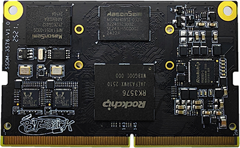

# 产品介绍

SSOM-3576是一款基于瑞芯微RK3576处理器开发设计的高性能核心模组，适合智能终端、工业控制和边缘计算等应用领域。
集成四核Cortex-A72和四核Cortex-A53 CPU，主频最高可达2.2GHz。集成ARM Mali-G52 MP4 GPU，为多任务处理和高级图形处理提供了强大能力。内置NPU具备高达6 TOPS的AI算力，可实现高效的终端AI工作负载推理，支持边缘计算和智能交互等应用。

模组通过260Pin金手指连接器将全部功能信号引出，具备丰富的高速接口信号，包括千兆以太网、PCIe 2.1、USB 3.0、MIPI DSI/CSI等，便于灵活的外设扩展和系统集成。支持高达4K@120fps的超高清视频解码和多显示配置，可满足广泛的多媒体和以显示为中心的应用场景需求。

凭借高性能、高稳定性和出色的可扩展性，SSOM-3576适合部署在智能终端、工业平板电脑、AI视觉系统和智能家居控制中枢等领域，为开发人员提供了稳定高效的嵌入式硬件平台。

## 功能框图

## 机械尺寸

