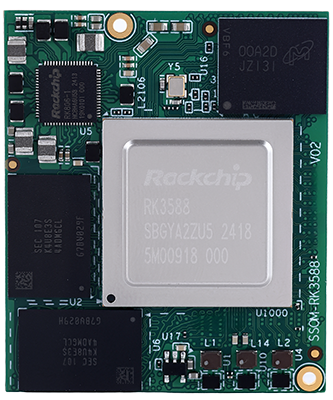
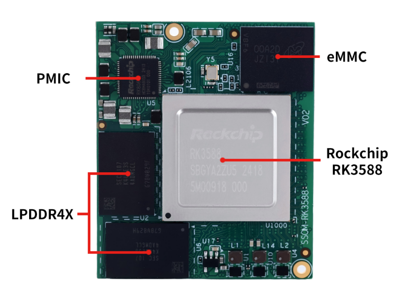
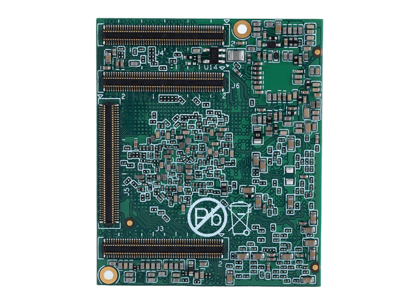
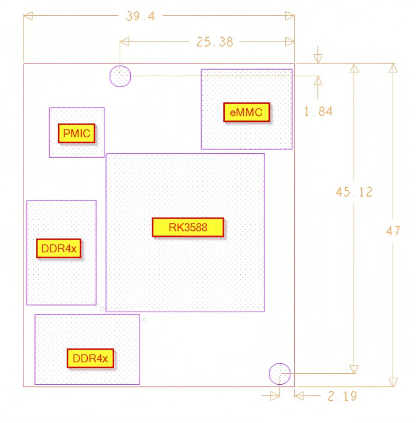

# 产品介绍

SSOM-3588-X2是一款基于瑞芯微RK3588开发设计的小尺寸高性能核心模组。集成四核Cortex-A76和四核Cortex-A55 CPU，确保性能与能效的平衡。RK3588还具备高性能四通道外部存储器接口(LPDDR4/LPDDR4X/LPDDR5)，可满足从图像后期处理到高要求计算任务等应用场景的大内存带宽需求。包含LPDDR4X、eMMC、PMIC及四个板对板连接器。由于大部分SoC信号可通过板对板连接器传输，该SoC的大多数功能均可实现。

SSOM-3588-X2尺寸仅为47x39.4mm，小巧紧凑，适用于对尺寸要求较高的智能终端、工业控制、机器视觉、边缘计算等领域的方案开发。

## 功能框图

## 机械尺寸

