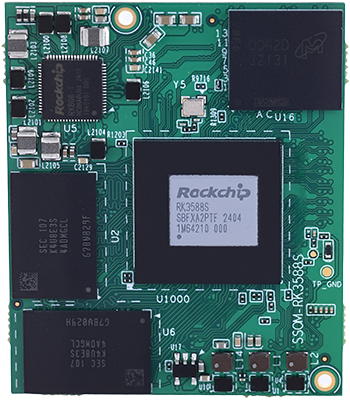

# 产品介绍

SSOM-3588S是一款基于瑞芯微RK3588S处理器开发设计的小尺寸高性能核心模组。集成四核Cortex-A76和四核Cortex-A55 CPU，Mali-G610 MP4 GPU，高达6 TOPs算力NPU。支持8K编解码；搭载新一代48MP图像信号处理器，支持HDR、3DNR等。包含LPDDR4X、eMMC、PMIC及四个板对板连接器。由于大部分SoC信号可通过板对板连接器传输，该SoC的大多数功能均可实现。

SSOM-3588S尺寸仅为47x39.4mm，小巧紧凑，适用于对尺寸要求较高的智能终端、边缘计算、物联网网关、工控平板、车载中控等方案开发。

## 功能框图

##  机械尺寸

