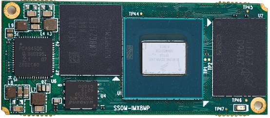

# 产品介绍

SSOM-IMX8MP是一款基于恩智浦i.MX 8M Plus应用处理器的超紧凑型系统级模块。该模块配备了LPDDR4 SDRAM、eMMC、NOR闪存、电源监控集成电路（PMIC）以及四个板对板连接器，作为连接到i.MX8M Plus的外围设备。由于大多数SoC（i.MX8M Plus）的信号可以通过板对板连接器连接，因此大部分SoC的功能都能实现。其设计兼容恩智浦开发套件(i.MX 8M Plus EVK)，可以实现与开发套件相同的功能特性，便于保持与恩智浦提供软件的兼容性。