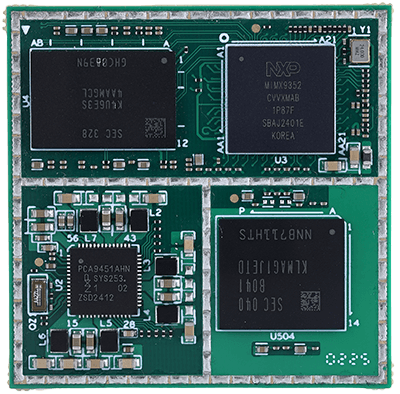
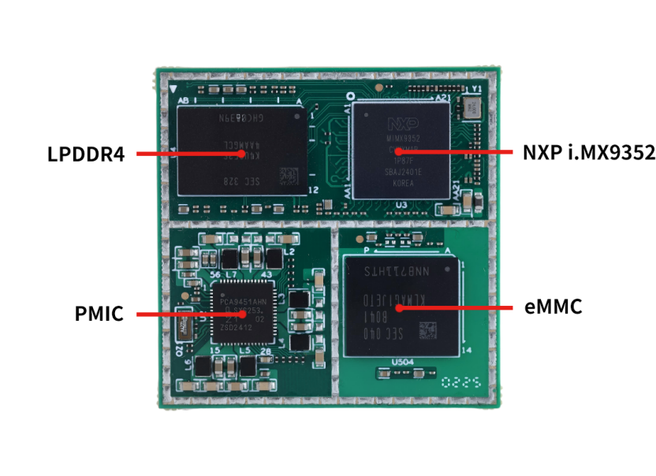
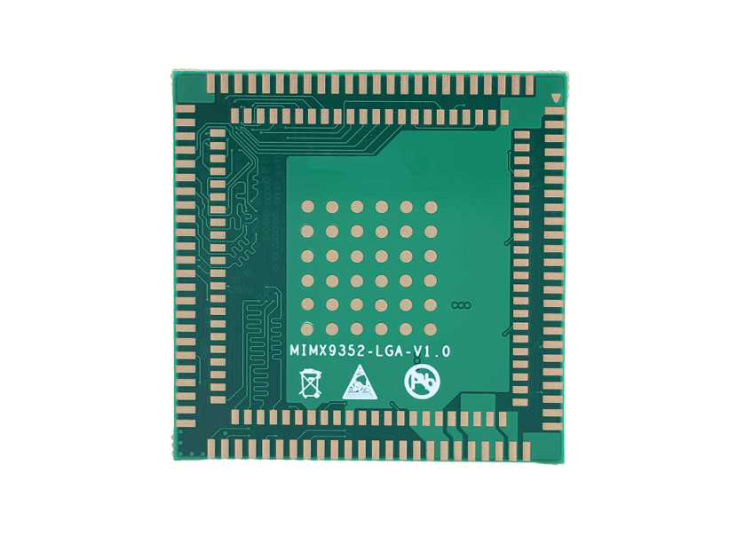
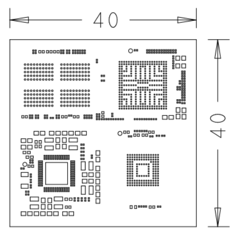

# 产品介绍

 

SSOM-IMX9352是一款基于NXP i.MX9352处理器开发设计的高性能低成本核心模组。集成双核Cortex-A55和Cortex-M33实时核，主频最高可达1.7 GHz。引出UART、2 路千兆以太网（其中1路支持TSN）、USB 2.0、CANFD 等常用接口。集成0.5 TOPS NPU（神经网络处理单元），可加速边缘机器学习应用。 	

SSOM-IMX9352尺寸仅为40x40mm，小巧紧凑，易于集成到各类产品中，为开发人员提供高性能、低成本的解决方案。

## 功能框图

## 机械尺寸

