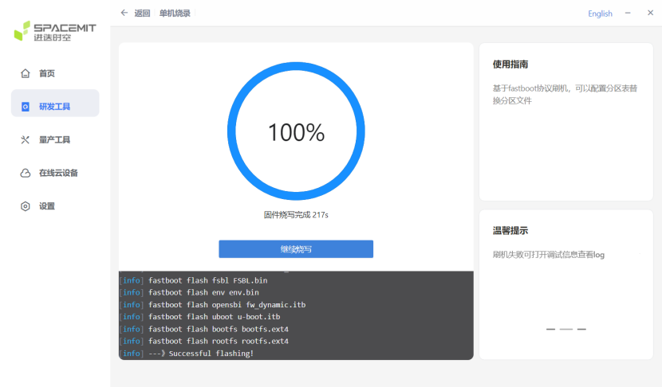

# SSOM-K1烧录镜像步骤

## 烧录工具及镜像下载

为 SSOM-K1 烧录镜像需要用到 **titanflasher** 烧录工具，下载地址如下：

- [Windows版本](https://cloud.spacemit.com/prod-api/release/download/tools?token=titantools_for_windows_X86_X64)
- [Linux版本](https://cloud.spacemit.com/prod-api/release/download/tools?token=titantools_for_linux_64BIT_APPIMAGE)

镜像地址：[bianbu-24.04-desktop-v2.2](https://pan.baidu.com/s/1TnG3lHML6Qi0zBplCSjm_Q?pwd=yfw9)，下载后进行解压缩，方便后续加快烧录速度。

## 烧录步骤

1. **打开titanflasher**，点击“研发工具”，进入“单机烧录”。

   

2. **连接设备**：
   
    将待烧录的核心板插入集群板的 master槽位。使用 **USB-C线** 连接集群板的 **USB2.0 OTG接口** 和电脑。给集群板上电。

  

3. **进入刷机模式**：
   
    按住集群板的 **Download键**，同时按一下 **Reset键**，随后松开。

  

4. **扫描设备**：
   
    在titanflasher中点击“扫描设备”，选择本地目录。

5. **选择镜像目录**：
   
     点击“刷机目录”，选择解压缩后的镜像目录。
    点击“开始刷机”。

6. **开始烧录镜像**：
   
    等待烧录过程完成，titanflasher会显示烧录进度。

## 烧录完成

- 烧录完成后，titanflasher会显示“烧录成功”的提示。

## 启动系统

1. 将烧录好镜像的核心板插入集群板。
2. 连接好外设（如显示器、键盘、鼠标等）。
3. 给集群板供电，等待系统启动。

> **注**：如果系统未能正常启动，请检查烧录过程是否成功，或者重新进行烧录。
